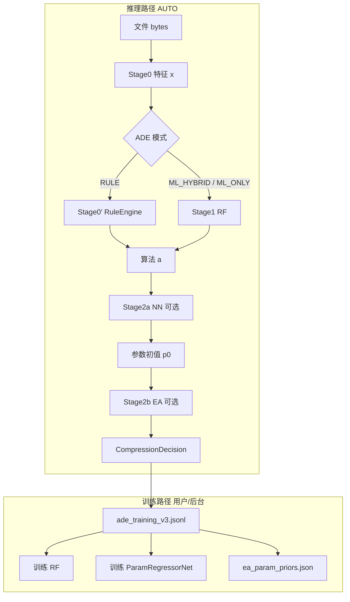

# ADE 决策流水线算法报告

## 0. 文档来源与范围

| 项目 | 内容 |
|------|------|
| **模块** | Algorithm Decision Engine (ADE) — WebCompress 智能压缩决策 |
| **版本** | 训练数据 v3.0；特征向量 v3.0（Base 20 维 + Extension 5–8 维） |
| **规范参照** | 本文档结构与记号风格对齐 `docs/ade/ERL-Re^2.md`、`docs/ade/ERL_Re2_Report.html` |
| **设计讨论** | `docs/ade/algorithm_decision_engine_design.md` |
| **实现根目录** | `src/ade/`（C++）、`src/gui/ade/`（Python 编排）、`core_engine`（pybind） |
| **资产路径** | `Package/ade/` 或 `assets/ade/`：`ade_training_v3.jsonl`、`default_model.bin`、`param_regressor.bin`、`ea_param_priors.json` |

> **命名**：下文 **Stage0** 指特征提取；**Stage1** 指算法分类（RF）；**Stage2a** 指参数回归 MLP；**Stage2b** 指 EA 黑盒精调；**Collect** 指静默探索与 JSONL 采集。与 ERL-Re² 的「三阶段 RL–EA 主循环」不同，ADE 是 **单步决策 + 离线/在线混合训练**，无 MDP 轨迹与 PeVFA。

---

## 1. 算法概述

### 1.1 一句话定位

**ADE** 在 AUTO 模式下对单个文件执行：**流式/内存特征提取 →（规则或 RF）算法分类 →（NN 预测或默认）参数初值 →（可选 EA）预算内精调**，并将结果写入压缩管线与 `ade_training_v3.jsonl` 以持续改进 Stage1/2 模型。

### 1.2 设计动机（Why 双阶段 + EA）

| 问题 | ADE 做法 |
|------|----------|
| 算法众多、特征异构 | v3 分段特征（Base + 类型 Extension），RF 学习非线性边界 |
| 同算法下参数空间高维、评估贵 | Stage2a 监督回归给出初值；Stage2b 仅在毫秒级预算内局部搜索 |
| 冷启动 / 模型未训练 | `RuleEngine` 熵分层启发式；RF 未加载时回退规则 |
| 标签稀缺（`params_used` 少） | 静默探索（AC-UCB）+ 用户压缩行为一并写入 JSONL |
| 部署约束 | RF / 小 MLP / EA 均在 **C++**；GUI 仅编排，Stage2a **不依赖 PyTorch** |

### 1.3 流水线阶段总览

| 阶段 | 名称 | 目的 | 典型实现 |
|------|------|------|----------|
| **Stage0** | 特征提取 | 将文件映射为固定维向量 $\mathbf{x}$ | `FeatureExtractorV3` |
| **Stage0′** | 规则引擎（可选） | 可解释启发式；ML 未就绪时的保底 | `RuleEngine` |
| **Stage1** | 算法分类 | $\mathbf{x} \mapsto$ 算法 ID $a^\*$ | `RandomForest` → `default_model.bin` |
| **Stage2a** | 参数回归 | $(\mathbf{x}, a) \mapsto$ 归一化参数 $\hat{\mathbf{p}}$ | `ParamRegressorNet` → `param_regressor.bin` |
| **Stage2b** | EA 精调 | 在 bounds 内最小化 fitness $f(\mathbf{p})$ | `ParameterOptimizer`（GA/PSO/CMA-ES） |
| **Collect** | 数据采集 | 沉淀 $(\mathbf{x}, a, \mathbf{p}, \text{ratio})$ | `TrainingDataStore` + `SilentExplorer` |



---

## 2. 数学基础与符号说明

### 2.1 主要符号

| 符号 | 含义 | 维度 / 类型 |
|------|------|-------------|
| $\mathcal{F}$ | 原始文件字节序列 | 变长 $N$ |
| $\mathbf{x}_b$ | Base 特征段 | $\mathbb{R}^{20}$ |
| $\mathbf{x}_e$ | Extension 特征段（按文件类型） | $\mathbb{R}^{d_e}$，$d_e \in \{4,5,6,7,8\}$ |
| $\mathbf{x}$ | 拼接特征 $\mathbf{x}_b \Vert \mathbf{x}_e$ | $\mathbb{R}^{20+d_e}$ |
| $\tilde{\mathbf{x}}$ | ML 填充向量 `to_padded_array` | $\mathbb{R}^{33}$，不足维补零 |
| $a$ | 压缩算法 ID | $a \in \mathcal{A}$，`AlgorithmID` 枚举 |
| $\mathbf{p}$ | 算法超参数向量 | 见 §2.3；Stage2 核心 5 维 |
| $y$ | RF 分类标签 | $y = \texttt{algorithm\_id\_to\_label}(a) \in \mathbb{Z}$ |
| $\hat{y}$ | RF 预测标签 | 集成投票 |
| $\hat{\mathbf{p}}_\text{norm}$ | NN 输出（归一化） | $[0,1]^5$ |
| $f(\mathbf{p})$ | EA 适应度 | 越小越好（压缩比或代理损失） |
| $\rho$ | 压缩比 | $\rho = \lvert \text{output} \rvert / \lvert \mathcal{F} \rvert$ |
| $\mathcal{D}_\text{jsonl}$ | 训练集 | JSON Lines，每行一个 `TrainingSampleV3` |

### 2.2 特征填充（Stage0 → Stage1 输入）

实现将 Base 与 Extension **拷贝到定长缓冲区**（`FeatureVectorV3::to_padded_array`）：

$$
\tilde{\mathbf{x}} = \bigl[ x_0,\ldots,x_{19},\; x_{20},\ldots,x_{19+d_e},\; 0,\ldots,0 \bigr]^\top \in \mathbb{R}^{33}
$$

其中 $x_{20+k}$ 来自对应 `ExtensionType` 的 union 内存布局；$d_e$ 由 `ext_dim` 决定，未用槽位为 $0$。

**Shannon 熵**（Base 维 $x_3$，用于规则分层）：

$$
H(\mathcal{F}) = -\sum_{b=0}^{255} p_b \log_2 p_b,\quad p_b = \frac{\text{count}(b)}{N}
$$

规则引擎使用阈值 $H < 3.0$、$3.0 \le H < 5.5$、$5.5 \le H < 7.0$、$H \ge 7.0$ 四档（见 `RuleEngine::decide`）。

### 2.3 参数向量与归一化（Stage2）

Stage2a/2b 在 C++ `AlgorithmParams` 与 GUI 之间对齐五元组（算法相关子集可能只用其中几项）：

| 索引 | 键名 | 典型范围 $[\underline{p}_j, \overline{p}_j]$ |
|------|------|-----------------------------------------------|
| 1 | `window_size` / `search_size` | $[1024,\,524288]$ |
| 2 | `min_match` | $[2,\,96]$ |
| 3 | `max_chain_length` | $[4,\,1024]$ |
| 4 | `lookahead_size` | $[8,\,512]$ |
| 5 | `dp_range` / `dp_top` / `dp_sub_match_max` | $[1,\,24]$（算法相关） |

**归一化**（`ParameterRegressor._normalize_params`）：

$$
\hat{p}_j = \mathrm{clip}\left( \frac{p_j - \underline{p}_j}{\overline{p}_j - \underline{p}_j},\; 0,\; 1 \right)
$$

**反归一化**（预测后取整）：

$$
p_j = \mathrm{round}\bigl( \hat{p}_j (\overline{p}_j - \underline{p}_j) + \underline{p}_j \bigr)
$$

Stage2a 网络输入为 **33 维特征 + 6 维算法 one-hot**：

$$
\mathbf{z} = \tilde{\mathbf{x}} \Vert \mathrm{onehot}(a) \in \mathbb{R}^{39}
$$

one-hot 槽位映射：`DEFLATE=0, LZSS=1, LZDP=2, DPFLATE=3, BROTLI=4, ZSTD=5`（`ParameterRegressor.ALGORITHM_MAP`）。

### 2.4 压缩比与 EA 适应度

**真实压缩比**（越小越好）：

$$
\rho = \frac{\lvert C(\mathcal{F}; a, \mathbf{p}) \rvert}{\max(\lvert \mathcal{F} \rvert,\, 1)}
$$

其中 $C$ 为引擎试压（可截断前 $B_\text{eval}$ 字节，`ea_max_eval_bytes`）。

**代理适应度**（无法 live compress 时，`engine._optimize_params`）：

$$
f_\text{prior}(\mathbf{p}) = 0.7 \cdot d_\text{JSONL}(\mathbf{p}) + 0.3 \sum_{j=1}^{5} \frac{\lvert p_j - p_j^\text{tgt} \rvert}{\max(p_j^\text{tgt}, 1)}
$$

$d_\text{JSONL}$ 来自 `ea_param_priors.json` 与当前参数的距离惩罚（`prior_fitness_penalty`）；$p_j^\text{tgt}$ 为 JSONL 高分位样本的中位数先验。

**Live 模式**：$f(\mathbf{p}) = \rho$（直接返回试压压缩比）。

---

## 3. Stage0：特征提取

### 3.1 目的

在单次遍历（或采样窗口）内计算 **与算法选择相关的统计量**，输出 `FeatureVectorV3`，供规则、RF、NN 共用。

### 3.2 Base 段（20 维，全体文件）

| 索引 | 字段 | 说明 |
|------|------|------|
| 0–2 | `file_size_log2`, `magic_confidence`, `printable_ratio` | 元数据 |
| 3–10 | 熵、字节分布、游程等 | 统计 |
| 11–15 | `header_entropy`, `skewness`, `kurtosis`… | 结构；**skewness 为加密/随机检测关键量** |
| 16–19 | bigram、RLE/dict 潜力 | N-gram 聚合 |

定义见 `src/ade/include/FeatureVectorV3.hpp` 中 `BaseSegment`。

### 3.3 Extension 段（按 `FileType` 路由）

| `ExtensionType` | 维度 $d_e$ | 典型用途 |
|-----------------|------------|----------|
| TEXT | 5 | 源码/标记语言 |
| IMAGE | 8 | 含 `is_lossless_original` |
| AUDIO / VIDEO | 6 / 7 | 多媒体是否已压缩 |
| ARCHIVE | 4 | 再压缩潜力 |
| BINARY | 5 | PE/ELF/加密等 |

### 3.4 伪代码

```text
Algorithm 0  FeatureExtractionV3

Input:  byte stream F, optional max_scan_bytes
Output: FeatureVectorV3 v (base, ext_type, ext)

1. Detect FileType via magic bytes → ext_type
2. Single pass over F (or prefix):
     update histogram, runs, Count-Min sketch for bigrams,
     sliding-window local entropy, extension-specific parsers
3. Fill v.base[0..19] with normalized scalars
4. If ext_type ≠ NONE:
     fill v.ext union; v.ext_dim ← d_e
5. Return v
```

**复杂度**：$O(N)$ 时间，$O(1)$ 额外空间（固定草图与窗口缓冲）。

---

## 4. Stage0′：规则引擎

### 4.1 目的

提供 **零模型依赖** 的可解释决策；在 `Mode::RULE_BASED` 下单独使用；在 `ML_HYBRID` 下与 RF 比较置信度。

### 4.2 决策逻辑（摘要）

```text
Algorithm 0′  RuleEngine.decide(x)

1. If is_already_compressed(x) or is_multimedia_already_compressed(x):
       return SKIP
2. H ← x.base.shannon_entropy
3. If H < 3.0:     return decide_low_entropy(x)      // LZSS / DEFLATE / DPFLATE
4. If H < 5.5:     return decide_medium_entropy(x)  // 文本→BROTLI/DPFLATE；混合→LZDP/ZSTD
5. If H < 7.0:     return decide_high_entropy(x)
6. Else:           return decide_very_high_entropy(x)
```

每条分支设置 `AlgorithmID`、`AlgorithmParams` 默认值、`estimated_ratio`、`confidence`、`reason` 字符串。

### 4.3 ML 混合模式置信度比较

$$
\text{output} = \begin{cases}
\text{decide\_ml}(\tilde{\mathbf{x}}) & \text{if } c_\text{ML} > c_\text{rule} \\
\text{decide\_rule}(\mathbf{x}) & \text{otherwise}
\end{cases}
$$

其中 $c_\text{ML} = \max_k \hat{P}(y=k \mid \tilde{\mathbf{x}})$ 为 RF 最大类概率（`decide_ml`）。

---

## 5. Stage1：随机森林算法分类

### 5.1 目的

学习映射 $\tilde{\mathbf{x}} \mapsto y$，在用户 AUTO 压缩时自动选择 **主压缩算法**（不含 Stage2 细参；细参由 Stage2 负责）。

### 5.2 单棵决策树：Gini 分裂

对节点样本索引集 $\mathcal{I}$，特征 $j$ 阈值 $t$ 划分 $\mathcal{I} = \mathcal{I}_L \cup \mathcal{I}_R$。

**Gini 不纯度**：

$$
G(\mathcal{I}) = 1 - \sum_{k=1}^{K} p_k^2,\quad p_k = \frac{\lvert \{ i \in \mathcal{I} : y_i = k \} \rvert}{\lvert \mathcal{I} \rvert}
$$

**分裂增益**（实现为不纯度下降）：

$$
\Delta = G(\mathcal{I}) - \frac{\lvert \mathcal{I}_L \rvert}{\lvert \mathcal{I} \rvert} G(\mathcal{I}_L) - \frac{\lvert \mathcal{I}_R \rvert}{\lvert \mathcal{I} \rvert} G(\mathcal{I}_R)
$$

选择 $(j^\*, t^\*) = \arg\max \Delta$，递归至 `max_depth` 或 `min_samples_leaf`。

**叶节点预测**：$\hat{y} = \arg\max_k p_k$（多数类）。

### 5.3 随机森林集成

训练 $T$ 棵树（默认 $T=100$），每棵树在 bootstrap 子集 $\tilde{\mathcal{D}}_t$（比例 `bootstrap_ratio=0.8`）上训练，分裂时随机子特征（`max_features`）。

**预测**：

$$
\hat{y} = \mathrm{mode}\bigl\{ h_t(\tilde{\mathbf{x}}) \bigr\}_{t=1}^{T}
$$

**类概率**（各树叶分布平均）：

$$
\hat{P}(y=k \mid \tilde{\mathbf{x}}) = \frac{1}{T} \sum_{t=1}^{T} \pi_t^{(k)}(\tilde{\mathbf{x}})
$$

**置信度**：$c_\text{ML} = \max_k \hat{P}(y=k \mid \tilde{\mathbf{x}})$。

### 5.4 标签与算法 ID

C++ 中 `algorithm_id_to_label(id) = static_cast<int>(id)`，即枚举值即训练标签。GUI 训练时常用子集映射（`ALGORITHM_TYPE_TO_ADE_LABEL`）。

### 5.5 伪代码

```text
Algorithm 1  RandomForest.train(D, config)

1. trees ← ∅
2. For t = 1 .. T:
3.     D_t ← BootstrapSample(D, ratio=0.8)
4.     trees.add( BuildTree(D_t, depth=0) )
5. Save trees → default_model.bin

Function BuildTree(D, depth):
    If pure(D) or depth ≥ max_depth or |D| < min_split:
        Return Leaf(majority_class(D))
    (j*, t*) ← argmax Δ Gini split on D
    Split D into D_L, D_R by feature j* ≤ t*
    Return Node(j*, t*, BuildTree(D_L), BuildTree(D_R))

Algorithm 1′  RandomForest.predict(x̃)
1. votes ← [ h_t(x̃) for t in 1..T ]
2. Return mode(votes); proba ← average leaf distributions
```

### 5.6 离线训练（GUI）

- 数据源：`ade_training_v3.jsonl`（`features_vector` 20 维 + `algorithm_used`）。
- 入口：`gui/ade/rf_train.py` → `ADE.train()` / `train_ade_model`。
- 最低样本：`MIN_RF_SAMPLES = 30`，至少 2 个类别。

---

## 6. Stage2a：参数回归网络（ParamRegressorNet）

### 6.1 目的

在 **算法已定** 为 $a$ 时，从 $(\tilde{\mathbf{x}}, a)$ 回归归一化超参 $\hat{\mathbf{p}}_\text{norm}$，作为 EA 初值或直接使用（EA 关闭时）。

### 6.2 网络结构（C++ 全连接 MLP）

$$
\mathbf{h}_1 = \mathrm{ReLU}(W_1 \mathbf{z} + \mathbf{b}_1),\quad W_1 \in \mathbb{R}^{128 \times 39}
$$

$$
\mathbf{h}_2 = \mathrm{ReLU}(W_2 \mathbf{h}_1 + \mathbf{b}_2),\quad W_2 \in \mathbb{R}^{64 \times 128}
$$

$$
\mathbf{h}_3 = \mathrm{ReLU}(W_3 \mathbf{h}_2 + \mathbf{b}_3),\quad W_3 \in \mathbb{R}^{32 \times 64}
$$

$$
\hat{\mathbf{p}}_\text{norm} = \sigma(W_4 \mathbf{h}_3 + \mathbf{b}_4),\quad W_4 \in \mathbb{R}^{5 \times 32}
$$

$\sigma$ 为逐维 sigmoid，输出 $\in (0,1)^5$。

### 6.3 训练目标

样本 $(\mathbf{z}_i, \mathbf{p}_i^\*)$，$\mathbf{p}_i^\*$ 为 `params_used` 归一化后的目标。

**加权 MSE**（实现为 batch 内平均平方误差）：

$$
\mathcal{L} = \frac{1}{B} \sum_{i \in \mathcal{B}} \sum_{j=1}^{5} w_i \,\bigl( \hat{p}_{ij} - p_{ij}^\* \bigr)^2
$$

**反向传播**：标准全连接反向传播；ReLU 导数为 $\mathbb{1}_{z>0}$；sigmoid 输出层链式法则。

**小样本策略**（$|\mathcal{D}| < 8$）：

- `validation_split ← 0`（全部样本训练）；
- C++ 侧 `train_end = data.size()`，避免 holdout 越界。

**早停**：验证损失连续 `patience_limit=10` epoch 无改进则停止。

### 6.4 伪代码

```text
Algorithm 2  ParamRegressorNet.train(rows, config)

Input:  rows = {(z_i, p*_i, w_i)}, |rows| ≥ 4
1. Initialize W1..W4, b1..b4 ~ N(0, 0.05²)
2. Shuffle rows; if |rows| ≥ 8: split train/val by validation_split
3. For epoch = 1 .. epochs:
4.     L_train ← MiniBatchSGD(train_indices, lr, batch_size)
5.     L_val   ← ForwardOnly(val_indices)
6.     If no val improvement for 10 epochs: break
7. Mark trained; optional save → param_regressor.bin

Algorithm 2′  ParamRegressorNet.predict(z)
1. Forward z → p̂_norm ∈ (0,1)^5
2. Denormalize per PARAM_RANGES → integer params p
```

### 6.5 推理优先级（GUI `DecisionEngine._optimize_params`）

```text
If ParamRegressor.is_ready and current file record exists:
    p ← NN.predict(record, algorithm a)
    If p valid: return p   // Stage2a 成功则跳过 EA
Else:
    Continue to Stage2b
```

---

## 7. Stage2b：进化算法参数精调

### 7.1 目的

在 **有界整数空间** $\prod_j [\underline{p}_j, \overline{p}_j]$ 内最小化 $f(\mathbf{p})$，弥补 NN 样本不足或试压与真实管线差异。

### 7.2 搜索空间编码

`ParameterBounds` 将 `AlgorithmParams` 与 $\mathbb{R}^5$ 双向映射（`to_vector` / `from_vector`），搜索后 `clamp` 到合法区间。

### 7.3 遗传算法（默认 EA 算法）

**个体**：$\mathbf{p}^{(i)}$ + fitness $f_i$。

**一代主循环**（`GeneticAlgorithm::optimize`）：

1. 评估种群；按 $f$ 升序排序（最小化）。
2. 精英保留：前 $\lceil \rho N \rceil$ 个体（`elitism_ratio=0.1`）。
3. 轮盘赌锦标赛选亲；以 `crossover_rate` 均匀交叉各维（连续向量插值 + 取整）。
4. 以 `mutation_rate` 扰动基因。
5. 直至 `max_generations`、`max_time_ms` 或停滞 `stagnation_limit`。

**适应度评估次数**：计入 `OptimizationResult.total_evaluations`。

### 7.4 粒子群（PSO）与 CMA-ES

| 算法 | 状态 | 更新要点 |
|------|------|----------|
| PSO | `ParticleSwarmOptimization` | 速度/位置更新，认知+社会项，`inertia_decay` |
| CMA-ES | `CMAESOptimizer` | 协方差矩阵自适应，特征分解采样 |

`ParameterOptimizer::set_algorithm`：`0=None, 1=GA, 2=PSO, 3=CMA-ES`。

### 7.5 伪代码

```text
Algorithm 3  Stage2b.ParameterOptimizer.optimize(f, bounds, max_time)

Input:  fitness f(p), bounds, time budget
1. Select backend ∈ {GA, PSO, CMA-ES} from config
2. Initialize population / swarm / N(μ, Σ)
3. Repeat:
4.     For each candidate p: fit[p] ← f(p)   // may call live compress
5.     If time ≥ max_time_ms or converged: break
6.     Genetic / PSO / CMA update step
7. Return p* = argmin fit[p]
```

**GUI 试压**（`Algorithm 3-Live`）：

```text
Function EA_LiveFitness(p):
    Read first B_eval bytes of file
    ρ ← CompressWithOverrides(data, algorithm a, p)
    Return ρ
```

---

## 8. Collect：数据采集与训练闭环

### 8.1 目的

构建 $\mathcal{D}_\text{jsonl}$，使 Stage1/2 与 EA 先验可持续更新；**不面向终端用户展示**（静默探索）。

### 8.2 样本结构（`TrainingSampleV3`）

| 字段 | 角色 |
|------|------|
| `features_vector` | 20 维 Base（RF 主用） |
| `algorithm_used` / `algorithm_id` | 算法臂标签 |
| `params_used` | Stage2 监督标签（稀缺） |
| `compression_ratio` | 奖励/质量 |
| `compression_time_ms` | 可选多目标权重 |

存储：`ade_training_v3.jsonl`，JSON Lines 追加写。

### 8.3 静默探索（AC-UCB 概要）

- **上下文**：20 维特征 → `FeatureClusterSpace` 聚类。
- **臂**：算法 × 参数组合。
- **奖励**：压缩比 $\rho$（越低越好）。
- **策略**：UCB 类探索，在主流压缩完成后可选触发（见 `gui/ade/explorer.py`）。

### 8.4 训练触发矩阵

| 操作 | 产物 | 最低数据量（实现侧） |
|------|------|---------------------|
| 用户「训练 RF 模型」 | `default_model.bin` | ≥30 条，≥2 类 |
| 用户「训练 NN 参数回归」 | `param_regressor.bin` | ≥4 条含 `params_used` |
| 后台 `maybe_supplemental_retrain` | 可选增量 NN | 配置阈值 |
| 构建 EA 先验 | `ea_param_priors.json` | 每算法 ≥5 条带 `params_used` |

---

## 9. 端到端推理主流程

### 9.1 伪代码（AUTO 单文件）

```text
Algorithm 4  ADE.Decide(file record r)

1. x̃, meta ← ADE.analyze_file(r.path) or analyze(r.raw_data)
      // Stage0 inside analyze
2. a, c, reason ← C++ AlgorithmDecisionEngine.decide(x) with mode ∈ {RULE, ML_HYBRID, ML_ONLY}
3. If a ∈ {NONE, SKIP}: return DecisionResult(a, params=∅)
4. p ← OptimizeParams(a, r):
5.     If Stage2a ready: p ← NN.predict(r, a); if p ≠ ∅: return p
6.     If EA disabled: return default_params(a)
7.     p* ← EA.optimize(f, bounds, time=ea_max_time_ms)
8.     return DecisionResult(a, params=p*, confidence=c, reason)
9. After user compression (optional): append TrainingSampleV3 to jsonl
10. After success (optional): SilentExplore(r) for extra arms
```

### 9.2 C++ / Python 边界

| 层 | 职责 |
|----|------|
| `ADEBridge` / `core_engine.ADE` | Stage0 + Stage1（C++） |
| `gui.ade.engine.DecisionEngine` | 模式、Stage2a/2b 编排、试压 |
| `gui.ade.params.ParameterRegressor` | Stage2a Python 包装 |
| `core_engine.ParameterOptimizer` | Stage2b C++ EA |

---

## 10. 超参数汇总

### 10.1 特征与 RF

| 参数 | 符号 | 默认 |
|------|------|------|
| 填充维度 | — | 33 |
| 树数量 | $T$ | 100 |
| 最大深度 | — | 10 |
| Bootstrap 比例 | — | 0.8 |
| min_samples_split | — | 5 |

### 10.2 ParamRegressorNet

| 参数 | 默认 |
|------|------|
| 输入维 | 39 |
| 隐层 | 128 → 64 → 32 |
| 输出维 | 5 |
| `learning_rate` | 0.001 |
| `batch_size` | min(32, \|rows\|) |
| `epochs` | 50（GUI 可配） |
| `validation_split` | 0.2（\|rows\|<8 时为 0） |

### 10.3 EA（GUI `ade.stage2`）

| 参数 | 默认 |
|------|------|
| `ea_algorithm` | 1 (GA) |
| `ea_max_time_ms` | 3000 |
| `ea_max_eval_bytes` | 512 KiB |
| `ea_use_live_compress` | true |
| GA `population_size` | 50 |
| GA `max_generations` | 100 |

### 10.4 规则引擎熵阈值

| 区间 | 分支函数 |
|------|----------|
| $H < 3.0$ | `decide_low_entropy` |
| $3.0 \le H < 5.5$ | `decide_medium_entropy` |
| $5.5 \le H < 7.0$ | `decide_high_entropy` |
| $H \ge 7.0$ | `decide_very_high_entropy` |

---

## 11. 与 ERL-Re² 报告的结构对照

| ERL-Re² 章节 | ADE 本文对应 |
|--------------|--------------|
| 设计动机 | §1.2 |
| 符号表 | §2 |
| 网络架构 | §5.2（RF 树）、§6.2（MLP） |
| 主循环伪代码 | §9 |
| 超参数表 | §10 |
| Ablation / 实验 | 见 `algorithm_decision_engine_design.md` 待测项；生产指标为 $\rho$ 与决策延迟 |

> **说明**：ERL-Re² 的 PeVFA、共享 $Z_\phi$、行为级 $W_i$ 进化属于 **序贯 RL–EA**；ADE Stage2b 为 **单步黑盒优化**，二者问题形态不同。若未来引入「按参数维整列交叉」的 GA，可单列 §7.6 与 ERL-Re² 的 $\otimes_d$ 对齐，见 `docs/ade/ERL-Re^2.md` §2.3。

---

## 12. 实现映射与相关文档

| 组件 | 头文件 / 模块 |
|------|----------------|
| 特征 v3 | `FeatureVectorV3.hpp`, `FeatureExtractorV3.hpp` |
| 规则 | `DecisionEngine.hpp` → `RuleEngine` |
| RF | `RandomForest.hpp` |
| 决策引擎 | `DecisionEngine.cpp`, `ADEBridge.cpp` |
| Stage2a | `ParamRegressorNet.hpp`, `models/ParamRegressorNet.cpp` |
| Stage2b | `EvolutionaryAlgorithms.hpp`, `models/EvolutionaryAlgorithms.cpp` |
| GUI 编排 | `gui/ade/engine.py`, `params.py`, `rf_train.py`, `nn_train.py` |
| 数据 | `gui/ade/training.py`, `explorer.py`, `ea_tune.py` |

| 文档 | 内容 |
|------|------|
| `algorithm_decision_engine_design.md` | 需求与架构决策记录 |
| `flate-encoding-design.md` | `use_3hfmtree`、Huffman 槽位等编码细节 |
| `ERL-Re^2.md` | 演化–强化学习参考（非 ADE 实现规格） |

---

## 13. 附录：RF 特征重要性

训练后 `RandomForest::feature_importance()` 返回长度 33 的向量，各维为分裂增益累计（归一化）。用于 GUI「决策详情」解释，对应 $\tilde{\mathbf{x}}$ 各维对 $\hat{y}$ 的影响排序。

---

*文档生成依据仓库实现快照（2026-05）；若枚举或路径变更，以 `src/ade/include/` 与 `gui/ade/` 源码为准。*
