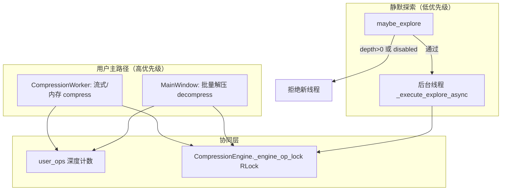
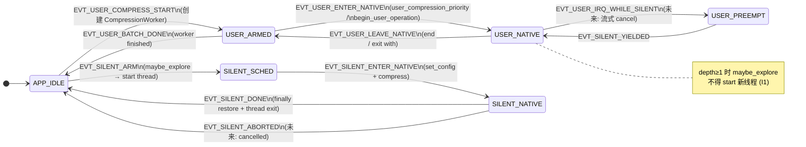

# 静默探索 — 用户中断协同设计

> **状态**：与实现对齐（2026-05）  
> **范围**：`SilentExplorer` 与 GUI **压缩 / 解压** 主路径的优先级、配置现场保护、持久化开关  
> **相关**：[`algorithm_decision_engine_design.md`](./algorithm_decision_engine_design.md) §8 静默采样策略；[`gui-crash-retrospective-zh.md`](../reports/gui-crash-retrospective-zh.md) §2.5 / §2.6  

---

## 1. 问题陈述

静默探索在**后台线程**中执行「额外一次」压缩以采集 `is_exploration=True` 样本。用户触发 **压缩**（`CompressionWorker`）或 **解压**（主窗口同步路径）的时刻**不可预测**，若与静默线程并发：

1. **全局算法配置**（`CompressionEngine._config`）被两处交替 `set_config` / 读取，可能出现半更新状态进 native，行为未定义。  
2. **新起**探索线程与用户操作重叠，放大上述风险并浪费算力。  

设计目标类比硬件中的 **中断优先级**：**用户主路径始终高于静默探索**；静默侧在「中断有效」期间不得抢占关键区，并尽量保护其自身的 `set_config → compress → restore` **现场**（通过串行化与「禁止新起」实现）。

---

## 2. 设计目标与非目标

| 目标 | 说明 |
|------|------|
| **G1** | 用户压缩 / 解压进行期间：**不新起**静默探索线程。 |
| **G2** | 任意时刻，依赖 `CompressionEngine` 全局配置的读写与 native 压/解压入口 **串行化**，避免配置撕裂。 |
| **G3** | 用户可通过 **高级 → 算法配置** 持久化关闭/开启静默探索；默认 **关**。 |
| **G4** | 开发/CI 可用环境变量强制开启，无需改 JSON。 |

| 非目标 | 说明 |
|--------|------|
| **NG1** | 不保证「已在跑的」探索线程被内核级中止；仅禁止**新起**并在进入 native 前二次检查。 |
| **NG2** | 不替代 C++ 内部线程安全审计；Python 层协同为**降低**竞态概率。 |

---

## 3. 机制总览



### 3.1 用户操作深度（类「中断屏蔽」）

- **类型**：进程内计数器 + 互斥锁（`SilentExplorer._user_ops_depth` / `_user_ops_lock`）。  
- **语义**：  
  - `begin_user_operation()`：`depth += 1`  
  - `end_user_operation()`：`depth = max(0, depth-1)`（支持嵌套，如未来子路径扩展）  
  - `user_operations_active()`：`depth > 0`  
- **`maybe_explore`**：若 `user_operations_active()`，直接返回 `False`（不 `start` 新线程）。  
- **`_execute_explore_async`**：线程入口若已处于用户关键区，**立即返回**（避免在「本应被中断」的窗口内改配置）。  
- **上下文管理器**：`with SilentExplorer.user_compression_priority():` 包裹 native **压缩**调用，保证 `with` 在 `maybe_explore` **之前**结束，主任务结束后仍可探索。

### 3.2 引擎全局配置锁（保护静默 `set_config` 现场）

- **类型**：`CompressionEngine._engine_op_lock`（`threading.RLock`）。  
- **覆盖**：`get_config` / `set_config` / `snapshot_*` / 流式阈值读写，以及 `compress` / `decompress` / `smart_*` / `pipeline_*` 等依赖 `_config` 的路径。  
- **与静默线程关系**：探索线程内 `get_config → set_config(explore) → compress → finally set_config(restore)` 整体与其它路径 **互斥**，避免「读一半写一半」。

### 3.3 默认关闭 + 持久化开关

- **配置**：`webcompress_settings.json` 中 `ade.silent_explore_enabled`（布尔，默认 `false`）。  
- **UI**：`AlgorithmConfigDialog` 顶部，**与主窗口流式「跟随全局」/ MinMatch「Auto」同款**的 `_streaming_follow_toggle_button`（☐/☑ 扁平样式，与工具栏「全选」视觉一致）。  
- **应用**：「应用」时写入 JSON，并 `SilentExplorer.get().set_enabled(...)`。  
- **恢复默认**：「恢复默认」将开关同步为 `get_defaults()["ade"]["silent_explore_enabled"]`（即 `false`）。

### 3.4 环境变量（开发强制开）

- **`WEBCOMPRESS_SILENT_EXPLORE=1|true|yes`**：在 `SilentExplorer` 初始化及 `apply_enabled_from_settings` 中，**覆盖**读盘结果为「开」，便于本地调试；正式发布包可不设。

---

## 4. 集成点（代码地图）

| 位置 | 行为 |
|------|------|
| `src/gui/ade/explorer.py` | `user_ops` API；`maybe_explore` / `_execute_explore_async` 门禁；`get_stats()["enabled"]`；`set_enabled` / `apply_enabled_from_settings` |
| `src/gui/ui/worker.py` | 流式 `smart_compress_file`、内存 `smart_compress`：`with SilentExplorer.user_compression_priority():` |
| `src/gui/ui/main_window.py` | `_on_decompress`：整批 `begin_user_operation` … `finally end_user_operation`；`AlgorithmConfigDialog` 开关与说明文案 |
| `src/gui/engine/compressor.py` | `_engine_op_lock` 与 `_get_config_unlocked` 等（全局配置 + native 串行） |
| `src/gui/config/settings.py` | `DEFAULTS["ade"]`、`get_silent_explore_enabled`、`save_config` 合并 |

---

## 5. 时序说明（主压缩 → 静默探索）

1. Worker 进入内存/流式压缩：`with user_compression_priority():` → `depth=1`。  
2. 执行 `smart_compress` / `smart_compress_file`（持引擎锁）。  
3. 退出 `with` → `depth=0`。  
4. 成功路径调用 `maybe_explore`：此时 **无**用户深度阻塞，若 `ade.silent_explore_enabled` 为真且策略命中，可 `start` 后台线程。  

若用户在步骤 4 同时触发解压：解压路径 `begin_user_operation` 使 `depth≥1`，则 `maybe_explore` 返回 `False`，**不新起**探索；解压结束后 `end_user_operation`。

---

## 6. 不变量（实现应维持）

1. **I1**：`user_operations_active()` 为真时，`maybe_explore` **不得** `threading.Thread(...).start()`。  
2. **I2**：任意 `CompressionEngine.set_config` 与依赖 `_config` 的 native 压/解压，须在 **`_engine_op_lock`** 保护下进行（含重入）。  
3. **I3**：默认安装 `silent_explore_enabled == false`，除非用户显式打开或设置环境变量。  

---

## 7. 维护记录

| 日期 | 变更 |
|------|------|
| 2026-05-13 | 初版：用户深度、`user_compression_priority`、解压批处理包裹、算法配置 UI 开关、`ade.*` 配置项、与 `compressor` RLock 协同说明 |
| 2026-05-15 | §8–§12：主循环监督器状态机、中断模块（IM）状态机、联合事件表、监督伪代码、演进路线（流式协作取消） |

---

## 8. 术语

| 符号 | 含义 |
|------|------|
| **监督器（Supervisor）** | 单进程 GUI 内对「用户任务 vs 静默探索」的编排逻辑；不替代 Qt 事件循环，而是在其之上约定状态。 |
| **中断模块（IM, Interrupt Module）** | `SilentExplorer` 提供的 `user_ops` 深度 +（可选）探索取消门闩 + 与 `CompressionEngine._engine_op_lock` 的协同契约。 |
| **用户任务** | 用户显式触发的压缩（`CompressionWorker`）、解压（`_on_decompress`）、算法对比、热力图等需 native 引擎的路径。 |
| **静默任务** | `maybe_explore` 通过后由后台线程执行的额外 `compress`（训练样本 `is_exploration=True`）。 |
| **IRQ 有效** | `user_operations_active()` 为真，等价于「用户中断线被拉高」：禁止**新起**静默线程。 |
| **引擎关键区** | 持有 `_engine_op_lock` 且可能调用 native 压/解压 / `set_config` 的代码段。 |

---

## 9. 主循环监督器状态机

监督器描述 **WebCompress 进程内**与压缩引擎相关的编排状态。Qt `QApplication` 事件循环始终运行；下表状态指 **引擎占用语义**，而非 UI 线程阻塞与否。

### 9.1 状态一览

| 状态 ID | 名称 | 含义 |
|---------|------|------|
| **S0** | `APP_IDLE` | 无用户 Worker 跑批压缩；无静默 native 占用（允许 `maybe_explore` 调度）。 |
| **S1** | `USER_ARMED` | 用户已点「开始压缩」或等价入口，任务队列已建立，Worker 尚未进入 native。 |
| **S2** | `USER_NATIVE` | 至少一处 `user_ops_depth > 0` 或整批解压 `begin_user_operation` 仍有效；用户路径占用引擎语义。 |
| **S3** | `SILENT_SCHED` | 主压缩刚结束，`maybe_explore` 已 `Thread.start`，探索线程尚未进入 `set_config`。 |
| **S4** | `SILENT_NATIVE` | 探索线程在 `set_config → compress → restore` 中（持引擎锁期间与用户路径互斥）。 |
| **S5** | `USER_PREEMPT` | （目标态，见 §12）用户 IRQ 有效且已向运行中的探索发出协作取消，等待静默让出。 |

**当前实现覆盖**：S0–S4；S5 未实现（NG1：不保证停已在跑的探索）。

### 9.2 监督器状态图



### 9.3 监督器事件与代码映射

| 事件 | 典型触发 | 代码位置 |
|------|----------|----------|
| `EVT_USER_COMPRESS_START` | 工具栏「开始压缩」 | `MainWindow._on_compress` → `CompressionWorker.start()` |
| `EVT_USER_ENTER_NATIVE` | 单次 `smart_compress` / `smart_compress_file` | `worker.py`：`with user_compression_priority()` |
| `EVT_USER_LEAVE_NATIVE` | 退出 `with` | 同上 `finally` → `end_user_operation` |
| `EVT_USER_DECOMPRESS_BATCH` | 批量解压整段 | `main_window._on_decompress`：`begin` … `finally end` |
| `EVT_USER_BATCH_DONE` | Worker `finished` | `_on_compression_finished` |
| `EVT_SILENT_ARM` | 主路径压缩成功且策略命中 | `maybe_explore` → `threading.Thread.start` |
| `EVT_SILENT_ENTER_NATIVE` | 探索线程通过门禁 | `_execute_explore_async` 内 `set_config` + `compress` |
| `EVT_SILENT_DONE` | 探索结束 | `_execute_explore_async` `finally` |

### 9.4 单文件主压缩 + 静默（监督器时序）

与 §5 对齐，用监督器状态标注：

```
[S0 APP_IDLE]
  → 用户点压缩 → [S1 USER_ARMED]
  → Worker 进入 with user_compression_priority → [S2 USER_NATIVE]
  → smart_compress* 完成，退出 with → [S1]（若仍有队列则保持 ARMED，否则趋近 IDLE）
  → maybe_explore（depth==0 且 enabled）→ [S3 SILENT_SCHED]
  → 探索线程 set_config+compress → [S4 SILENT_NATIVE]（与用户路径互斥，因引擎锁）
  → 探索 finally → [S0 APP_IDLE]
```

若用户在 [S3]/[S4] 触发解压：`begin_user_operation` → IRQ 有效 → **不得**再 `start` 新探索；已在 [S4] 的线程可能仍跑完当前 `compress()`（NG1）。

---

## 10. 中断模块（IM）状态机

中断模块是 **横切组件**：不拥有 Worker 线程，只维护 **IRQ 线**（`user_ops`）与 **引擎互斥**契约，供监督器与各子系统在边界处查询/登记。

### 10.1 IM 内部状态

| 状态 ID | 名称 | 条件 |
|---------|------|------|
| **I0** | `MASK_OFF` | `user_ops_depth == 0`，允许 `maybe_explore` 发起新静默线程（仍受 `enabled`、预算、并发上限约束）。 |
| **I1** | `MASK_ON` | `user_ops_depth > 0`，静默 **调度被屏蔽**（I1）。 |
| **I2** | `ENGINE_HELD` | 某线程持有 `CompressionEngine._engine_op_lock` 并执行 native / `set_config`（可与 I0/I1 叠加）。 |

`I2` 由 `CompressionEngine` 实现；IM 通过 **约定** 要求：凡改全局配置或压/解压必须经引擎 API（内部持锁），探索线程与用户线程 **串行** 进入 `I2`，避免配置撕裂。

### 10.2 IM 状态图

```mermaid
stateDiagram-v2
    direction TB
    [*] --> MASK_OFF

    MASK_OFF --> MASK_ON: IM_RAISE\nbegin_user_operation()\n或 user_compression_priority 进入
    MASK_ON --> MASK_OFF: IM_LOWER\nend_user_operation()\ndepth 归零

    state ENGINE_HELD <<join>>
    MASK_OFF --> ENGINE_HELD: ACQUIRE_ENGINE\ncompress / set_config / smart_*
    MASK_ON --> ENGINE_HELD: ACQUIRE_ENGINE
    ENGINE_HELD --> MASK_OFF: RELEASE_ENGINE\n(锁释放; 若 depth仍>0 则回 MASK_ON)
    ENGINE_HELD --> MASK_ON: RELEASE_ENGINE

    note right of MASK_ON
      maybe_explore → 拒绝 start
      _execute_explore_async 入口 → 立即 return
    end note
```



### 10.3 IM 原语（API）

| 原语 | 效果 | 调用方 |
|------|------|--------|
| `IM_RAISE` | `depth += 1`，进入 `MASK_ON` | `begin_user_operation`、`user_compression_priority` 入口 |
| `IM_LOWER` | `depth = max(0, depth-1)` | `end_user_operation`、`user_compression_priority` 出口 |
| `IM_QUERY` | 返回 `depth > 0` | `maybe_explore`、`_execute_explore_async` 入口 |
| `ACQUIRE_ENGINE` | 获取 `_engine_op_lock` | `CompressionEngine` 各入口（对用户/静默透明） |
| `RELEASE_ENGINE` | 释放锁 | 同上 |

**嵌套**：解压批处理包一整段 `begin`/`end`；单次压缩用 `with user_compression_priority()`；二者可嵌套，`depth` 计数保证 IRQ 直到最外层 `end` 才解除。

### 10.4 IM 与静默探索的门禁点

```text
maybe_explore():
  if not enabled: return
  if IM_QUERY(): return          # MASK_ON → 不 EVT_SILENT_ARM
  … AC-UCB 策略 …
  Thread.start(_execute_explore_async)

_execute_explore_async():
  if IM_QUERY(): return          # 竞态：start 后用户才 RAISE
  ACQUIRE_ENGINE (via set_config / compress)
  … compress …
  RELEASE_ENGINE (finally restore config)
```

---

## 11. 监督器 × 中断模块联合转移表

行：监督器状态；列：事件；单元：下一监督器状态 + IM 副作用。

| 当前 \\ 事件 | `IM_RAISE`（用户进 native / 解压批） | `IM_LOWER` | `EVT_SILENT_ARM` | `EVT_SILENT_DONE` |
|--------------|--------------------------------------|------------|------------------|-------------------|
| **S0** | → S2，`MASK_ON` | — | → S3（仅 `MASK_OFF`） | — |
| **S1** | → S2 | — | 拒绝（应在 S2 前不应 explore） | — |
| **S2** | 保持 S2，`depth++` | `depth--`；若 0 且 Worker 未完 → S1 | **拒绝**（I1） | — |
| **S3** | → S2（用户抢占调度） | — | — | → S0 |
| **S4** | 保持 S4；用户阻塞在锁上或排队 | — | **拒绝** 新线程 | → S0 |

**引擎锁与 IRQ 正交**：用户可在 `MASK_ON` 下持锁压缩；静默在 `MASK_OFF` 下持锁探索；二者不会同时持锁，但 **静默可能在 MASK_OFF 时长时间占锁**，用户 UI 需容忍等待（或未来 S5 取消）。

---

## 12. 监督伪代码（含中断模块）

下列为 **规范级** 伪代码，便于实现与评审对齐；与 `explorer.py` / `worker.py` / `main_window.py` 一一对应。

```python
# ─── 中断模块（IM）────────────────────────────────────────
class InterruptModule:
    depth = 0
    lock = Mutex()

    def raise_irq(self):
        with lock: depth += 1

    def lower_irq(self):
        with lock: depth = max(0, depth - 1)

    def irq_active(self) -> bool:
        with lock: return depth > 0

    @contextmanager
    def user_priority(self):
        self.raise_irq()
        try:
            yield
        finally:
            self.lower_irq()


# ─── 监督器：用户压缩 Worker（单文件简化）──────────────────
def compression_worker_main_loop(tasks):
  for record in tasks:
    # S1 USER_ARMED — 读盘、ADE decide、set_config(AUTO) 等，通常不在 IM 下
    prepare_record(record)

    with IM.user_priority():                    # → S2 USER_NATIVE
      result = Engine.smart_compress(...)       # ACQUIRE_ENGINE 在引擎内部

    # 退出 with → IM_LOWER；若 depth 仍>0（例如外层批解压），勿 explore
  finalize_batch()                              # → S0

  if not IM.irq_active() and Explorer.enabled:
    if Explorer.maybe_explore(record, algo):    # → S3，可能 → S4
      pass


# ─── 监督器：批量解压（整批 IRQ）──────────────────────────
def decompress_batch(tasks):
  IM.raise_irq()                                # 整批 MASK_ON → S2
  try:
    for task in tasks:
      with IM.user_priority():                  # 嵌套 depth≥2 亦可
        Engine.smart_decompress(...)
  finally:
    IM.lower_irq()


# ─── 静默探索线程 ───────────────────────────────────────
def silent_explore_async(record, algo, params):
  if IM.irq_active():
    return
  original = Engine.get_config()
  try:
    Engine.set_config(merge(original, params))
    Engine.compress(record.raw_data, algo)      # 持 ENGINE_HELD
  finally:
    Engine.set_config(original)
```

**不变量（监督器 + IM）**

- **SI1**：`maybe_explore` 仅在 `not IM.irq_active()` 时 `Thread.start`。  
- **SI2**：`silent_explore_async` 入口再次 `IM.irq_active()` 检查（TOCTOU 窗口）。  
- **SI3**：`maybe_explore` 永远在用户 `user_priority` **之外**调用（主压缩 `with` 已结束）。  
- **SI4**：所有 `set_config` / native 压解压经 `CompressionEngine`，保证 `ACQUIRE_ENGINE` 互斥。

---

## 13. 演进路线：流式协作取消（S5 / `USER_PREEMPT`）

当前 NG1 下，[S4] 无法被 IRQ **截断**。若产品需要「用户一点击压缩，正在跑的探索尽快让出」：

| 阶段 | 行为 | 监督器 |
|------|------|--------|
| **P0（现状）** | IRQ 屏蔽新静默；引擎锁串行 | S0–S4 |
| **P1** | 探索改 `pipeline_compress_file` + per-job cancel；`IM_RAISE` 经 **SIM** 拉取消 | 进入 **S5**，探索 `EVT_SILENT_ABORTED` → S0 |
| **P2** | `CompressionWorker.run` 最外层 `begin`…`end`，覆盖 AUTO/decide 阶段 | 拉长 MASK_ON，彻底避免 S1 窗口竞态 |

**流式现场与 SIM 完整规格**（L1/L2 政务 checkpoint、**不做** L3 编解码续压）：见 **[`streaming-interrupt-checkpoint-design.md`](./streaming-interrupt-checkpoint-design.md)**。

**不做（与上文档一致）**：半截 WCX **续压**；探索取消后仅保存 manifest、**整次重跑** 探索。

---

## 14. 与 §6 不变量的关系

| 原不变量 | 状态机表述 |
|----------|------------|
| I1 | `MASK_ON` 时禁止 `EVT_SILENT_ARM`（S2/S5 不得 start） |
| I2 | 进入 `SILENT_NATIVE` / `USER_NATIVE` 必经 `ENGINE_HELD` |
| I3 | `enabled` 为配置门闩，与 S0 调度无关；默认 false |
