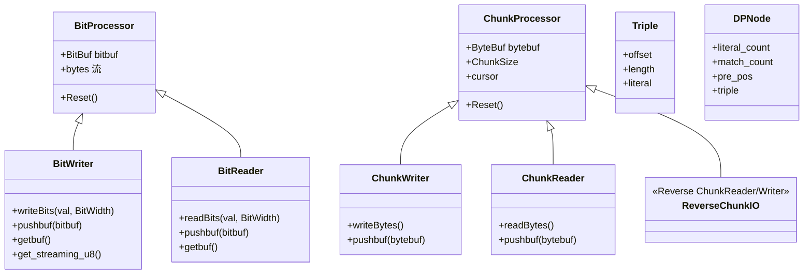
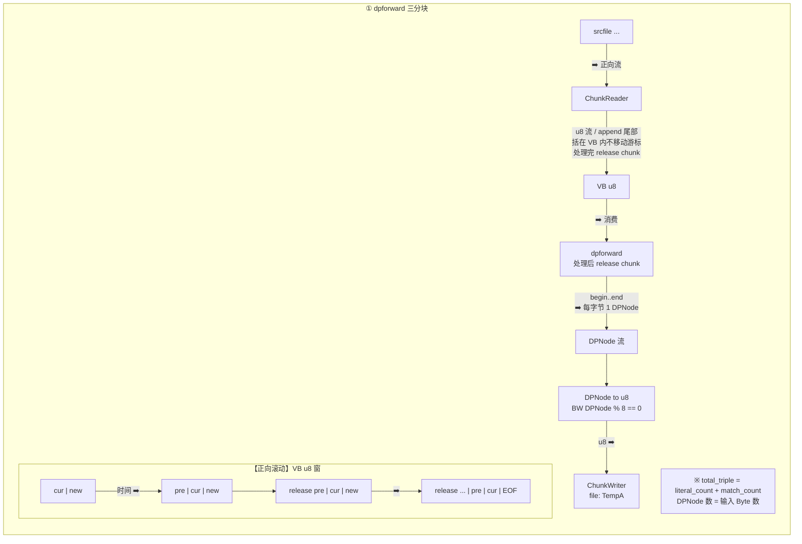
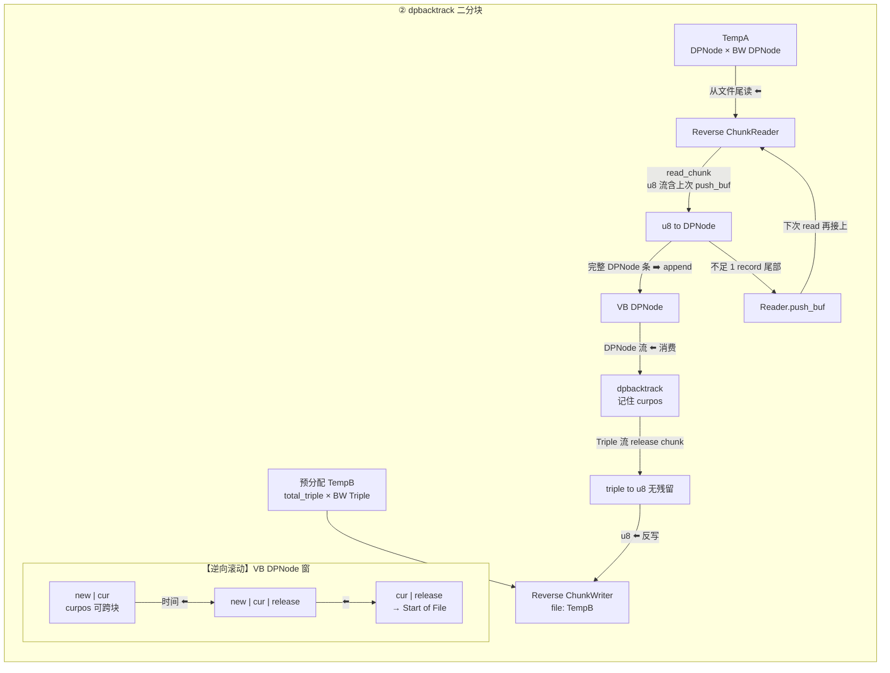
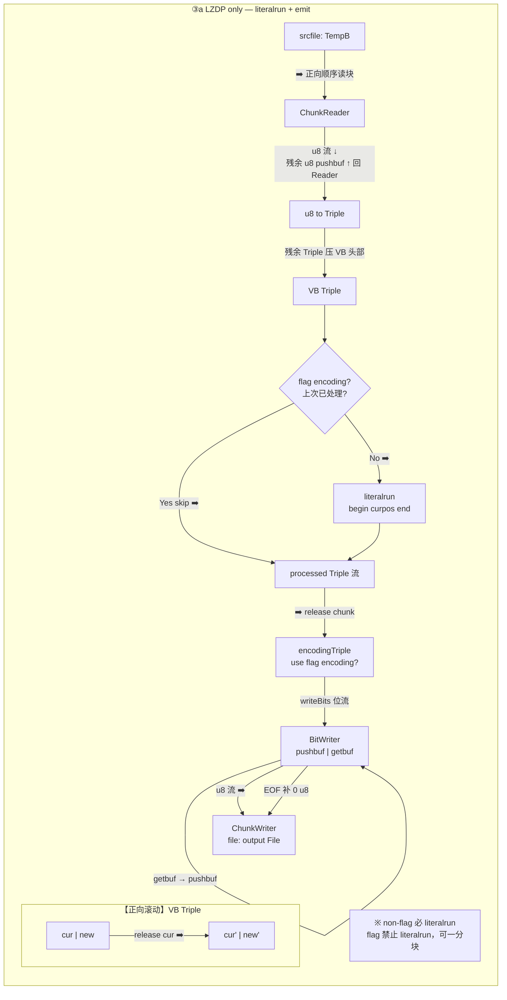
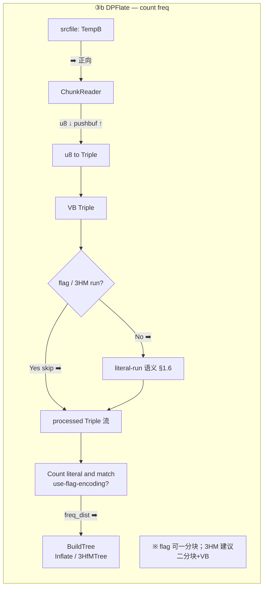
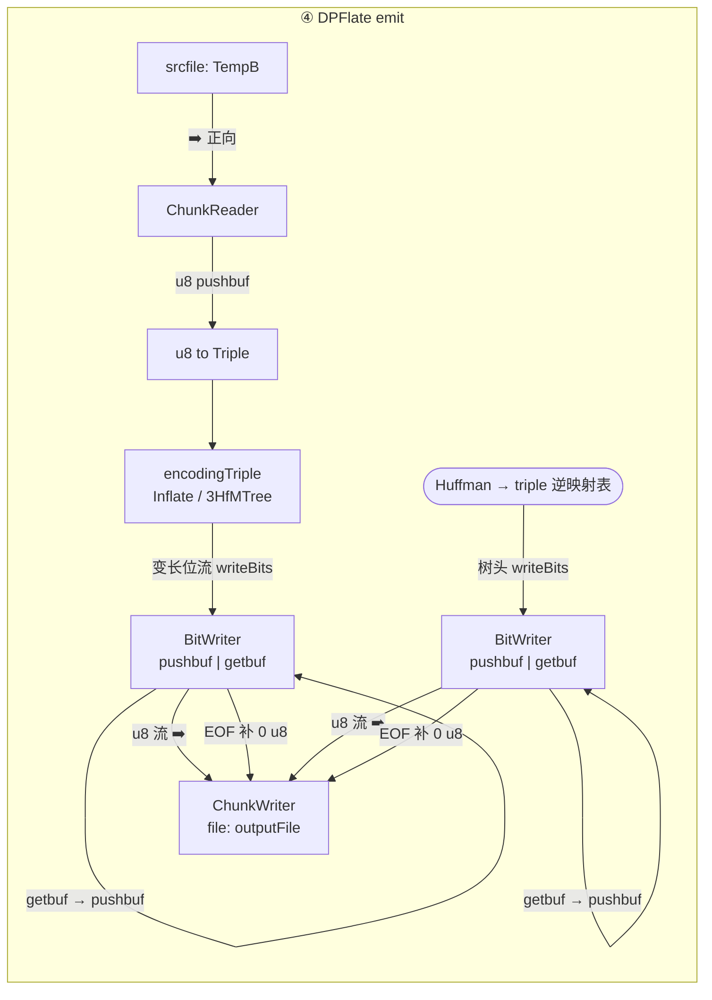
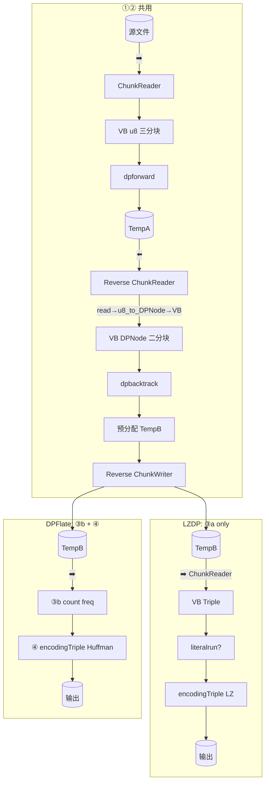
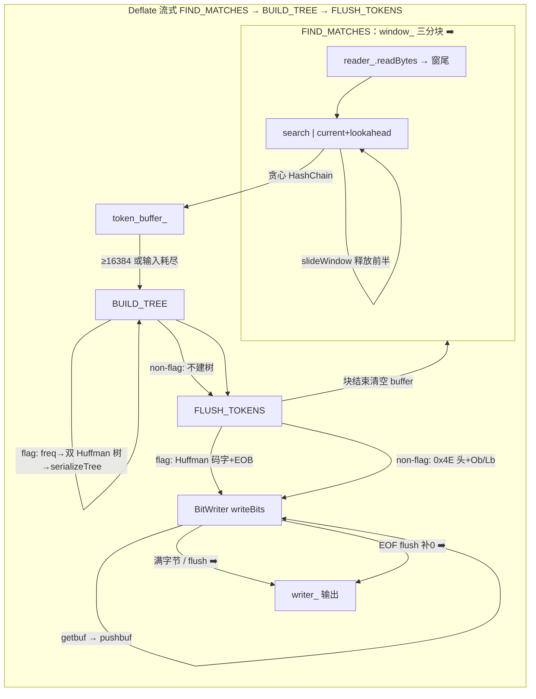
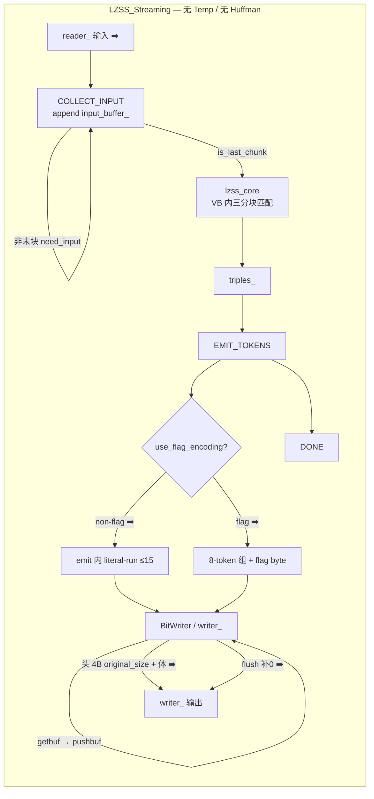

# 流式压缩设计文档

---

# 一、设计砖块

本章将流式压缩系统的各个设计概念解耦为独立"砖块"。每个砖块描述一个独立的设计决策与接口，不耦合到具体算法。后续算法章节引用这些砖块，说明各算法使用了哪些砖块及如何组合。

**第一章砖块索引（按依赖顺序）**：


| 节          | 砖块                                      |
| ---------- | --------------------------------------- |
| §0.1       | 硬约束（五类边界、parity）                        |
| §1.1–§1.4  | 三分块、二分块、推进式 DP、状态机                      |
| §1.5–§1.6  | LZ 结果编码（摘要）、熵编码策略 FLATE / 3HfMTree      |
| §1.7–§1.10 | 内存管理、滑动窗解压、相对距离、解压状态机                   |
| §1.11      | 可配置参数 Config                            |
| §1.12      | 算法族与编码分层                                |
| §1.13      | Triple（LZ 统一 IR）                        |
| §1.14      | 匹配引擎 + TopMatch                         |
| §1.15      | LiteralRun 变换                           |
| §1.16      | LZ 结果编码管线（`literalrun` + `writetriple`） |
| §1.17      | I/O 砖块（BitProcessor、ChunkProcessor）     |
| §1.18      | VirtualBuffer 与滑动分块                     |
| §1.19      | DPNode 与 Temp 文件物理格式                    |
| §1.20      | 流式分块管线总览（以 DPFlate / LZDP 为例）           |
| §1.21      | 解压 I/O 策略（全文件读入 + 明文分块写出）               |


参考实现：`src/algorithm_new/include/LZencoding.hpp`、`Models.hpp`、`LZDP.hpp`、`Streaming.hpp`、`BitProcessor.hpp`。

手绘流程图（§1.20 颗粒度基准）：仓库内 `assets/..._b749fb0f....png` 及同目录阶段③④图；文字+Mermaid 精化版见 [`流程图二.md`](./流程图二.md)（框图逐字对齐）、[`流程图三.md`](./流程图三.md)（流向 / pushbuf 标注 + `VB` + ③a/③b 拆分）。**§1.20 下图 = 二者综合体**；阶段③读 **TempB**（非手稿误标的 TempA）。

---

## 0.1 本轮修订后的硬约束

本设计的验收目标不是“流式可以和内存版有压缩率差异”，而是：**同算法、同参数、同编码策略下，流式路径应尽量复现内存路径的 token 序与编码语义；若输出字节不一致，至少必须解释为明确的格式差异而不是块边界 bug。**

### 压缩 vs 解压：I/O 不对称（全项目硬约束）


| 方向       | 压缩侧                                | 解压侧                                    |
| -------- | ---------------------------------- | -------------------------------------- |
| **输入**   | 明文 **流式** 分块读入（§1.1 三分块、§1.20 等）   | **整个压缩文件一次性读入内存** 后再解码                 |
| **输出**   | 压缩比特流流式写出（BitWriter / ChunkWriter） | 解码得到的 **明文按块流式写出**；**不是**把整段明文攒满再一次性写盘 |
| **分块目的** | 控制匹配窗、Temp 文件、峰值内存                 | 降低 **输出侧** 峰值缓冲；**不**对压缩比特流做「分块解压」     |


**解压明文写出块大小**（Pipeline / `writer_` 每次刷新的 span）必须满足：

```
plaintext_flush_chunk_bytes  >  max_lz_search_window
```

其中 `max_lz_search_window` 取该次任务配置中的最大回退距离上界，例如：

- LZSS / LZDP：`config_.window.search_size`（或头字段 `offset_bits` 推出的 `(1<<Ob)-1`，与压缩侧一致）
- Deflate / Inflate：`min(32768, distance 上界)`（RFC1951 32KB 窗）
- DPFlate / Inflate3HM：同上或按头字段 `offset_bits` / 压缩参数

**原因**：LZ77 式 match copy 要引用「已解码明文」中最多 `search_size`（或 32KB）字节之前的数据。若明文写出块 **≤ search window**，块边界 flush 后容易在实现上丢掉仍被下一 token 引用的历史，或被迫在块边界做错误截断。块长 **严格大于** search window，并配合解码器内 **至少保留 `max_lz_search_window` 历史**（§1.8 环形窗或 §1.9 等价策略），才能保证 **分块写出 ≠ 分块解码语义**。

详见 **§1.21**。与 §0.1 下列「输入边界」行 **仅适用于压缩**；解压输入边界为 **整文件在内存**。

本轮反思后，流式模块需要补齐 4 类边界（**压缩路径**）：


| 边界          | 处理对象                                        | 正确设计                                                                                                                                                                                                                          |
| ----------- | ------------------------------------------- | ----------------------------------------------------------------------------------------------------------------------------------------------------------------------------------------------------------------------------- |
| 输入边界        | 原始 `uint8_t`                                | 三分块：保留 search window，追加 lookahead，末块解除 lookahead 阻塞                                                                                                                                                                           |
| 临时记录边界      | `DpLink` / `Triple` 等固定记录                   | **临时写入必须字节对齐**；跨 chunk 读取时保留不足一条记录的尾部字节接力                                                                                                                                                                                     |
| 编码 bit 边界   | LZDP bit-packed / FLATE / 3HfMTree          | 编码写入使用 `BitWriter`，未满 8 bit 的 pending bits 必须跨输出缓冲保留，最终 `flush()` 时补 0                                                                                                                                                        |
| 语义边界        | non-flag literal-run、3HfM literal-run、EOB   | literal-run 不能是函数局部临时变量；遇到输出缓冲满 / chunk 结束时必须作为状态保留，直到 match 或最终结束时 flush                                                                                                                                                     |
| Pipeline 边界 | `is_last_chunk` 传给 `AlgorithmBase::process` | `processor::StreamProcessor` 在末次 `push(..., is_last=true)` 处理该 chunk 的 plaintext 时必须 `final_flag = is_last`（勿要求 `in_chunks_.empty()`），否则末块会被当成非末块只处理 `size - LOOKAHEAD` 字节，流式 DP/编码与 `DPFlateCompressor::compress_to_end` 不一致 |


因此，流式模块必须区分两种写入：


| 写入类型 | 用途                              | 对齐规则                 | 跨块残留                                |
| ---- | ------------------------------- | -------------------- | ----------------------------------- |
| 临时写入 | temp A 的 DP 链节、temp B 的 token 流 | 固定 record size，按字节写入 | 只可能剩不足一个 record 的字节，交给下一次读取         |
| 编码写入 | 最终压缩 bitstream、Huffman 编码输出     | 任意 bit 宽             | `BitWriter` pending bits 是状态机现场，不能丢 |


当前代码中 `SpillBitStream.hpp` 的 bit-packed temp record 能减少临时文件体积，但它把“临时写入”也变成了 bit 边界问题，增加了随机读取和跨块残留复杂度。目标修正是：temp A / temp B 改为固定字节记录；最终压缩输出才使用 bit-packed 编码。

## 1.1 三分块设计（匹配阶段）

### 适用场景

**所有需要 LZ77 匹配的算法**在匹配阶段都需要三分块。无论是 DP 最优匹配还是贪心最长匹配，都需要在 search window 中查找匹配，且需要 lookahead 来确定完整匹配长度。


| 算法      | 匹配方式    | 三分块形态                                        |
| ------- | ------- | -------------------------------------------- |
| LZDP    | DP 最优匹配 | `input_buffer_` 可变长缓冲区                       |
| DPFlate | DP 最优匹配 | `input_buffer_` 可变长缓冲区                       |
| Deflate | 贪心最长匹配  | `window_` 滑动窗口                               |
| LZSS    | 贪心最长匹配  | **目标**：`input_buffer_` 三分块；**当前 `LZSS_Streaming`**：末块前只累积、末块一次 `lzss_core`（§2.4） |


### 概念模型

3 个分块各司其职，构成一个滑动窗口：


| 分块            | 角色                  | 用途                                 |
| ------------- | ------------------- | ---------------------------------- |
| prev_chunk    | 历史窗口（search window） | 为 current_chunk 开头提供已处理字节作为字典      |
| current_chunk | 正在处理                | 指针从位置 0 推进到末尾                      |
| new_chunk     | 前瞻窗口（lookahead）     | 为 current_chunk 末尾提供未处理字节，确定完整匹配长度 |


**为什么需要 3 个分块？**

- **prev（search window）**：位置 `i` 需要向前搜索已处理字节作为字典——没有 prev 会导致块开头匹配断档。
- **new（lookahead）**：位置 `i` 在块末尾时，匹配可能延伸到块外——没有 lookahead 无法确定完整匹配长度（贪心）或评估未来代价（DP）。

### 实现形态一：`input_buffer`_ 可变长缓冲区

**适用算法**：LZDP、DPFlate、LZSS（`LZSS_Streaming`）

```
input_buffer_ 结构:
[0 ...... keep_start_idx ...... current_i_ ...... current_i_+LOOKAHEAD ...... size())
 ├─ search window ─┤├──── 当前处理 ────┤├── lookahead ──┤├── 新读入 ──┤
    (prev 角色)        (current 角色)     (new 角色)
```


| 变量                | 含义                                         |
| ----------------- | ------------------------------------------ |
| `input_buffer_`   | 可变长缓冲区，包含 search window + 当前数据 + lookahead |
| `window_abs_pos_` | 当前窗口中第一个字节在原始文件中的绝对位置                      |
| `current_i_`      | 当前处理指针在 `input_buffer_` 中的偏移               |
| `SEARCH_SIZE`     | 最大搜索距离                                     |
| `LOOKAHEAD_SIZE`  | 最大前瞻距离                                     |


**滑动逻辑**：尾部追加新数据 → 处理 `processable = size - LOOKAHEAD - current_i_` 字节 → 头部释放 `SEARCH_SIZE` 之前的字节（`erase`）。

### 实现形态二：`window_` 滑动窗口

**适用算法**：Deflate

```
window_ 结构（WINDOW_SIZE = 2 × SLIDE_SIZE）:
[0 ............. SLIDE_SIZE ............. 2×SLIDE_SIZE)
 ├─ search window ─┤├── current + lookahead ──┤
     (prev 角色)          (current + new 角色)
                          ↑
                       cursor_ 指向当前处理位置
```


| 变量           | 含义                         |
| ------------ | -------------------------- |
| `window_`    | 定长 `2×SLIDE_SIZE` 缓冲区      |
| `cursor_`    | 当前处理位置                     |
| `lookahead_` | 未处理字节数                     |
| `SLIDE_SIZE` | 滑动窗口半长（= search window 大小） |


**滑动逻辑**：`cursor_ >= SLIDE_SIZE` 时触发 `slideWindow()`：`memcpy` 后半→前半，`cursor_ -= SLIDE_SIZE`，哈希链指针同步偏移。

---

### 边界处理

三分块的核心难点在于**块边界处如何保持匹配连续性**。以下按三种实现形态分别说明。

#### 形态一（`input_buffer_`）边界处理

```
块 N 处理完毕时:
  input_buffer_ = [prev_N | current_N | new_N | 新读入数据]
                                   ↓
块 N+1 开始时:
  keep_start = max(0, next_abs_pos - SEARCH_SIZE)
  input_buffer_.erase(begin → keep_start)   ← 释放 SEARCH_SIZE 之前的字节
  window_abs_pos_ += keep_start              ← 更新绝对位置
  current_i_ -= keep_start                   ← 调整处理指针
  reseedHashChainPrefix(input_buffer_.size()) ← 重建 search window 的哈希链
```


| 边界场景                  | 行为                                                                                             |
| --------------------- | ---------------------------------------------------------------------------------------------- |
| **首块**                | `window_abs_pos_ = 0`，search window 为空。`current_i_` 从 0 开始，仅当前块数据可用作字典                         |
| **中间块**               | 保留上一块末尾 `SEARCH_SIZE` 字节作为 search window，`reseedHashChainPrefix` 重建哈希链                         |
| **末块**                | `is_last_chunk = true`，`LOOKAHEAD_SIZE` 约束解除，`processable = input_buffer_.size() - current_i_` |
| **小文件（< chunk_size）** | 单块处理，search window 和 lookahead 都在同一块内，退化为全文件内存语义                                               |
| **文件末尾不足 LOOKAHEAD**  | `processable` 计算中 `LOOKAHEAD_SIZE` 自动缩减为剩余字节数，不阻塞                                              |


**哈希链跨块维护**：

```cpp
// 每块处理完毕后，search window 保留在 input_buffer_ 头部
// 下一块开始时重建哈希链，确保 search window 内的位置可被匹配
auto reseedHashChainPrefix(size_t end_exclusive) -> void {
    std::fill(head_.begin(), head_.end(), UINT32_MAX);
    for (size_t i = 0; i + 2 < end_exclusive; ++i) {
        const size_t slot = hashBucket3(i);
        prev_buf_[i] = head_[slot];
        head_[slot] = static_cast<uint32_t>(i);
    }
}
```

#### 形态二（`window_`）边界处理

```
cursor_ >= SLIDE_SIZE 时触发 slideWindow():

  滑动前: [0 ......... SLIDE_SIZE ......... 2×SLIDE_SIZE)
           ├─ search window ─┤├── current + lookahead ──┤
                              ↑ cursor_
  滑动后: [0 ......... SLIDE_SIZE ......... 2×SLIDE_SIZE)
           ├─ search window ─┤├── current + lookahead ──┤
           ↑ cursor_ -= SLIDE_SIZE
```


| 边界场景    | 行为                                                                               |
| ------- | -------------------------------------------------------------------------------- |
| **首块**  | `fillWindow()` 从 reader 读入数据填充 `window_`，`cursor_ = SLIDE_SIZE`，search window 为空 |
| **中间块** | `slideWindow()` 将后半复制到前半，保留 `SLIDE_SIZE` 字节 search window，哈希链指针同步偏移              |
| **末块**  | `is_last_chunk = true`，`lookahead_` 耗尽后进入 BUILD_TREE                             |
| **小文件** | 单次 `fillWindow()` 即可覆盖全部数据，无需 `slideWindow()`                                    |


**哈希链跨块维护**：

```cpp
auto slideWindow() -> void {
    // 1. 移动窗口数据
    memcpy(window_.data(), window_.data() + SLIDE_SIZE, SLIDE_SIZE);
    cursor_ -= SLIDE_SIZE;
    lookahead_ += SLIDE_SIZE;  // 滑动后 lookahead 空间扩大

    // 2. 同步调整哈希链指针
    for (size_t i = 0; i < HASH_SIZE; ++i) {
        if (head_[i] != NULL_PTR) {
            head_[i] = (head_[i] >= SLIDE_SIZE) ? (head_[i] - SLIDE_SIZE) : NULL_PTR;
        }
    }
    for (size_t i = 0; i < SLIDE_SIZE; ++i) {
        if (prev_[i] != NULL_PTR) {
            prev_[i] = (prev_[i] >= SLIDE_SIZE) ? (prev_[i] - SLIDE_SIZE) : NULL_PTR;
        }
    }
}
```

---

### 中断信号与现场保存

三分块匹配阶段是**有状态的**——哈希链、search window、两块 DP frontier、temp 文件游标构成 L3 编解码现场。中断信号到来时，这些状态**不可安全冻结**。

#### 取消检查点位置

```
handleCollectInput 入口:
   ① 检查 cancel flag → 若拉高则设置 status.done=true 并返回
   ② 读入新数据
   ③ DP 推进循环（每 2048 次迭代检查一次 cancel flag）
   ④ 处理完毕 → 状态转移
```

```cpp
auto handleCollectInput(AlgorithmStatus& status, bool is_last_chunk) -> void {
    // ① 取消检查点
    if (g_cancel_callback && g_cancel_callback()) {
        status.done = true;
        return;
    }

    // ... 读入数据、DP 推进 ...

    // ② DP 循环内定期检查
    for (size_t i = 0; i < processable; ++i) {
        if ((i & 2047) == 0 && g_cancel_callback && g_cancel_callback()) {
            status.done = true;
            return;
        }
        // DP 推进 ...
    }
}
```

#### 可保存的现场（L2 管线政务）


| 字段              | 来源                             | 说明                                                                                  |
| --------------- | ------------------------------ | ----------------------------------------------------------------------------------- |
| `bytes_read`    | `window_abs_pos_ + current_i_` | 已读入的原始字节数                                                                           |
| `total_in_len_` | 末块确定后设置                        | 输入总长度                                                                               |
| `current_state` | `state_` 枚举                    | 当前状态机阶段（COLLECT_INPUT / BACKTRACK / EMIT）                                           |
| `config`_ 快照    | `*Config` 结构体（§1.11）           | `search_size`、`lookahead_size`、`use_flag_encoding`、`dp_top` 等；与构造参数 / Pipeline 入参一致 |


#### 不可保存的现场（L3 编解码）


| 组件                               | 原因                                   |
| -------------------------------- | ------------------------------------ |
| 两块 DP frontier（`cur` / `next`）   | 跨块推进的中间状态，序列化后无法保证与 temp 文件一致        |
| `prev_buf`_ / `head_` 哈希链        | 依赖 `input_buffer_` 的绝对索引，取消后重建成本等于重跑 |
| temp 文件 A / B 游标                 | 外存文件与内存状态耦合，版本化成本极高                  |
| record carry / literal-run carry | 与当前阶段和 temp 文件游标绑定，取消后统一整次重跑         |


#### 取消后策略

**整次重跑**（参考 `[streaming-interrupt-checkpoint-design.md](./streaming-interrupt-checkpoint-design.md)` §4）：

```
取消 → 写入 CheckpointManifest（L2）→ 删除 .part → 后续重跑整次 pipeline_compress_file
```

不尝试从半截状态续压（L3 非目标）。

---

## 1.2 二分块设计（临时记录 / 建树 / 回溯 / 发码阶段）

### 适用场景

Huffman 建树、DP 回溯和 token 发码阶段**不需要 LZ77 匹配**，因此不需要 search window 和 lookahead。但这不等于“块边界无状态”：只是不再维护字典窗口，仍必须维护 record 尾部、回溯游标、literal-run 和 bitbuffer。


| 阶段             | 目的                                    | 分块策略                   | 原因                                        |
| -------------- | ------------------------------------- | ---------------------- | ----------------------------------------- |
| **临时记录读取**     | 从 `uint8_t` 流恢复 `DpLink` / `Triple`   | **二分块 + carry buffer** | chunk 末尾可能不足一条固定记录                        |
| **DP 回溯**      | 根据 temp A 的 predecessor 链恢复最优 token 序 | **二分块 + 位置游标**         | `cur` 可能跨 chunk 跳转，必须按 record index 定位    |
| **Huffman 建树** | 统计 token 频率，构建 Huffman 树              | **二分块 + 语义状态**         | FLATE 近似无状态；3HfMTree 需要 literal-run carry |
| **发码**         | 将 token 序列转为最终 bitstream              | **二分块 + bitbuffer**    | 编码输出不是 8 bit 对齐，pending bits 必须接力         |


### 概念模型

```
二分块结构:
┌──────────────────┬──────────────────┐
│   current_chunk  │  output_buffer   │
│   (当前处理数据)   │  (编码输出)       │
└──────────────────┴──────────────────┘
```

### 临时记录格式（二分块的基础）

temp A / temp B 不是最终压缩格式，不追求极限 bit 压缩，优先保证可定位、可分块、可调试。推荐使用固定字节记录：

```cpp
struct TempTokenRecord {
    uint16_t length;  // 0 表示 literal；>0 表示 match length
    uint16_t offset;  // length==0 时保存 literal byte；length>0 时保存 match offset
};
```


| 记录                              | 写入阶段                           | 读取方式                         | 说明                                           |
| ------------------------------- | ------------------------------ | ---------------------------- | -------------------------------------------- |
| temp A `**DPNode` 定长字节**（§1.19） | `dpforward` 每处理一个输入绝对位置写一条     | `record_index = abs_pos` 随机读 | 含路径代价字段 + 本步 `Triple` 决策；**条数 = 输入字节数**      |
| temp B `**Triple` 定长字节**（§1.13） | `dpbacktrack` 每恢复一个 token 追加一条 | emit 阶段 **逆向** 读，恢复正向序       | 物理上等价 `TempTokenRecord`；逻辑 IR 为 §1.13 Triple |


> **迁移说明**：当前 `src/algorithm` 中 temp A 仍可能用精简 `TempTokenRecord`（仅 length/offset）或 bit-packed link；目标设计与 `algorithm_new` 手绘流程一致：**TempA = `BW(DPNode)` 整记录**，**TempB = `BW(Triple)` 整记录**，且 `BW(record) % 8 == 0`（§1.19）。

跨 chunk 读取时使用 record carry：

```cpp
record_bytes = sizeof(TempTokenRecord);
bytes = carry + reader.read(chunk_size);
usable = (bytes.size() / record_bytes) * record_bytes;
parse(bytes[0:usable]);
carry = bytes[usable:];  // 不足一条记录的尾巴，下次接上
```

临时记录禁止使用最终编码规则；否则 backtrack / emit 会同时面对 record 边界和 bit 边界，复杂度不必要地放大。

### DP 回溯（二分块 + 位置游标）

回溯不是简单“顺序读完整 temp 文件”。它从 `total_in_len` 开始，根据每个位置保存的 predecessor 决策跳转：

```cpp
cur = total_in_len;
while (cur > 0):
    link = read_temp_a_record(cur)
    write_temp_b_record(link)  // backtrack 顺序写入，token 方向为反序
    cur -= (link.length == 0 ? 1 : link.length)
```

关键约束：


| 约束                              | 说明                                           |
| ------------------------------- | -------------------------------------------- |
| `cur` 是绝对输入位置                   | 不能用当前 chunk 局部下标替代                           |
| temp A 必须可按 record index 定位     | 固定字节记录可以 `seek(record_index * record_bytes)` |
| temp B 写出的是反序 token             | 阶段② **Reverse ChunkWriter** 预分配反写；③ **ChunkReader** 正向读块，emit 按 **token 下标** `total_tokens-1-k` 寻址记录 |
| `total_tokens` 在 backtrack 阶段统计 | 预分配 TempB 与 emit 消费顺序均依赖 `total_tokens` |


### Huffman 建树（二分块）

FLATE 频率统计基本是无状态聚合：每个 token 独立转换为 literal/length symbol 与 distance symbol。

3HfMTree 不是完全无状态：non-flag 语义下 literal token 需要合并为 literal-run，只有遇到 match 或输入结束时才能 flush。这个 literal-run 必须跨 chunk 保存。

```
while (has_more_tokens):
    chunk = read_token_chunk()
    tokens = token_carry + parse_complete_records(chunk)
    token_carry = incomplete_record_tail(chunk)
    for token in tokens:
        if FLATE:
            count_flate_symbol(token)
        else if 3HfMTree:
            count_3hm_symbol_with_literal_run_carry(token)
buildHuffmanTree(freq)
```

### 发码（二分块 + bitbuffer）

最终编码写入和临时写入不同。最终输出是 bitstream，必须允许跨输出缓冲保留未满 8 bit 的尾巴：

```
while (has_more_tokens):
    records = read_temp_b_records_backward()
    for token in records:
        encode_token_to_bitwriter(token)
flush_final_bits_with_zero_padding()
```

non-flag literal-run 是发码阶段的语义状态：

```cpp
for token in forward_token_order:
    if token.is_literal:
        literal_run.push(token.literal)
        if literal_run.size() == max_run:
            flush_literal_run()
    else:
        flush_literal_run()
        encode_match(token)
end:
    flush_literal_run()
    bitwriter.flush()  // 最后一字节补 0
```

`literal_run` 不能是 `handleEmitTokens()` 内的局部变量。如果 `writer_.ensureSpace()` 导致状态机让出，下一次进入必须继续使用同一个 literal-run。

### 二分块 vs 三分块


| 维度            | 三分块（匹配阶段）                     | 二分块（建树/回溯）                                               |
| ------------- | ----------------------------- | -------------------------------------------------------- |
| 窗口数           | 3（prev + current + new）       | 2（current + output）                                      |
| search window | 需要（跨块匹配）                      | 不需要                                                      |
| lookahead     | 需要（完整匹配长度/未来代价）               | 不需要                                                      |
| 跨块状态          | 哈希链、search window、DP frontier | record carry、`cur` 游标、literal-run、BitWriter pending bits |
| 块边界影响         | 无 lookahead 则匹配截断             | 无影响（每块独立处理）                                              |


---

### 边界处理

二分块的核心特征是**不再维护 LZ77 字典窗口**，不是无状态。块边界必须显式传递 4 类状态：record carry、backtrack `cur`、literal-run carry、BitWriter pending bits。

#### Huffman 建树边界

```
块 N:  token_chunk_N → 统计频率 → freq_map += chunk_freq → 释放 chunk
块 N+1: token_chunk_{N+1} → 统计频率 → freq_map += chunk_freq → 释放 chunk
...
末块:  最后 chunk 统计完毕 → freq_map 完整 → buildHuffmanTree(freq_map)
```


| 边界场景    | 行为                                     |
| ------- | -------------------------------------- |
| **首块**  | `freq_map` 从零开始累加                      |
| **中间块** | 每块统计完释放 token chunk，只保留 `freq_map` 累加器 |
| **末块**  | 最后一块统计完毕后触发 `buildHuffmanTree()`       |
| **空块**  | 无 token 的 chunk 直接跳过，累加器不变             |


**关键约束**：FLATE 频率累加是交换律的；3HfMTree 频率统计必须先维护 literal-run carry，否则跨 chunk 的连续 literal 会被错误拆分，树频率和最终 bitstream 都会偏离内存路径。

#### DP 回溯边界

```
初始: cur = total_in_len
块 N:  按 cur 定位 temp A record → 取 predecessor → 写 temp B → cur -= token_span
块 N+1: 从上次保存的 cur 继续，而不是从 chunk 边界继续
...
结束: cur == 0 → temp B 中保存反序 token，进入 BUILD_TREE/EMIT_TOKENS
```


| 边界场景    | 行为                                            |
| ------- | --------------------------------------------- |
| **首块**  | 从 `total_in_len` 对应的 temp A record 开始         |
| **中间块** | 保存 `cur` 和 temp B 写入位置；下一轮继续 predecessor walk |
| **末块**  | `cur == 0` 后，`total_tokens` 固定，temp B 可逆向发码   |
| **单块**  | 逻辑相同，只是 `cur` walk 在一次调用内完成                   |


**关键约束**：回溯是 predecessor 链遍历，不是纯顺序扫描。temp A 必须支持按绝对位置定位，temp B 必须记录 token 总数以便 emit 恢复正向顺序。

#### 发码（EMIT_TOKENS）边界

```
块 N:  ChunkReader(TempB) 正向读 u8 块 → u8_to_Triple → 按 token 下标消费反写记录 → encodingTriple → BitWriter
块 N+1: 继续读取更靠前的 temp B records，同时继承 literal-run 和 pending bits
...
末块:  flush literal-run → 写入 EOB/终止符 → BitWriter 最终补 0 → DONE
```


| 边界场景    | 行为                                               |
| ------- | ------------------------------------------------ |
| **首块**  | 从 temp B 最后一条 record 开始，输出最早的 token              |
| **中间块** | 继承 temp B 读游标、literal-run、BitWriter pending bits |
| **末块**  | 发码完毕后写入 EOB / 终止符，并最终 `flush()`                  |


---

### 中断信号与现场保存

二分块阶段是**无状态或弱状态**的——每个 chunk 独立处理，不维护跨块的数据结构。中断信号到来时，现场保存比三分块简单。

#### 取消检查点位置

```
建树循环:
   ① 检查 cancel flag
   ② 读 token chunk
   ③ 统计频率
   ④ 循环

回溯循环:
   ① 检查 cancel flag
   ② 从 temp A 读 chunk
   ③ 逆向回溯，写 temp B
   ④ 循环

发码循环:
   ① 检查 cancel flag
   ② 从 temp B 读 chunk
   ③ 编码输出
   ④ 循环
```

```cpp
// 建树阶段取消检查点
auto handleBuildTree(AlgorithmStatus& status, bool is_last_chunk) -> void {
    if (g_cancel_callback && g_cancel_callback()) {
        status.done = true;
        return;
    }
    // ... 读 token chunk、统计频率 ...
}

// 回溯阶段取消检查点
auto handleBacktrack(AlgorithmStatus& status, bool is_last_chunk) -> void {
    if (g_cancel_callback && g_cancel_callback()) {
        status.done = true;
        return;
    }
    // ... 从 temp A 读 chunk、回溯 ...
}
```

#### 可保存的现场（L2 管线政务）


| 字段                       | 来源          | 说明                                  |
| ------------------------ | ----------- | ----------------------------------- |
| `bytes_read`             | 已处理的输入字节数   | 从三分块阶段传递                            |
| `freq_map` / `dist_freq` | 建树累加器       | 已统计的 token 频率（可序列化）                 |
| `total_tokens_`          | 回溯阶段        | 已回溯的 token 总数                       |
| `emitted_tokens_`        | 发码阶段        | 已编码输出的 token 数                      |
| `current_state`          | `state_` 枚举 | 当前阶段（BACKTRACK / BUILD_TREE / EMIT） |


#### 不可保存的现场（L3 编解码）


| 组件               | 原因                 |
| ---------------- | ------------------ |
| BitWriter 未封口比特  | 跨字节边界的中途比特，续压时无法对齐 |
| Huffman 树（已建）    | 建树完成后可重新构建，无需保存    |
| temp 文件 A / B 游标 | 外存文件位置，取消后整次重跑     |


#### 取消后策略

与三分块阶段一致——**整次重跑**（参考 `[streaming-interrupt-checkpoint-design.md](./streaming-interrupt-checkpoint-design.md)` §4）：

```
取消 → 写入 CheckpointManifest（L2）→ 删除 .part → 后续重跑整次 pipeline_compress_file
```

二分块阶段虽然状态比三分块简单，但取消后仍选择整次重跑而非续压，因为：

1. 建树阶段取消时频率表可能不完整，续压需要重新读取全部 token——等于重跑
2. 回溯/发码阶段取消时 temp 文件游标与内存状态耦合，续压成本高于重跑
3. 统一策略（整次重跑）降低实现复杂度

---

## 1.3 推进式 DP（Push-style DP）

### 适用算法

LZDP、DPFlate

### 核心特性

这里的 DP 是“一维最短路式”的推进：处理位置 `i` 时，只从 `dp[i-1]` 取得已到达前缀的最优代价，然后把字面量或 match 转移推送到未来位置。注意：比较条件必须是**编码代价**，不是 token 数。

```
dp[0].cost = 0  // 起点

for i = 1 to n:
    base = dp[i-1].cost

    // 字面量：推到 i
    relax(dp[i], base + literal_cost_or_literal_run_cost_delta)

    // 匹配：推到 i+L-1
    for each match (offset, L):
        target = i + L - 1
        relax(dp[target], base + match_cost(offset, L))
```

关键特性：

- dp[i] 只从 dp[i-1] 获得 base cost
- dp[i] 的决策向前推送，不影响已处理的 dp[0..i-1]
- 流式分块不能丢弃被推送到未来的状态；必须使用两块 DP frontier（`cur` / `next`）衔接

### 代价模型

DP 的目标是最小化压缩输出总比特数。推进式 DP 在比较转移时使用**固定位宽代理**（建树前即可常数时间比较）：

```
字面量一步  ≈ 8 bits（non-flag）或 9 bits（flag）
匹配一步    ≈ Ob + Lb bits（non-flag）或 1 + Ob + Lb bits（flag）
```

其中 `Ob = ceil(log2(search_size + 1))`，`Lb = ceil(log2(lookahead_size + 1))`。

non-flag 编码下，literal 并不是“每个字面量一个完整 token”的代价。连续 literal 会被 literal-run 合并：

```cpp
cost_literal_run(n) =
    sum over chunks:
        Ob + Lb + chunk_len * 8
```

因此内存 DP 和流式 DP 的 relax 比较都必须通过统一的 `cal_cost(literal_count, match_count)` / 等价增量代价函数，不能只比较 token 数。若使用简化的 `literal_cost=8`、`match_cost=Ob+Lb`，只能作为近似，不能作为 parity 验收的最终目标。

### 两块 DP frontier（跨分块状态衔接）

流式分块中，分块 A 末尾的 DP 推进可能写入分块 B 的位置。旧设计中的 pending 表容易与 `input_buffer_` 滑动、temp A 写入顺序脱节；目标设计使用两块 DP frontier：


| frontier | 含义                          | 生命周期                            |
| -------- | --------------------------- | ------------------------------- |
| `cur`    | 当前可提交到 temp A 的绝对位置区间       | 处理完并写入 temp A 后释放               |
| `next`   | match/literal relax 写入的未来位置 | `rotate(commit_until)` 后成为下一轮起点 |


规则：

```cpp
for abs_pos in processable_range:
    cur = dp.cell_at(abs_pos)
    relax literal/matches into dp.cell_at(future_abs_pos)
    write tempA[abs_pos] = cur.choice

commit_until = first_unprocessed_abs_pos
dp.rotate(commit_until)  // 保留 commit_until 的 carry 状态
dp.prune_before(window_abs_pos_after_slide)
```

`rotate()` 只能在本批所有可处理位置都已写入 temp A 后调用；否则前向 match 推入的状态会被提前释放。

---

## 1.4 状态机驱动模式

### 适用算法

LZDP、DPFlate、Deflate、LZSS（`LZSS_Streaming`）

### 统一入口

所有流式算法通过 `handle(AlgorithmStatus&, bool is_last_chunk)` 统一入口，内部 `while(true)` 循环推进状态：

```cpp
auto handle(AlgorithmStatus& status, bool is_last_chunk) -> void {
    while (true) {
        (this->*kStateHandlers[static_cast<size_t>(state_)])(status, is_last_chunk);
        if (status.need_input || status.need_output || status.done) {
            return;  // 让出控制权，等待 Pipeline 满足 I/O 需求后再次调用
        }
    }
}
```

### AlgorithmStatus 字段


| 字段               | 含义          |
| ---------------- | ----------- |
| `need_input`     | 需要更多输入数据    |
| `need_output`    | 输出缓冲区有数据待消费 |
| `done`           | 压缩完成        |
| `bytes_consumed` | 本轮消费的输入字节数  |
| `bytes_produced` | 本轮产生的输出字节数  |


---

## 1.5 编码分层（摘要）

压缩管线分为 **三层**，不可混谈：


| 层               | 砖块                                     | 产物                   | 适用算法                           |
| --------------- | -------------------------------------- | -------------------- | ------------------------------ |
| **L0 匹配**       | §1.14 MatchEngine + TopMatch           | 候选 match             | LZSS、LZDP、DPFlate、Deflate      |
| **L1 LZ IR**    | §1.13 Triple                           | 原始 / 回溯后的 Triple 序列  | LZSS、LZDP；（DPFlate 再映射为 Token） |
| **L2a LZ 结果编码** | §1.15 LiteralRun + §1.16 `writetriple` | **最终比特流**（无 Huffman） | **仅 LZSS、LZDP**                |
| **L2b 熵编码**     | §1.6 FLATE / 3HfMTree                  | **最终比特流**（Huffman）   | **Deflate、DPFlate**            |


**关键区分**：

- **Flag / Non-flag（`EncodingConfig::use_flag_encoding`）** 对 **LZSS / LZDP** 是 **结果编码二选一**（§1.16）。Non-flag **必须**先 `literalrun()`；flag **禁止** `literalrun()`。
- 对 **Deflate / DPFlate**，flag/non-flag 影响 **Token 打包与是否走 Huffman**（中间表示），**不是** LZ 系的 `writetriple`。
- **Deflate `use_flag_encoding=true`**：§1.6 **FLATE** Huffman（`BUILD_TREE` 建树 + `FLUSH_TOKENS` 发码）；**无** 3HfMTree（3HM 仅 **DPFlate** 在 `use_3hfmtree=true` 时）。
- **Deflate `use_flag_encoding=false`**：**不经 Huffman**，`BUILD_TREE` 仅切状态，在 `FLUSH_TOKENS` 用 **Ob/Lb 位宽 + magic `0x4E` 头** 直接 `writeBits`（与 §1.16 `writetriple` **格式不同**）。
- **DPFlate** flag 路径：§1.6 **FLATE 或 3HfMTree** 二选一，与 standalone Deflate 比特流 **不兼容**。

比特布局摘要（LZ 结果编码，详见 §1.16）：

```
Flag:     [flag=1][byte 8b] 或 [flag=0][offset Ob][length Lb]
Non-flag: [offset=0][run_len Lb][literal 8b]×N 或 [offset>0][length Lb]   // 须经 literalrun
```

算法族组合见 §1.12。Triple 语义见 §1.13。

---

## 1.6 熵编码策略（FLATE / 3HfMTree）

本节描述 **Deflate / DPFlate 专用** 的第二层编码（L2b），与 §1.16 LZ 结果编码 **正交**。`Inflate` 与 `Inflate3HM` 是 **两套不同的 Huffman 策略**，解压器 **不可互换**。


| 策略           | 压缩侧                          | 解压侧          | 树结构                             | 比特流特征                                                            |
| ------------ | ---------------------------- | ------------ | ------------------------------- | ---------------------------------------------------------------- |
| **FLATE**    | `HuffmanTree` + `dist_tree_` | `Inflate`    | 字面量/长度 286 + 距离 30              | RFC1951 风格：length/distance **码 + extra bits**；块头 magic 如 `0x46`  |
| **3HfMTree** | `HuffmanTree3HM`             | `Inflate3HM` | 字面量 256 + offset 槽树 + length 槽树 | 头含 `offset_bits`、`length_bits`、`chunk_bits`；三树序列化；magic 如 `0x33` |


**FLATE**：长度码 257–285、距离码 0–29，EOB 符号 256。

**3HfMTree**：`offset_huffman_chunk_bits` / `length_huffman_chunk_bits` 为槽宽；一次 match 对 offset 树 `ceil(Ob / b_o)` 次、对 length 树 `ceil(Lb / b_l)` 次查询。Non-flag 语义下 **字面量游程**在 **频率统计与 emit** 阶段维护（与 §1.15 LZ `literalrun` **不同层**：3HM 的 run 是 Huffman 符号流上的语义，不是 `writetriple` 前的 Triple 变换）。

配置项：`HuffmanBackendConfig::use_3hfmtree`（§1.11）在二者间 **二选一**，不是同时启用。

### 适用算法


| 算法          | FLATE（`Inflate`） | 3HfMTree（`Inflate3HM`） |
| ----------- | ---------------- | ---------------------- |
| DPFlate     | ✓                | ✓（`use_3hfmtree=true`） |
| Deflate     | ✓（仅 flag 模式）     | —（standalone Deflate 无 3HM） |
| LZDP / LZSS | —                | —（无 Huffman 层，走 §1.16） |


---

## 1.7 内存管理

### 三分块释放规则（`input_buffer_` 形态）

```cpp
// 每次 handleCollectInput 处理完毕（非最后一块）:
size_t keep_start_idx = (next_abs_pos > SEARCH_SIZE) ? (next_abs_pos - SEARCH_SIZE) : 0;
if (keep_start_idx > 0) {
    input_buffer_.erase(begin, begin + keep_start_idx);
    prev_buf_.erase(begin, begin + keep_start_idx);
    window_abs_pos_ = keep_start_abs;
    current_i_ -= keep_start_idx;
}
```

### 三分块释放规则（`window_` 形态）

```cpp
// cursor_ >= SLIDE_SIZE 时触发:
memcpy(window_.data(), window_.data() + SLIDE_SIZE, SLIDE_SIZE);
cursor_ -= SLIDE_SIZE;
// 哈希链指针同步偏移
```

### 二分块释放规则

```cpp
// 每次 chunk 处理完毕:
output.flush()
free(cur_chunk)
cur_chunk = next_chunk
```

### 内存上限

任何时候内存中最多有：

- **Phase 1（`input_buffer_` 形态）**：`input_buffer_`（≈ SEARCH_SIZE + chunk_size + LOOKAHEAD_SIZE）+ `prev_buf`_（等长）+ `dp_states`_（≈ 2×LOOKAHEAD_SIZE 槽位）
- **Phase 1（`window`_ 形态）**：`window`_（= 2×SLIDE_SIZE）+ `head`_/`prev`_ 哈希表
- **Phase 2**：2 个 temp 文件分块在内存中滚动（二分块）

---

## 1.8 滑动窗口解压

### 适用算法

Inflate（Deflate 解压）、Inflate3HM（3HfMTree 解压）

### 核心设计

解压侧的 match copy 需要访问已解码的历史字节。滑动窗口方案用一个定长环形缓冲区 `window_`（32KB）保存最近解码的字节，通过 `out_abs_ % kWindowSize` 取模寻址：

```
window_ 结构（kWindowSize = 32768）:
[0 ...................................... 32768)
 ├─ 已解码历史字节（环形覆盖）──────────────┤
 
out_abs_: 全局已解码字节计数（单调递增，永不归零）
window_[out_abs_ % kWindowSize] = 新解码字节
```

**match copy 逻辑**：

```cpp
// pending_dist_: match 的向后距离
// pending_length_: match 长度
const uint64_t base = out_abs_;  // copy 开始时的全局位置
for (size_t i = 0; i < pending_length_; ++i) {
    const uint64_t src_abs = base - pending_dist_ + i;
    uint8_t b = window_[src_abs % kWindowSize];  // 环形取模
    output_buf_.push_back(b);
    window_[out_abs_ % kWindowSize] = b;          // 同时写入窗口
    ++out_abs_;
}
```

**关键约束**：`pending_dist_ ≤ kWindowSize`（32KB），即 match 不能引用超过 32KB 之前的数据。这是 Deflate RFC1951 的规定，也是滑动窗口方案能工作的前提。

### 输出缓冲与 flush

解码在 **整段压缩载荷已在内存** 的前提下进行（§1.21）。明文侧采用 **分块写出**：

```
DECODE_LOOP → 累积明文 → (待写出 ≥ flush_chunk) → FLUSH_TO_WRITER → DECODE_LOOP
```

`flush_chunk`（明文块大小）须 **> kWindowSize**（Deflate 为 32768；实现常取 `max(32768, search_size)+ε` 或 Pipeline 配置的 `plaintext_flush_chunk_bytes`，§1.21）。

**错误理解**：「等全部解码完再一次性写出」——违反 §1.21 对输出侧流式的要求。  
**正确理解**：压缩输入可整文件在 RAM；解码器边解边把明文 **按块** 交给 `writer_`；**历史窗在解码器内保留**，不依赖已写出块仍留在 `output_buf_` 全文索引（§1.9 当前 `output_buffer_` 全文保留是实现债，目标应趋向环形窗 + 分块 flush）。

### 内存占用


| 组件            | 大小                                                          |
| ------------- | ----------------------------------------------------------- |
| 压缩输入          | **整文件**（§1.21）                                              |
| `window_`     | 32KB（定长环形缓冲区；match 历史）                                      |
| `output_buf_` | ≤ `flush_chunk`（满即向 Pipeline 写出；**须 > 32KB / search_size**） |
| Huffman 树     | 动态（FLATE: 2 棵树，3HfMTree: 3 棵树）                              |


---

## 1.9 LZDP / LZSS 解压：相对距离 match copy

### 适用算法

`LZDP::decompress`、`LZDPDecompress_Streaming`、`LZSS::decompress`

### 编码语义（与 LZSS 一致）

**LZDP 与 LZSS 的 match offset 都是 LZ77 式「向后距离」**：从**当前已解码末尾**向前数 `offset` 字节处开始复制，**不是**从文件/stream 开头的绝对字节索引。


| 算法                | 压缩侧距离                                                                 | 解压侧 copy                                  |
| ----------------- | --------------------------------------------------------------------- | ----------------------------------------- |
| LZSS              | `match_offset = cursor - i`（flag / non-flag 均如此）                      | `start = result.size() - position`        |
| LZDP              | HashChain：`dist = pos_idx - match_buf_idx`；KMP：`dist` 为 search 窗内向后距离 | `copy_start = out_size - offset`          |
| DPFlate / Inflate | Deflate `distance`（RFC1951）                                           | `window_[(out_abs - dist) % kWindowSize]` |


比特流里写入的 `offset` / `position` / `distance` 含义相同：**距当前输出位置的历史回退长度**。Flag 与非 flag 只改变「如何打包 literal / match token」，**不改变 offset 的几何意义**。

```cpp
// LZDP / LZDPDecompress_Streaming（src/algorithm/LZDP.cpp）
size_t copy_start = out_size - static_cast<size_t>(offset);
out.push_back(out[copy_start + k]);

// LZSS（src/algorithm/LZSS.cpp）
size_t start = result.size() - position;
result.push_back(result[start + k]);
```

### 最大回退距离

可引用的历史长度由**压缩参数与头字段**限定，而非「整文件历史」：

- 压缩：`SEARCH_SIZE` / `max_search_size_` 限制匹配查找范围；`offset_bits_` 通常取 `calcBitWidth(search_size)`。
- 解压：头中 `offset_bits`（低 7 位）决定 `offset` 字段位宽，合法 match 满足 `offset ≤ out_size` 且 `**offset ≤ (1 << Ob) - 1`**（实现里还与压缩侧 search 窗一致）。

因此 **语义上**只需保留最近约 `max_offset` 字节的已解码历史即可做 match copy（与 §1.8 Inflate 32KB 环形窗同类，只是上界由 `Ob` 决定，可为 4KB、32KB 等，不必固定 32768）。

### 与 §1.21 的关系（输入全文件、输出分块）


| 项         | 项目约束（§1.21）                | 说明                                     |
| --------- | -------------------------- | -------------------------------------- |
| 压缩 **输入** | 整文件读入内存                    | `reader_` 绑定完整 `.wcx` / payload span   |
| 明文 **输出** | 分块写出，`chunk > search_size` | `output_flush_idx_` 推进；每块 flush 后消费者可见 |
| match 历史  | `cap ≥ max_offset`         | 格式只需最近 `search_size`；不必 O(明文) 全文缓冲     |


### 当前实现：`output_buffer_` 全量保留（实现债）

`LZDPDecompress_Streaming` **当前**用单调增长的 `output_buffer_` + `output_flush_idx_` 增量写出，**不在 flush 后丢弃前缀**：

```cpp
output_buffer_.push_back(lit);
output_buffer_.push_back(output_buffer_[copy_start + k]);

writer_.writeBytes(output_buffer_.data() + output_flush_idx_, available);
output_flush_idx_ += n;
```

这 **满足** §1.21「压缩文件整段在内存、明文可分块写出」，但 **未满足** 峰值内存目标：大文件下 `output_buffer_` 涨到与原文等大。

**目标实现**（与 §1.8 对齐）：`history_` 环形窗 `cap ≥ max_offset` + 明文 `flush_chunk > cap`；flush 时只写出「不会再被 match 引用」的前缀，或写出固定块长但解码引用仅依赖窗内历史。

### 内存占用（当前实现）


| 组件                  | 大小                                 |
| ------------------- | ---------------------------------- |
| `output_buffer_`    | 已解码全文（实现选择；格式仅需 `≤ max_offset` 历史） |
| `output_flush_idx_` | 已写出游标                              |


---

## 1.10 解压状态机

### 与压缩状态机的对比


| 维度   | 压缩状态机                                                  | 解压状态机                                                      |
| ---- | ------------------------------------------------------ | ---------------------------------------------------------- |
| 输入   | 原始字节流                                                  | 压缩比特流                                                      |
| 输出   | 压缩比特流                                                  | 原始字节流                                                      |
| 分块策略 | 三分块（匹配）/ 二分块（建树/回溯）                                    | **输入**：整文件在内存（§1.21）；**输出**：明文分块 flush（块长 > search window） |
| 状态数  | 3-4（MATCH→BACKTRACK→BUILD_TREE→EMIT）                   | 4-7（取决于算法复杂度）                                              |
| 跨块状态 | 哈希链、search window、DP frontier、record/literal-run carry | `window`_ + `out_abs`_（Inflate）/ `output_buffer_`（LZDP）    |


### 统一入口

与压缩侧相同，所有解压器通过 `handle(AlgorithmStatus&, bool is_last_chunk)` 统一入口，内部 `while(true)` 循环推进状态。`need_input` / `need_output` / `done` 控制让出。

### 解压状态机通用模式

```
READ_HEADER → DECODE_LOOP → FLUSH → DONE
                  ↑            │
                  └────────────┘
```

- **READ_HEADER**：解析压缩头（位宽、编码模式、Huffman 树等）
- **DECODE_LOOP**：循环解码 token（字面量 / match），写入输出
- **FLUSH**：输出缓冲区满时刷新到 writer_
- **DONE**：压缩比特流已耗尽（整段已在内存）、明文全部 flush 完毕

---

## 1.21 解压 I/O 策略（全文件读入 + 明文分块写出）

### 适用场景

**所有算法**的解压路径（`Inflate`、`Inflate3HM`、`LZDPDecompress_Streaming`、`LZSS::decompress`、Pipeline `decompressFile` 等）。与压缩侧 §1.1 / §1.20 **故意不对称**。

### 硬约束（三条）

1. **压缩输入整文件进内存**
  在开始 `READ_HEADER` / `DECODE_LOOP` 之前，Pipeline 将 **完整压缩 payload**（去掉 WCX 容器头后的算法比特流，或帧拼接后的逻辑字节流）装入连续缓冲区，或绑定 `BitReader` 于 `vector<uint8_t>` / `mmap`。  
   **不对压缩比特流** 做「按 disk chunk 边读边解码」的三分块/二分块（那是压缩侧语义）。
2. **明文分块写出**
  解码器将还原的 plaintext 通过 `writer_.writeBytes` / Pipeline **分多次** 交给下游；单次写出长度记为 `plaintext_flush_chunk_bytes`（可与 `MemoryPool` 输出槽、GUI 进度粒度对齐）。
3. **明文写出块 > LZ search window**

```text
plaintext_flush_chunk_bytes  >  max_lz_search_window_bytes
```


| 算法族                  | `max_lz_search_window_bytes` 取法                  |
| -------------------- | ------------------------------------------------ |
| LZSS / LZDP          | `search_size` 或 `(1 << offset_bits) - 1`（与压缩头一致） |
| Deflate / Inflate    | `32768`（RFC1951）                                 |
| DPFlate / Inflate3HM | `max(32768, (1 << offset_bits) - 1)` 或头字段        |


**禁止**：为省内存而把 `plaintext_flush_chunk_bytes` 设为 ≤ `search_size`（例如 4KB 明文块 + 32KB 窗），除非解码器用 **独立环形历史窗** 保存 match 引用且证明块边界不破坏语义（§1.8）。

### 数据流示意

```
┌──────────────────┐     整段读入      ┌─────────────────────┐
│ 磁盘 .wcx /      │ ───────────────► │ compressed_buf[]     │
│ 压缩 payload     │                  │ (或 BitReader 绑定)   │
└──────────────────┘                  └──────────┬──────────┘
                                                 │
                                    READ_HEADER / DECODE_LOOP
                                    (状态机 §1.10；历史窗 §1.8/§1.9)
                                                 │
                                                 ▼
                        ┌────────────────────────────────────────┐
                        │ 明文写出（多块，每块 > search_window）      │
                        │  [chunk_0][chunk_1]…[chunk_n] → 文件/管道  │
                        └────────────────────────────────────────┘
```

解码器内部 **必须** 在 flush 已写出明文后，仍保留长度 **≥ `max_lz_search_window_bytes`** 的已解码历史（环形 `window_` 或等价结构），供后续 match copy。

### 与 Pipeline / `StreamChunkPolicy` 的关系

- `effective_stream_chunk_bytes()`（`StreamChunkPolicy.hpp`）主要约束 **压缩侧明文读盘** 与 **压缩输出池**；默认 1MiB **通常** 已远大于典型 `search_size`（4K–32K）。
- 解压侧应 **显式校验**（构造 Pipeline 或 `decompressFile` 时）：

```cpp
const size_t sw = decompress_config.max_search_window(); // 由算法/头推导
const size_t out_chunk = effective_stream_chunk_bytes(requested);
assert(out_chunk > sw);  // 或 out_chunk = max(out_chunk, sw + 1)
```

可选：新增 `effective_decompress_plaintext_flush_bytes(search_window, requested)`，封装 `max(requested, search_window + 1, kMinFlush)`。

### 各解压器对照


| 解压器                        | 压缩输入                             | 明文输出                                       | 历史窗                                        |
| -------------------------- | -------------------------------- | ------------------------------------------ | ------------------------------------------ |
| `Inflate`                  | 整段 `reader_` span                | `output_buf_` 满则 flush（应配置 **> 32KB**）     | `window_` 32KB 环形                          |
| `Inflate3HM`               | 同上                               | 同上                                         | 同上                                         |
| `LZDPDecompress_Streaming` | 整段（头可跨 chunk 累积，**比特流本体**仍全量在内存） | `output_flush_idx_` 增量写出                   | 目标：`cap≥max_offset`；当前：全文 `output_buffer_` |
| `LZSS::decompress`         | 整 `vector` 输入                    | 内存 `result` 后一次写出（小文件）；Pipeline 包装时应遵守块长约束 | `result` 全文索引                              |


### 与中断 / checkpoint 的关系

解压任务若支持取消：L2 可记录 `bytes_written_plain`、`config_`；**无需** 对压缩比特流做 L3 续解（输入已全量在内存时，取消后通常整任务重跑）。见 `[streaming-interrupt-checkpoint-design.md](./streaming-interrupt-checkpoint-design.md)`。

---

## 1.11 可配置参数（Config Brick）

### 适用场景

**所有**流式 / 内存压缩器与解压器类（`AlgorithmBase` 子类、`*_Streaming`、Pipeline 工厂入参）。本砖块规定：**哪些成员属于「构造期或 reset 前确定、运行中不变」的可配置参数**，以及如何与 **运行时现场（Runtime State）**、**I/O 适配（`reader_` / `writer_`）** 分离。

与 §0.1 parity 的关系：内存路径与流式路径必须在 **同一份 `Config` 快照** 下比较 token 序与编码语义；`Config` 不得散落在 `SEARCH_SIZE` 成员、`set_*()` 与 Pipeline 侧第二套字段中各写一份。

### 三类成员（强制划分）


| 类别                          | 语义                                              | 何时写入                            | 典型示例                                                       | 是否可嵌套 `Config` |
| --------------------------- | ----------------------------------------------- | ------------------------------- | ---------------------------------------------------------- | -------------- |
| **可配置参数 `config_`**         | 算法行为旋钮；影响匹配窗、DP、编码、Huffman 策略                   | 构造、`applyConfig()`、`reset()` 开头 | `search_size`、`use_flag_encoding`、`dp_top`                 | **是**（见下文嵌套）   |
| **运行时现场 `runtime_` / 分散成员** | 状态机、三分块缓冲、DP frontier、temp 游标、literal-run carry | `handle()` 推进中读写                | `state_`、`input_buffer_`、`streaming_dp_`、`emitted_tokens_` | **否**          |
| **I/O 与框架**                 | 比特流读写、取消回调                                      | `process()` / Pipeline 注入       | `reader_`、`writer_`、`g_cancel_callback`                    | **否**          |


**硬规则**：

1. `config_` 在单次压缩 / 解压任务内 **视为 const**（从第一次 `handleCollectInput` / `handleFindMatches` 到 `done`，不得修改）。
2. 由 `config_` 派生的 **只读派生量**（如 `offset_bits_ = calcBitWidth(config_.window.search_size)`）在 `applyConfig()` 或 `reset()` 中 **一次性计算**，存入 `derived_` 子结构或 `config_` 的 `validated` 视图，禁止在 DP 热循环里重复 `calcBitWidth`。
3. L2 中断现场（见 `[streaming-interrupt-checkpoint-design.md](./streaming-interrupt-checkpoint-design.md)`）可序列化 `**config_` 快照 + `bytes_read` + `current_state`**；L3 现场仍不可续压。
4. 禁止把「随输入推进变化的量」放进 `Config`（如 `total_in_len_`、`window_abs_pos_`、`freq_map_` 累加结果）。

### 目标类布局（示意）

```cpp
class DPFlate : public AlgorithmBase {
public:
    explicit DPFlate(DPFlateConfig config = {});

    void applyConfig(const DPFlateConfig& config);  // 仅 reset 前或任务开始前
    [[nodiscard]] const DPFlateConfig& config() const noexcept { return config_; }

    void reset() override;

protected:
    void handle(AlgorithmStatus& st, bool is_last_chunk) override;

private:
    DPFlateConfig config_{};           // 可配置参数（可嵌套子结构）
    DPFlateDerived derived_{};         // 由 config_ 派生的 Ob/Lb、lit_cost 等（可选）

    DPFlateState state_{};             // 运行时：状态机
    std::vector<uint8_t> input_buffer_; // 运行时：三分块
    StreamingDpTwoChunk streaming_dp_;  // 运行时：§1.3
  // TempFile / freq_map / emitted_tokens_ … 均为运行时
};
```

内存版 `LZDP::compress_dp(...)` 与流式 `LZDP_Streaming` **应接受同一 `LZDPConfig`**（或 `LZDPConfig` 是二者公共超集），由薄包装调用 `applyConfig`，避免「内存用构造参数、流式用 `LzdpWholeFileParams`」双轨漂移。

### 嵌套可配置参数结构体

跨算法复用的旋钮抽成 **嵌套 Config 砖块**（本身仍是 `Config`，不是 Runtime）：


| 嵌套结构（建议名）                 | 字段（示例）                                                                   | 复用算法                          |
| ------------------------- | ------------------------------------------------------------------------ | ----------------------------- |
| `Lz77WindowConfig`        | `search_size`, `lookahead_size`, `min_match`                             | LZDP、DPFlate、Deflate、LZSS     |
| `GreedyMatchConfig`       | `max_chain_length`                                                       | Deflate、（可选）Brotli 类          |
| `DpMatcherConfig`         | `dp_top`, `dp_sub_match_max`, `match_engine`                             | LZDP、DPFlate                  |
| `EncodingSchemeConfig`    | `use_flag_encoding`                                                      | LZDP、DPFlate、Deflate、LZSS     |
| `HuffmanBackendConfig`    | `use_3hfmtree`, `huffman_offset_chunk_bits`, `huffman_length_chunk_bits` | DPFlate、Deflate（经 DPFlate 内核） |
| `StreamChunkPolicyConfig` | `plaintext_chunk_bytes`（Pipeline 层，算法层通常不持有）                             | 工厂 / `StreamProcessor`        |


**组合示例**（DPFlate 顶层只拼装，不重复字段名）：

```cpp
struct DPFlateConfig {
    Lz77WindowConfig window{};
    DpMatcherConfig dp{};
    EncodingSchemeConfig encoding{};
    HuffmanBackendConfig huffman{};
    bool prefer_disk_dp_tables{false};

    [[nodiscard]] bool validate(std::string* err = nullptr) const;
};
```

```cpp
struct LZDPConfig {
    Lz77WindowConfig window{};
    DpMatcherConfig dp{};
    EncodingSchemeConfig encoding{};
    // 无 HuffmanBackendConfig
};
```

嵌套层级建议 **不超过 2 层**（顶层算法 Config → 领域子 Config），避免 `config_.a.b.c.d` 难以序列化与 diff。

### 声明位置：统一中央 vs 各算法板块 — 讨论与结论


| 方案              | 做法                                                                         | 优点                             | 缺点                                                              |
| --------------- | -------------------------------------------------------------------------- | ------------------------------ | --------------------------------------------------------------- |
| **A. 全部中央**     | 所有 `*Config` 放在 `algorithm/include/AlgorithmConfigs.hpp`（或 `config/*.hpp`） | 单文件查阅；ADE/GUI 映射简单             | 文件膨胀；改 LZSS 牵动全局头；算法模块边界模糊                                      |
| **B. 全部分散**     | 每个 `Foo.hpp` 内定义 `FooConfig`，嵌套子结构各自重复                                     | 算法内聚                           | `search_size` 在 LZDP/DPFlate/Deflate 重复定义；parity / ADE 难以保证字段一致 |
| **C. 分层组合（推荐）** | **共享嵌套砖** 中央声明；**算法顶层 Config** 在算法头文件（或同目录 `FooConfig.hpp`）组合嵌套砖           | 复用与内聚兼顾；Pipeline 可 `using` 或嵌入 | 需维护 `validate()` 与工厂映射表                                         |


**推荐 C 的具体约定**：

```
src/algorithm/include/config/
  Lz77WindowConfig.hpp
  DpMatcherConfig.hpp
  EncodingSchemeConfig.hpp
  HuffmanBackendConfig.hpp
  ConfigValidate.hpp          // clamp、calcBitWidth、互斥项检查

src/algorithm/include/
  LZDP.hpp          → struct LZDPConfig { Lz77WindowConfig window; … };
  DPFlate.hpp       → struct DPFlateConfig { … };
  Deflate.hpp       → struct DeflateConfig { … };

src/core/include/AlgorithmFactory.hpp
  LzdpWholeFileParams   → 迁移为 LZDPConfig 的别名或薄包装（字段顺序与默认值一致）
  DpflatePipelineParams → 迁移为 DPFlateConfig 的子集视图 + 工厂 fill
```


| 层级                             | 放什么                                                                               | 不放什么                                          |
| ------------------------------ | --------------------------------------------------------------------------------- | --------------------------------------------- |
| `algorithm/include/config/`    | 被 **≥2 个算法** 共用的嵌套 Config                                                         | 某算法独有旋钮（如 `prefer_disk_dp_tables`）            |
| `algorithm/include/<Algo>.hpp` | `<Algo>Config` 组合体 + `validate()`                                                 | Pipeline 读盘块大小（属 processor）                   |
| `core/` / `api/` / `ade/`      | **管线快照**：`LzdpWholeFileParams`、`AlgorithmParams`（ADE）— 面向 GUI/决策引擎的 **稳定 ABI 视图** | 重复实现匹配逻辑；应通过 `toLZDPConfig()` 映射到 algorithm 层 |
| 本文档 **第二章**                    | 各算法「砖块使用表」中列出 **本算法 `*Config` 含哪些嵌套砖**                                            | 不必复制嵌套砖的字段表（引用 §1.11 即可）                      |


**为何不采用纯 B**：当前已有漂移实例——`core::LzdpWholeFileParams` 与 `LZDP_Streaming` 构造参数列表一致但类型不同；`ade::AlgorithmParams` 用 `window_size` 命名而算法侧用 `search_size`。Config 砖块的目标之一即是 **单一语义、多处视图（view）**。

**为何不采用纯 A**：LZSS、Delta、Zstd 等与 LZ77-DP 族正交，强行塞进同一巨型头文件会违反 algorithm 层「无 core 依赖」的边界（见 `src/algorithm/README.md`）。

### 与现有代码的映射（迁移参照）


| 现状                                                   | 目标                                                                      |
| ---------------------------------------------------- | ----------------------------------------------------------------------- |
| `DPFlate` 构造参数 + 大量 `set_*()`                        | 单一 `DPFlateConfig config_` + `applyConfig()`；`set_`* 仅保留为 deprecated 包装 |
| `LZDP_Streaming` 构造参数 vs `core::LzdpWholeFileParams` | 统一为 `LZDPConfig`；工厂 / pybind 传 `LZDPConfig`                             |
| `SEARCH_SIZE` / `LOOKAHEAD_SIZE` 既作配置又作 `size_t` 成员  | 仅 `config_.window.`*；运行时代码只读 `config_` 或 `derived_`                     |
| `ade::AlgorithmParams`                               | 保留 ADE 专用命名；提供 `toDpflateConfig()` / `toLzdpConfig()` 显式映射，禁止隐式字段拷贝     |


### 适用算法（压缩 / 解压）


| 算法                      | 顶层 Config（建议）                        | 嵌套砖                                                               |
| ----------------------- | ------------------------------------ | ----------------------------------------------------------------- |
| LZDP / `LZDP_Streaming` | `LZDPConfig`                         | `Lz77WindowConfig` + `DpMatcherConfig` + `EncodingSchemeConfig`   |
| DPFlate                 | `DPFlateConfig`                      | 上表 + `HuffmanBackendConfig`                                       |
| Deflate                 | `DeflateConfig`                      | `Lz77WindowConfig` + `GreedyMatchConfig` + `EncodingSchemeConfig` |
| LZSS / `LZSS_Streaming` | `LZSSConfig`                         | `Lz77WindowConfig` + `EncodingSchemeConfig`（无 DP）                 |
| Inflate / Inflate3HM    | `InflateConfig` / `Inflate3HMConfig` | 多为 `EncodingSchemeConfig` + 3HM 槽宽（解压从比特流头读取部分参数）                 |


解压侧 Config 通常 **小于** 压缩侧（窗长可由比特流头推导）；仍建议结构体统一，以便 `reset()` 与 L2 现场快照一致。

---

## 1.12 算法族与编码分层

### 组合关系

本仓库 LZ77 族算法的 **逻辑组合**（实现可共享砖块，但管线阶段不同）：

```
                    ┌─────────────┐
                    │  LZ 匹配层   │  HashChain / KMP + TopMatch(n)
                    └──────┬──────┘
                           │ Triple 序列（§1.13）
           ┌───────────────┼───────────────┐
           ▼               ▼               ▼
      ┌─────────┐    ┌──────────┐   ┌──────────────┐
      │  LZSS   │    │   LZDP   │   │   DPFlate    │
      │ 贪心 n=1 │    │ +推进式DP│   │ LZDP+熵编码  │
      └────┬────┘    └────┬─────┘   └──────┬───────┘
           │              │                  │
           │         §1.16 writetriple      │ §1.6 Huffman
           │         （最终比特流）          │ FLATE / 3HfMTree
           └──────────────┴──────────────────┘
                           │
                    Deflate ≈ LZSS + §1.6（贪心，无 DP）
```


| 公式                                                                         | 含义  |
| -------------------------------------------------------------------------- | --- |
| **LZSS** = LZ77 贪心匹配（TopMatch **n=1**）+ Triple + §1.16 结果编码                |     |
| **LZDP** = LZSS 匹配候选（TopMatch **n≥1**）+ §1.3 推进式 DP + Triple + §1.16       |     |
| **Deflate** = LZSS 匹配 + Deflate **Token** + §1.6 **FLATE 或 3HfMTree**（二选一） |     |
| **DPFlate** = LZDP 匹配/DP + Token/符号流 + §1.6 **FLATE 或 3HfMTree**（二选一）      |     |


### 编码角色对照


| 概念              | LZSS / LZDP                        | Deflate / DPFlate                                |
| --------------- | ---------------------------------- | ------------------------------------------------ |
| 统一 IR           | **Triple**（§1.13）                  | Triple 或内部 Token，再映射 Huffman 符号                  |
| Flag / Non-flag | **最终**比特流格式（§1.16）                 | 多为 **中间**打包；最终由 §1.6 决定                          |
| `literalrun()`  | Non-flag **必用**；flag **禁用**（§1.15） | 不走 LZ `literalrun`；3HM 在 Huffman 层自有 literal-run |
| 解压器             | `readtriple` / 流式 LZDP 解码          | `Inflate` **或** `Inflate3HM`（互斥）                 |


---

## 1.13 Triple（LZ 统一 IR,Intermediate Representation）

### 适用场景

**所有 LZ 族算法**（LZSS、LZDP）的匹配输出、DP 决策、回溯恢复、以及 temp B 的逻辑内容，统一为 **Triple**。参考：

```cpp
struct Triple {
    uint32_t offset;   // 0 = 字面量语义；>0 = 向后距离（LZ77）
    uint32_t length;   // match 长度；字面量常为 1
    uint8_t literal;   // offset==0 时有效字节
};
```

（`src/algorithm_new/include/LZencoding.hpp`；生产路径 `src/algorithm` 应收敛到同一类型，禁止各头文件私自改字段语义。）

> **手绘类图旁注（括号 = 对应关系，不是等号）**：第一张图在 `Triple` 字段旁用括号标注 `(search window)`、`(lookahead window)`，表示 **与 LZ77 三分块/编码参数的对应**，而非「`offset` 等于 search window」。对应关系可理解为：`offset` 字段的位宽与语义由 **search 窗上界**（`Ob`、`SEARCH_SIZE`）约束；`length` 由 **lookahead 上界**（`Lb`、`LOOKAHEAD_SIZE`）约束。§1.13 字段语义不变：`offset` = **向后距离**，`length` = **match 长度**（或 non-flag run 头时的 run 长）。

### 语义不变式


| 情形                                      | `offset` | `length`      | `literal` | 含义                                  |
| --------------------------------------- | -------- | ------------- | --------- | ----------------------------------- |
| 原始字面量（匹配/D P 输出）                        | `0`      | `1`           | 字节值       | 单字节 literal，**尚未** run 化            |
| 匹配                                      | `>0`     | `≥ min_match` | —         | 从当前输出末尾向前 `offset` 复制 `length` 字节   |
| Run 头（**仅** non-flag 且经 `literalrun` 后） | `0`      | `>1`          | `0`       | 后续跟 `length` 个 `(0,1,byte)` payload |
| Run 内字面量（non-flag 线格式）                  | `0`      | `1`           | 字节值       | `writetriple` non-flag 分支写 8 bit    |


**注意**：`offset==0 && length==1` 在 **原始序列** 与 **run 内 payload** 形态相同；区分靠 **是否已执行 `literalrun`** 及在序列中的位置（run 头后紧跟的 `(0,1,*)` 属于 payload）。

### 与流式 temp 记录的映射

二分块 temp B 物理格式为 `TempTokenRecord { uint16_t length; uint16_t offset; }`（§1.2），与 Triple **逻辑等价**：


| Triple             | TempTokenRecord                    |
| ------------------ | ---------------------------------- |
| 字面量 `(0, 1, lit)`  | `length=0`, `offset=lit`（低 8 位存字节） |
| 匹配 `(off, len, *)` | `length=len`, `offset=off`         |


temp A（DP link）存 predecessor 决策，字段含义与上表相同。禁止在 temp 层使用 §1.16 的 flag bit 布局。

### 适用算法


| 算法      | Triple 角色                                                                    |
| ------- | ---------------------------------------------------------------------------- |
| LZSS    | `lzss_core` 输出 `vector<Triple>`（或等价）                                         |
| LZDP    | DP 每步决策 + backtrack 恢复 Triple 序                                              |
| DPFlate | COLLECT/BACKTRACK 内部为 `(len,off)` link；发 Huffman 前映射为 Deflate Token / 3HM 符号 |
| Deflate | 内部 `Token` 结构；与 Triple 字段对应但含 extra bits 槽                                   |


---

## 1.14 匹配引擎与 TopMatch

### 适用场景

在 **search window + lookahead**（§1.1）内为当前位置枚举 LZ77 匹配候选。两种 **可互换策略**（`MatchEngine` / `config_.dp.match_engine`）：


| 引擎            | 说明                 |
| ------------- | ------------------ |
| **HashChain** | 3 字节哈希 + 前向链；适合大窗  |
| **KMP**       | 在窗内做 KMP；候选质量与窗长相关 |


二者对上层暴露 **相同接口**：向 `TopMatch` 插入候选，不直接写比特流。

### TopMatch（Top-n 容器）

按 **匹配长度降序** 维护最多 **n** 条候选（`algorithm_new` 存 `Triple`；`src/algorithm/TopMatch.hpp` 存 `(offset,length)`，语义一致）。

```cpp
class TopMatch {
public:
    explicit TopMatch(uint8_t capacity);  // n = dp_top 或 1
    void insert(const Triple& t);         // offset==0 忽略
    // 返回按 length 排序的候选列表
};
```


| n         | 服务的算法            | 行为                                         |
| --------- | ---------------- | ------------------------------------------ |
| **n = 1** | **LZSS**（贪心取最长）  | 每位置只保留最优 match；无 DP                        |
| **n ≥ 1** | **LZDP、DPFlate** | DP `relax` 时对 TopMatch 中 **每条** 候选尝试推送未来状态 |


**硬规则**：`n=0` 非法；LZSS 构造时 `dp_top` 应视为 1。DP 的 `dp_sub_match_max`（子链枚举）是 **另一维度**，在 TopMatch 之后、仍属匹配/DP 砖块扩展，不替代 TopMatch。

### 与 §1.3 的衔接

```
当前位置 i
  → MatchEngine 扫描窗内
  → TopMatch.insert(match_triple) × k
  → LZSS: 取 top[0] 或 literal
  → LZDP/DPFlate: for each candidate in TopMatch: relax(dp[i+candidate.length])
```

---

## 1.15 LiteralRun 变换

### 适用场景

**仅 LZ 结果编码的 non-flag 路径**（§1.16）。将 **原始 Triple 序列**（连续 `offset==0, length==1` 字面量）变为 **带 run 头的线格式序列**。

### 与 flag 路径的关系（硬约束）


| `use_flag_encoding` | 是否调用 `literalrun()`                                      |
| ------------------- | -------------------------------------------------------- |
| **true（flag）**      | **禁止**。flag 位区分 literal/match，逐 Triple `writetriple` 即可。 |
| **false（non-flag）** | **必须**。`writetriple` 的输入 **只能是** `literalrun` 之后的序列。     |


**不是**「可选优化」：non-flag 下跳过 `literalrun` 会导致与 `readtriple`、内存 `encode_triples` **不一致**。

### 算法（与 `LZencoding.hpp::literalrun` 一致）

```
输入: raw_triples[], max_run = (1 << length_bits) - 1
缓冲 buf = []

for t in raw_triples:
    if t.offset == 0:          // 原始字面量
        buf.push(t)
    else:
        flush(buf) → 输出 Triple(0, run_len, 0) + run_len × Triple(0, 1, byte)
        输出 match Triple(t.offset, t.length, _)
flush(buf)  // 文件尾
```

`flush` 内若 `run_len > max_run` 按 `max_run` 切块，每块一个 run 头 + 若干 payload Triple。

### 流式注意

流式 EMIT 可在 **不物化整表** 的情况下 **增量** 实现同一语义：维护 `emit_literal_buf_`，遇 match 或 `need_output` 边界时按 §1.15 规则 flush run 头 + 字节（与 §0.1 语义边界一致）。逻辑等价于先 `literalrun` 再 `writetriple`，不允许 non-flag 下逐 literal 写 `(0,1)` 头。

### 适用算法


| 算法                    | 使用 §1.15                      |
| --------------------- | ----------------------------- |
| LZSS / LZDP（non-flag） | ✓ 必经                          |
| LZSS / LZDP（flag）     | ✗ 禁止                          |
| DPFlate / Deflate     | ✗ 使用 Huffman 层 run（§1.6），非本砖块 |


---

## 1.16 LZ 结果编码（`writetriple` / `readtriple`）

### 适用场景

**LZSS、LZDP**（含 `LZDP_Streaming` EMIT）将 Triple 序列写入 **最终压缩比特流**。配置：`EncodingConfig { offset_bits, length_bits, use_flag_encoding }`（§1.11 `EncodingSchemeConfig` 派生）。

### 管线（强制顺序）

```
raw_triples  ──[flag?]──┬─ use_flag_encoding=true  ──► writetriple(triples, config)  ──► bitstream
                        │
                        └─ use_flag_encoding=false ──► literalrun(triples, max_run)
                                                      ──► writetriple(run_triples, config)
                                                      ──► bitstream
```

### Flag 路径（`use_flag_encoding == true`）

对每个 **原始** Triple（**未经** `literalrun`）：


| Triple          | 比特                                             |
| --------------- | ---------------------------------------------- |
| 字面量 `offset==0` | `1` + 8 bit literal（共 9 bit）                   |
| 匹配              | `0` + `offset` Ob + `length` Lb（共 1+Ob+Lb bit） |


### Non-flag 路径（`use_flag_encoding == false`）

输入 **必须** 为 §1.15 输出：


| Triple                   | 比特             |
| ------------------------ | -------------- |
| `offset==0 && length==1` | 8 bit literal  |
| `offset==0 && length>1`  | Ob + Lb（run 头） |
| `offset>0`               | Ob + Lb（match） |


### 与 §1.6 / Deflate Token 的边界


| 阶段   | LZSS/LZDP           | DPFlate/Deflate                                        |
| ---- | ------------------- | ------------------------------------------------------ |
| IR   | Triple              | Triple → `Token`（length code + distance code + extras） |
| 最终编码 | §1.16 `writetriple` | flag：§1.6 FLATE Huffman；non-flag：Ob/Lb `writeBits`（**非** §1.16） |


parity 测试：LZ 族对比 **同一 `EncodingConfig` 下** 内存 `encode_triples` / `writetriple` 与流式 EMIT 字节；DPFlate 对比 **同一 `HuffmanBackendConfig`** 下 FLATE 或 3HM 整段 payload。

### 代码归位目标


| 砖块                                                                    | 建议路径                                                                 |
| --------------------------------------------------------------------- | -------------------------------------------------------------------- |
| `Triple`, `EncodingConfig`, `literalrun`, `writetriple`, `readtriple` | `src/algorithm/include/LZencoding.hpp`（从 `algorithm_new` 迁入）         |
| `TopMatch`, `MatchEngine`                                             | `src/algorithm/include/MatchEngine.hpp` 或 `config/` + `TopMatch.hpp` |
| `VirtualBuffer`, `File_Chunk_*`                                       | `src/algorithm/include/Streaming.hpp`（自 `algorithm_new` 迁入）          |
| `BitWriter` / `BitReader`                                             | `utils::BitWriter`（`AlgorithmBase`）或 `BitProcessor.hpp`              |


---

## 1.17 I/O 砖块（BitProcessor、ChunkProcessor）

### 适用场景

凡需 **跨 chunk 保留不足 1 字节 / 不足 1 条定长 record 的尾部**、或 **从磁盘 Temp 文件流式读写** 的阶段，使用本节砖块，而不是在算法类内直接 `fstream` 读写。

与 §0.1 边界对应：


| 边界        | 砖块                                                                            |
| --------- | ----------------------------------------------------------------------------- |
| 编码 bit 边界 | **BitProcessor**（`BitWriter` / `BitReader` + `push_buf` / `get_buf`）          |
| 临时记录边界    | **ChunkProcessor**（定长 record 的 `readBytes` / `writeBytes` + **record carry**） |


### BitProcessor（比特处理器）

**职责**：在 **编码写入**（§0.1「编码写入」）路径上累积 pending bits，只向下游 `ChunkWriter` 输出 **满 8 bit 的字节**；末块 EOF 时再 `flush()` 补 0。


| 成员 / 操作                                | 类型                           | 说明                                             |
| -------------------------------------- | ---------------------------- | ---------------------------------------------- |
| `buffer_` / `_buffer`                  | `uint64_t buf` + `int count` | 未满 8 bit 的 pending 现场；**跨 `need_output` 必须保留** |
| `writeBits(val, bitWidth)`             | BitWriter                    | LSB-first，与 `readBits` 对称                      |
| `readBits(bitWidth)`                   | BitReader                    | 解码侧                                            |
| `push_buf` / `get_buf`                 | 序列化现场                        | 与 Chunk 边界交接时保存/恢复 bit 状态                      |
| `get_streaming()` / `getstreaming()` / `drainFullBytes()` | 输出 | 取出已对齐的完整字节交给 `ChunkWriter`（手绘写作 `getstreaming()`） |


### `encodingTriple`（编码阶段统一框，手绘命名）

流程图上的 **`encodingTriple`** 是 **一个函数/模块名**（不是把 `BitWriter` 画成与之间并列的独立流水线方框）：

| 职责 | 说明 |
|------|------|
| 编码逻辑 | LZ：§1.16 `writetriple` 语义；DPFlate：Triple→Huffman 码字（§1.6） |
| 内部 **`BitWriter`** | 把 token 编成 **比特流**；`push_buf`/`get_buf` 管理 **未满 8 bit 的 pending**，跨 `encodingTriple` 调用接力 |
| 下游 **`ChunkWriter`**（流水线 **独立方框**，在 BitWriter 之后） | BitWriter **只负责产出 u8 流**（`getstreaming()` / 满字节 drain）；**写进输出文件** 交给 `ChunkWriter` |

**阶段 ③a / ④ 标准链路**（与手绘一致）：

```text
encodingTriple(...)     // 方框：writeBits → BitWriter
    → BitWriter：getbuf → pushbuf 自环（pending bits 接力）
    → BitWriter → u8 流 ➡️ ChunkWriter(output)   // 运行中满字节 drain
    → Reader(TempB) EOF → BitWriter 补 0 u8 ➡️ ChunkWriter 尾块 flush
```

手绘上 **`encodingTriple` 方框内** 可只画编码逻辑；**`BitWriter`** 画 **getbuf 射线回到 pushbuf** 自环；**EOF 补 0 u8** 边从 **BitWriter 指向 ChunkWriter**（不是 ChunkWriter 指回自己）。u8 落盘必经 `ChunkWriter`。

**使用位置**：

- LZDP **阶段 ③a**（§1.20）：`literalrun?` → **`encodingTriple`**（内部 = `writetriple` + BitWriter 现场管理）。
- DPFlate **阶段 ④**：**`encodingTriple`**（内部 = Triple→Huffman 码字 + 同一套 BitWriter 接力）；**BUILD_TREE** 写树头时可共用或分实例 `encodingTriple`，同样须 `push_buf`/`get_buf`。
- 手绘「Huffman → triple 逆映射表」支路：树序列化也经 **BitWriter 现场**，由对应 `encodingTriple` 或建树子步骤管理 pending。

**硬规则**：Temp 文件 **禁止** 用 BitProcessor 写 packed link（§0.1）；Temp 只写 **定长字节 record**（§1.19）。

### ChunkProcessor（块处理器）

**职责**：以 `chunk_size` 从 **源文件 / Temp 文件** 读写字节流，并维护 **字节级 carry**（`ByteBuffer::leftover`），保证定长 record 流在 chunk 边界 **不截断**。


| 变体                    | 方向          | 典型 `src` / `dst`              |
| --------------------- | ----------- | ----------------------------- |
| `ChunkReader`         | 正向          | 原始输入文件、`TempA`（阶段 2 一般不正向读 A） |
| `ChunkWriter`         | 正向          | `TempA`、**阶段③a/④ `output File`**（接在 BitWriter 的 u8 流之后） |
| `Reverse_ChunkReader` | **从文件尾向前**  | `TempA`（阶段 2 `dpbacktrack`）   |
| `Reverse_ChunkWriter` | **从文件尾向前写** | **仅阶段②**：预分配 **TempB** 后反写 token 记录 |
| `ChunkReader`（读 TempB） | 正向读块 | **阶段③a/③b/④**；**非** Reverse ChunkReader |


| 成员 / 操作                          | 说明                                                                      |
| -------------------------------- | ----------------------------------------------------------------------- |
| `chunk_size_`                    | 与 Pipeline `effective_stream_chunk_bytes` 对齐（可配置，§1.11）                 |
| `cursor_` / `next_chunk_start_`  | 反向读写的文件偏移                                                               |
| `read_chunk()` / `write_chunk()` | 返回/写入一块 `vector<u8>`                                                    |
| `push_buf` / `get_buf`           | **上一次读块剩下的 u8**（不足一条定长 record 的尾部）；须 **`push_buf` 回 Reader**，再参与下一次 `read_chunk` / `u8_to_*` |

**阶段 ① 无 `push_buf`**：手绘第一张图在 `ChunkReader → VB<u8>` 之间 **未画** 残余 `push_buf`；明文 u8 直接追加进 `VB<u8>`（§1.20 阶段①）。

**阶段 ② 起：`push_buf` 回灌 Reader**（与手绘第二、三张图「剩余 u8 push buf」一致）：

```text
u8_stream = Reader.read_chunk()              // 可与 Reader 内已有 leftover 拼接
records, leftover = u8_to_DPNode(u8_stream)  // 只消费完整 BW(DPNode) 条
Reader.push_buf(leftover)                    // 强调：carry 是「上一次剩下的」，推回 Reader
→ 再 append 完整 DPNode 到 VB<DPNode>
```

`u8_to_Triple` 同理：`Reader.push_buf(leftover)`，下次 `read_chunk` 从 Reader 取回尾部再拼。

**record 级接力**（逻辑等价于上述 `push_buf` 循环）：

```cpp
bytes = reader.read_chunk();  // 内部已含上次 push_buf 的 leftover
usable = (bytes.size() / kRecordBytes) * kRecordBytes;
parse_records(bytes[0:usable]);
reader.push_buf(bytes[usable:]);  // 上一次剩下的，交还 Reader
```

### ChunkWriter（输出侧，阶段 ③a / ④）

**输入**：来自 **`BitWriter` 的 u8 流**（不是比特直接写文件）。`ChunkWriter` 维护 **`ByteBuf`**（`push_buf` / `get_buf`），按配置的 **`chunk_size`**（或 Pipeline 输出池粒度）调用 `write_chunk()` 写入 `output File`。

| 时机 | 行为 |
|------|------|
| 运行中 | `BitWriter` 每产出满 8 bit 的 u8 → 追加到 `ChunkWriter` 的 buf；**buf 达到设定块长** → `write_chunk()` 落盘，`release chunk`（与 VB 滑动联动） |
| **`ChunkReader(TempB)` 到达 EOF** | 表示 **TempB 侧输入终点**（无新 u8 块）；进入 **收尾序列**（③a / ④ 均适用） |
| EOF 收尾 ① | **`BitWriter` 内 pending 不足 1 字节**：**补 0** 填满末字节，将 u8 交给 `ChunkWriter`（手绘「EOF? → 补 0 u8」） |
| EOF 收尾 ② | **`ChunkWriter` 的 buf 未满设定块长**：仍将 **剩余全部 u8** `write_chunk()` 写入文件（尾块 flush，禁止丢弃） |

```text
Reader.is_eof()  // TempB 读完
  → encodingTriple 刷尽剩余 token
  → BitWriter：补 0 + flush pending → u8 推入 ChunkWriter.buf
  → ChunkWriter：write_chunk( buf )  // 含不足 chunk_size 的尾块
  → done
```

**区分两个 EOF**：**Reader EOF**（TempB/输入结束，触发补 0 + 尾块写盘）≠ **输出文件写满**（可能多次 `write_chunk` 后才发生）。

### 与 `AlgorithmBase` 的关系

当前生产路径中，`AlgorithmBase::process` 的 `reader_` / `writer_` 由 Pipeline 绑定 **内存 span**（等价于无文件的 Chunk 读写）。**目标架构**（手绘流程）对 **TempA/TempB** 使用 `File_Chunk_`* + `VirtualBuffer`（§1.18），对 **最终输出** 仍可用 `writer_` 或 `ChunkWriter` 写 `output File`。

---

## 1.18 VirtualBuffer 与滑动分块

### 适用场景

在 **单阶段内** 用「多块容器 + 释放已处理块」模拟 **三分块 / 二分块** 的 `pre | cur | new` 滑动语义，而不必每次 `erase` 整个 `input_buffer_`（与 §1.1 `input_buffer_` 形态可并存：VB 偏 **磁盘 chunk 拼接**，`input_buffer_` 偏 **单连续窗**）。

参考：`algorithm_new::streaming::VirtualBuffer<T>`。

### 操作语义


| 操作                        | 含义                   |
| ------------------------- | -------------------- |
| `append(chunk)`           | 尾部追加新读入块（**new** 角色） |
| `append_front(chunk)`     | 头部插入（反向回溯时少见）        |
| `pop()` / `pop_end()`     | 释放已处理的前块 / 后块        |
| `[i]`                     | 逻辑下标跨块访问             |
| `size()` / `num_chunks()` | 总元素数 / 块数            |


### 手绘图例（阶段 ①②，第一张流程图）

| 图例 | 含义 |
|------|------|
| **绿色填充条** | 当前 `dpforward` / `dpbacktrack` **正在处理** 的逻辑区间（`begin`…`end`） |
| **蓝色外框** | 整块为 **`VirtualBuffer<T>`**；其内可有多段 chunk（`cur` / `new` / `pre`） |
| 箭头方向 | 阶段①：明文窗 **向右** 推进（`cur → new`，`release pre`）；阶段②：自 **TempA 文件尾向头**（`Start of File` ← EOF）；阶段③a/③b/④：读 **TempB** **正向**（`ChunkReader`，非 Reverse ChunkReader） |

### 流向与 pushbuf 对照（流程图二 + 流程图三）

| 阶段 | 总体数据流向 | 缓冲区 pushbuf / 滑动 |
|------|-------------|----------------------|
| **① dpforward** | ➡️ **正向**：源文件头 → 尾 | 📥 新 u8 **尾部追加** 到 `VB<u8>`；窗 `[pre\|cur\|new]` 向右滚，`release pre` |
| **② dpbacktrack** | ⬅️ **逆向**：TempA 尾 → 头 | **先** `read_chunk`（含上次 `push_buf`）→ `u8_to_DPNode` → **完整条 append `VB<DPNode>`**；尾部 → **`Reader.push_buf`**；`[new\|cur]` 向左消费 |
| **② 写 TempB** | ⬅️ token **物理反序** 落盘 | **预分配** `total_tokens×BW(Triple)` + **Reverse ChunkWriter** |
| **③a / ③b / ④** | ➡️ **正向读 TempB** 块 | 📥 残余 u8 **推回 Reader**；未完结 Triple **压入 `VB<Triple>` 头部** 优先消费；`[cur\|new]` 处理后 `release` |
| **③a / ④ 输出** | ➡️ 位流 → 输出文件 | BitWriter 内 **getbuf → pushbuf** 自环；满字节 **u8 → ChunkWriter**；EOF **BitWriter 补 0 u8 → ChunkWriter** |

阶段①旁注：**「处理后 release chunk」**——`dpforward` 完成本段 `[begin,end)` 后，对应 VB 块 `pop` 释放，避免整文件常驻。

### 三分块滑动（阶段 1：`VB<u8>` + `dpforward`）

手绘 **阶段 1** 窗口（向右推进）：

```
时间 →
[ pre | cur | new ]  →  release pre  →  [ pre' | cur' | new' ]
  ↑search    ↑处理中   ↑lookahead
```


| 块角色   | 内容                                           |
| ----- | -------------------------------------------- |
| `pre` | 已释放或仅保留 search 窗对应字节（与 §1.1 `keep_start` 一致） |
| `cur` | 当前 `dpforward` 正在提交 DPNode 的区间               |
| `new` | 新 `ChunkReader` 读入、尚未参与 DP 的字节               |


`dpforward(input, dp, begin, end)` 在 **逻辑连续** 的 `VB<u8>` 上调用；处理完 `[begin, end)` 后 **释放** 对应 chunk（`pop`），避免整文件驻留。

**阶段 ① 管线（与手绘逐框对齐）**：

```
ChunkReader(srcfile) → u8流          // 阶段①手绘未画 push_buf
    → append → VB<u8>
    → dpforward(begin, end, …)     // 每输入字节写 1 条 DPNode
    → DPNode流
    → DPNode_to_u8   // 约束：BW(DPNode) % 8 == 0
    → ChunkWriter    → file: TempA
```

阶段①结束须 **记住末 DPNode**：`total_triple = literal_count + match_count`（即回溯时的 `total_tokens`）；且 **DPNode 条数 = 输入 Byte 数**（每绝对位置一条）。

### 二分块滑动（阶段 2：`VB<DPNode>` + `dpbacktrack`）

手绘 **阶段 2** 自 **TempA 尾部向前**（反向 ChunkReader）；旁注 **`curpos` 可能访问相邻两块`**（predecessor 跳转跨 chunk 时）：

```
← 回溯方向（EOF → Start of File）
[ new | cur ]  右侧（更靠近 EOF）已 release
```


| 块角色   | 内容                               |
| ----- | -------------------------------- |
| `cur` | 当前参与 predecessor walk 的 DPNode 块 |
| `new` | 更靠近文件头、待读入的 DPNode 块             |


`dpbacktrack` **记住 `cur_pos`**（绝对输入下标）；跨 chunk 时 `curpos` 可能落在 **当前块 + 邻块** 边界上。读 TempA 定长记录：

```text
byte_offset = dpnode_index × BW(DPNode)    // 手绘：DPnode下标 × BW(DPNode)
```

**阶段 ② 管线（与手绘逐框对齐）**：

```
Reverse ChunkReader(TempA) → read_chunk() → u8流（与 Reader 内 push_buf 拼接）
    → u8_to_DPNode
         ├─ 完整 DPNode 条 → append → VB<DPNode>
         └─ 不足一条 record 的尾部 → Reader.push_buf(尾部)   // 推回 Reader，下次 read 再接上
    → dpbacktrack(VB, begin, end, cur_pos)   // 消费 VB；处理后 release chunk
    → triple流
    → triple_to_u8   // 旁注「无残留」：定长 record 对齐，无额外字节尾巴
    → 预分配 TempB 空间（total_triple × BW(Triple)）
    → Reverse ChunkWriter → file: TempB   // 回溯结果反序写入；③a/④ 不再用 Reverse ChunkWriter

TempB 字节数 ≈ total_triple × BW(Triple)
```

**TempB 写入 vs 读取（勿混）**：

| 阶段 | I/O | 说明 |
|------|-----|------|
| ② `dpbacktrack` | **Reverse ChunkWriter** → TempB | 预分配文件长度；token **物理反序** 落盘 |
| ③a LZDP / ③b–④ DPFlate | **ChunkReader(TempB)** 正向读块 | **不用** Reverse ChunkReader；按 `u8` 块读入 + `push_buf` 回 Reader |
| ③a/④ 逻辑 token 序 | emit / count 按 **token 下标** 消费 | 与 §1.2 一致：反序写在盘上，**正向 emit 用 `idx = total_tokens - 1 - k` 寻址**（或等价实现），不是再反向读文件 |

### 一分块 / 简化二分（阶段 3b：`count freq`）

手绘注明：**count freq** 可用 **一分块**（整段 Triple 流在内存中统计频率），因 FLATE 频率累加近似 **可交换、无窗依赖**。3HfMTree 若需 literal-run 语义，仍须 **跨 chunk 的 run 状态**（§1.6），此时用 **二分块 + `VB<Triple>`** 更安全。

### 二分块滑动（阶段 3a / 3b / 4：`VB<Triple>`）

手绘 **③a/③b/④** 窗口（正向读 TempB，逻辑消费 token；VB 内 `[cur | new]`）：

```
时间 →
[ cur | new ]  →  release cur  →  [ cur' | new' ]
  ↑ 上一块残余 triple 可经 push_buf 压入 VB 头部优先消费
```

- **LZDP ③a**：`literalrun?` → **`encodingTriple`** → BitWriter → ChunkWriter(output)；TempB Reader EOF → 补 0 + 尾块。
- **DPFlate ③b**：`count freq` → BuildTree；**④** Huffman **`encodingTriple`**（跳过 §1.16 作最终格式）。

---

## 1.19 DPNode 与 Temp 文件物理格式

### DPNode（temp A 逻辑记录）

**适用**：`dpforward` 每推进一个 **输入绝对位置** `abs_pos ∈ [0, total_in_len)` 写入一条；**记录条数 = 输入字节数**（手绘备注：「DPNode 数量 = 字节数」）。

参考 `algorithm_new::models::DPNode`：

```cpp
struct DPNode {
    size_t literal_count;  // 到达该位置的路径：字面量步数
    size_t match_count;    // 到达该位置的路径：匹配步数
    int    pre_pos;        // 手绘字段名 dpoffset：前驱绝对位置；0 表示空/起点
    Triple triple;         // 本步决策：literal 或 match（§1.13）
};
```

> **手绘类图 vs 代码命名**：第一张图 `DPNode` 写字段 **`dpoffset`**，与 `Models.hpp` 的 **`pre_pos`** 同义；文档与实现统一用 `pre_pos`，映射表可写 `dpoffset → pre_pos`。


| 字段                              | 回溯用途                                                                           |
| ------------------------------- | ------------------------------------------------------------------------------ |
| `literal_count` + `match_count` | 与末位置节点一起得到 `**total_tokens**`（手绘：`total_triple = literal_count + match_count`） |
| `pre_pos`                       | `dpbacktrack` 沿前驱链跳转                                                           |
| `triple`                        | 恢复 token；写入 temp B                                                             |


**与 §1.3 `StreamingDpTwoChunk` 的关系**：内存中 `StreamingDpCell` 保存 **当前窗内** 的 DP 前沿；**提交**到 temp A 时投影为定长 **DPNodeRecord**（或迁移期的 `TempTokenRecord` 精简版）。二者必须 **同参同语义**，否则 parity 失败。

### 定长字节与 `BW(record)`


| 文件        | 记录类型                                     | 约束                                                                      |
| --------- | ---------------------------------------- | ----------------------------------------------------------------------- |
| **TempA** | `DPNodeRecord` = `serialize(DPNode)`     | `sizeof(DPNodeRecord) % 8 == 0`（手绘：`BW(DPNode)` 可被 8 整除，便于 Chunk 对齐）    |
| **TempB** | `TripleRecord`（同 §1.2 `TempTokenRecord`） | `sizeof(TripleRecord) % 8 == 0`；temp B 大小 ≈ `total_tokens × BW(Triple)` |


序列化层：

```
DPNode 流  ──►  u8 流（ChunkWriter）──►  file: TempA
Triple 流  ──►  u8 流（Reverse ChunkWriter）──►  file: TempB
```

TempA / TempB I/O（勿混）：

```
TempA  ── Reverse ChunkReader ──► u8 ──► DPNode 流 ──► VB<DPNode>     // 仅阶段②读 A
TempB  ── Reverse ChunkWriter（预分配）◄── Triple 流                    // 仅阶段②写 B
TempB  ── ChunkReader ──► u8 ──► Triple 流 ──► VB<Triple>              // 阶段③a/③b/④读 B（正向读块）
```

### TripleRecord 与 §1.13 映射

（同 §1.13 表，此处强调 **temp B 只存 Triple 投影**，不存 DP 路径计数。）


| Triple  | `TripleRecord { length, offset }` |
| ------- | --------------------------------- |
| literal | `length=0`, `offset=literal byte` |
| match   | `length>0`, `offset=distance`     |


---

## 1.20 流式分块管线总览（以 DPFlate / LZDP 为例）

本节与手绘流程图 **四段编号** 对齐，作为 §2.1 / §2.2 的 **颗粒度基准**。状态机（§1.4）是调度视图；本节是 **数据流 + 分块 + I/O** 视图。

### 总览表


| 阶段     | 手绘编号 | 名称                      | 分块                      | DPFlate 状态                        | LZDP 状态         | 输入 → 输出                            |
| ------ | ---- | ----------------------- | ----------------------- | --------------------------------- | --------------- | ---------------------------------- |
| **1**  | ①    | `dpforward`             | **三分块** `VB<u8>`        | `COLLECT_INPUT`                   | `COLLECT_INPUT` | 源文件 → **TempA**（DPNode 字节流）        |
| **2**  | ②    | `dpbacktrack`           | **二分块** 反向 `VB<DPNode>` | `BACKTRACK`                       | `BACKTRACK`     | TempA → **预分配 TempB** + **Reverse ChunkWriter** 反写 |
| **3a** | ③    | `literalrun?` + **`encodingTriple`** | **二分块** `VB<Triple>` | **跳过** | `EMIT_TOKENS` | **ChunkReader(TempB)** → 输出（§1.15–§1.16） |
| **3b** | ③    | `count freq`            | **一分块** 或二分块            | `BACKTRACK` 内累加 / `BUILD_TREE` 准备 | —               | TempB → `freq_dist`                |
| **4**  | ④    | **`encodingTriple`**    | **二分块**（BitWriter 在框内） | `BUILD_TREE` + `EMIT_TOKENS` | — | TempB + Huffman → **输出**（§1.6） |

**权威图示**：下方 **①–④ 分阶段 Mermaid**（**LZDP / DPFlate**；含 VB、pushbuf、TempA/B）+ 分叉总览。**LZSS / standalone Deflate** 无此四段 Temp 管线，见 **§2.3 / §2.4** 专用图。

### 阶段 1：`dpforward`（三分块）

```
ChunkReader(srcfile)
    → u8 流
    → append 到 VB<u8>  [ pre | cur | new ]
    → dpforward(VB, begin, end)     // 每字节位置写 DPNode
    → DPNode 流
    → serialize → u8
    → ChunkWriter(file: TempA)

末位置 DPNode：记录 total_tokens 路径信息
  total_tokens = literal_count + match_count   // 末节点
```

- **MatchEngine + TopMatch**（§1.14）在 `dpforward` 内调用：`dp_top = n` 条候选供 relax。
- **两块 DP frontier**（§1.3）在内存；**提交**后写入 TempA 定长记录。
- 与 §1.1 `input_buffer_` + `reseedHashChainPrefix` **语义等价**，实现可二选一或逐步迁移到 `VB<u8>`。

### 阶段 2：`dpbacktrack`（二分块，反向）

```
Reverse ChunkReader(TempA)
    → read_chunk() → u8 流
    → u8_to_DPNode → 完整条 → VB<DPNode>
    → 尾部（上一次剩下的不足一条 record）→ Reader.push_buf(尾部)
    → VB<DPNode>  [ new | cur ]   // 自尾向头
    → dpbacktrack(VB, cur_pos)   // 记住 cur_pos，沿 pre_pos 走
    → Triple 流（逻辑正向 token；物理反序写盘）
    → triple_to_u8
    → 预分配 TempB（total_tokens × BW(Triple)）
    → Reverse ChunkWriter(TempB)   // 仅此阶段对 TempB 反写

total_tokens 由末 DPNode 的 literal_count + match_count 确定
```

- temp B：**阶段②** 用 **Reverse ChunkWriter** 反序写入；**③a/④** 用 **ChunkReader(TempB)** 正向读 u8 块（**非** Reverse ChunkReader）。
- **DPFlate**：在 `dpbacktrack` 循环内 **同时** `count literal/match freq`（手绘 ③b），为阶段 4 建树准备（§1.6）。

### 阶段 3a：`literalrun?` + `encodingTriple`（仅 LZDP）

```
ChunkReader(TempB) → read_chunk() → u8 流    // 正向读块；不是 Reverse ChunkReader
    → u8_to_Triple → 完整 Triple 条 → VB<Triple>
    → 尾部 → Reader.push_buf(尾部)
    → use_flag_encoding?
         ├─ false → literalrun(...)   // §1.15 必用，处理 Triple 流
         └─ true  → 禁止 literalrun
    → encodingTriple(...)
    → BitWriter → u8 流 → ChunkWriter(output)
    → Reader(TempB) EOF → BitWriter 补 0 → ChunkWriter 尾块 flush
    → release chunk（VB 滑动）
```

emit 按 token 下标从 `total_tokens-1` 向 0 消费 TempB 中反写记录（**ChunkReader 正向读块** + 下标寻址，**非** Reverse ChunkReader）。

- **DPFlate 跳过本阶段**：最终输出走阶段④（Huffman **`encodingTriple`** + BitWriter + ChunkWriter），不以 LZ 系 `writetriple` 比特流为最终格式。

### 阶段 3b：`count freq`（仅 DPFlate）

```
ChunkReader(TempB) → u8 流 → u8_to_Triple → push_buf  // 同③a：正向读，非 Reverse ChunkReader
    → Triple 流
    → use_flag_encoding?（影响 Token 打包语义，§1.5 L2b 中间层）
    → non-flag 且 3HM：在统计阶段维护 literal-run（§1.6，≠ §1.15）
    → count_literal_and_match → freq_dist
    → BuildTree：Inflate（FLATE）或 Inflate3HM（3HfMTree）二选一
```

- 手绘：**可用一分块**（整表累加）；3HM + literal-run 建议二分块并保留 run 状态。

### 阶段 4：`encodingTriple`（仅 DPFlate）

```
ChunkReader(TempB) → read_chunk() → u8_to_Triple → Reader.push_buf(尾部)  // 正向读 TempB
    → VB<Triple>  [ cur | new ]  →  release cur
    → encodingTriple(triples)        // Huffman 编码方框；内部驱动 BitWriter
         ├─ Triple → Huffman 码字（§1.6）
         └─ BitWriter push_buf/get_buf：跨 chunk / need_output 接力
    → BitWriter → u8 流
    → ChunkWriter(file: output)
         ├─ 运行中：buf 达设定块长 → write_chunk()
         └─ Reader(TempB) EOF → 补 0 u8 → 尾块 write_chunk()（未满块长也写出）

另支（BUILD_TREE）：Huffman 树 / 逆映射表 → BitWriter → u8 → ChunkWriter（写树头）
     （手绘椭圆「Huffman → triple 逆映射表」；EOF 规则以 **emit 读完 TempB** 为准）
```

- **BUILD_TREE** 状态：树序列化经 **BitWriter → ChunkWriter** 写入输出头（magic `0x46` / `0x33` 等）。
- **EMIT_TOKENS** 状态：**ChunkReader(TempB)** → **`encodingTriple` → BitWriter → ChunkWriter**；3HM 维护 **emit_literal_run_**（§1.6）。**TempB Reader EOF** 时补 0 + 尾块 flush（§1.17）。

### 流程图（流程图二 + 流程图三 综合体）

以下 Mermaid 与 [`流程图二.md`](./流程图二.md) 框图逐框对齐，并吸收 [`流程图三.md`](./流程图三.md) 的 **➡️/⬅️ 流向**、**pushbuf 方向**、**VirtualBuffer** 与 **③a / ③b** 拆分。阶段③统一读 **TempB**（手稿误写 TempA 处已改正）。

#### 数据结构（Bit / Chunk / IR）



#### ① `dpforward`（三分块）

> ➡️ **总体正向**；📥 读入 u8 **尾部追加** `VB<u8>`。阶段① **无** Reader `push_buf`（手绘未画）。



#### ② `dpbacktrack`（二分块）

> ⬅️ **总体逆向**读 TempA；**先** `Reader.push_buf` 与 `read_chunk` 拼 u8 流 → `u8_to_DPNode` → **完整条** 再 **append 入 `VB<DPNode>`**；尾部 leftover **推回 Reader**；写 TempB：**预分配** + **Reverse ChunkWriter**。



#### ③a `literalrun?` + `encodingTriple`（仅 LZDP；DPFlate **跳过**）

> ➡️ **ChunkReader(TempB)** 正向读块（**非** Reverse ChunkReader）；📥 残余 u8 → Reader；未完结 Triple → **VB 头部**。



#### ③b `count freq`（仅 DPFlate）

> 可与 **② 内** `dpbacktrack` 循环同时累加；亦可 **独立再扫 TempB**（下图）。3HM non-flag 须跨块 literal-run 状态（§1.6）。



#### ④ `encodingTriple` Huffman emit（仅 DPFlate）



#### LZDP 与 DPFlate 分叉（总览）



> **TempB**：② **预分配 + Reverse ChunkWriter** 反写；③ **ChunkReader 正向读块**（③a/③b/④，**不用** Reverse ChunkReader）。③a `literalrun` 在 `encodingTriple` 之前（§1.15）；DPFlate **无** LZ §1.15 `literalrun`。


### 类成员划分（与 §1.11 对齐）


| 类 / 砖块                   | 可配置参数 `config_`               | 运行时现场                                               | I/O                           |
| ------------------------ | ----------------------------- | --------------------------------------------------- | ----------------------------- |
| `ChunkReader` / `Writer` | `chunk_size`, `path`          | `cursor`, `ByteBuffer leftover`                     | 文件                            |
| `BitWriter`              | `EncodingConfig` 或 Huffman 表宽 | `_buffer` pending                                   | 绑定 `ChunkWriter` 或 `writer_`  |
| `VirtualBuffer<T>`       | —                             | `chunks_`, 滑动窗口角色                                   | —                             |
| `LZDP` / `DPFlate`       | `*Config`（§1.11）              | `state_`, `streaming_dp_`, `freq_map_`, `emitted_*` | `reader_`/`writer_` + Temp 文件 |


---

# 二、算法实现

本章每个算法一节。每节首先列出该算法使用的砖块，然后给出状态机设计和解耦的流式框架架构图。

---

## 2.1 LZDP

### 砖块使用表


| 砖块                     | 使用方式                                                                                                                         |
| ---------------------- | ---------------------------------------------------------------------------------------------------------------------------- |
| 三分块（§1.1）              | `input_buffer_` 可变长缓冲区形态（COLLECT_INPUT）                                                                                      |
| 二分块（§1.2）              | DP 回溯（BACKTRACK）+ 发码（EMIT_TOKENS）                                                                                            |
| 推进式 DP（§1.3）           | DP 核，固定位宽代价，`dp_core()` 纯函数                                                                                                  |
| 状态机（§1.4）              | 3 状态驱动                                                                                                                       |
| Triple IR（§1.13）       | 匹配/回溯/ temp B 逻辑单元；与 `TempTokenRecord` 映射                                                                                    |
| 匹配引擎 + TopMatch（§1.14） | HashChain / KMP；`dp_top` = n≥1                                                                                               |
| LiteralRun（§1.15）      | non-flag **必用**；flag **禁用**                                                                                                  |
| LZ 结果编码（§1.16）         | `writetriple` / `readtriple`；**最终**比特流                                                                                       |
| 编码分层（§1.5）             | 仅 L2a；无 §1.6 Huffman                                                                                                         |
| 可配置参数（§1.11）           | `LZDPConfig` = `Lz77WindowConfig` + `DpMatcherConfig` + `EncodingSchemeConfig`；与 `LzdpWholeFileParams` / 内存 `compress_dp` 对齐 |
| 内存管理（§1.7）             | 三分块 + 二分块释放规则                                                                                                                |
| 算法族（§1.12）             | LZDP = LZSS + 推进式 DP                                                                                                         |
| I/O 与分块管线（§1.17–§1.20） | ①② 同 DPFlate；③a **`encodingTriple`→BitWriter→ChunkWriter**；**无** ③b/④ |
| `encodingTriple`（§1.17） | ③a：内部 `writetriple` + BitWriter 接力；**无** Huffman |
| DPNode / Temp（§1.19）   | TempA=DPNode；TempB=Triple 反序 |
| 解压 I/O（§1.21）        | 压缩文件整段进内存；明文分块写出 |

> LZDP 无 Huffman 层（§1.6）。**不走** DPFlate 阶段 ③b/④。

`**LZDPConfig` 嵌套关系**（字段表见 §1.11，此处仅列组合）：

```
LZDPConfig
├── window      : Lz77WindowConfig     // search_size, lookahead_size, min_match
├── dp          : DpMatcherConfig      // dp_top, match_engine（无 dp_sub_match_max）
└── encoding    : EncodingSchemeConfig // use_flag_encoding
```

### 状态机 ↔ 四段管线（§1.20）

```
COLLECT_INPUT → BACKTRACK → EMIT_TOKENS
     阶段①          阶段②              阶段③a
   dpforward    dpbacktrack   Triple流 → literalrun? → encodingTriple
```


| 状态              | §1.20 阶段        | 分块                              | 数据流                                    |
| --------------- | --------------- | ------------------------------- | -------------------------------------- |
| `COLLECT_INPUT` | ① `dpforward`   | 三分块 `VB<u8>`（或 `input_buffer_`） | 源文件 → **TempA**（DPNode 字节，§1.19）       |
| `BACKTRACK`     | ② `dpbacktrack` | 二分块反向 `VB<DPNode>`              | TempA → **TempB**（反序 Triple 字节）        |
| `EMIT_TOKENS`   | ③a emit         | 二分块 `VB<Triple>`                | **ChunkReader(TempB)** → literalrun? → encodingTriple → 输出（§1.15–§1.16） |


### 解耦的流式框架

颗粒度以 **§1.20** 与手绘流程图为准；下图仅保留 LZDP 特有模块。

```
┌─────────────────────────────────────────────────────────────┐
│  LZDP = 阶段①② + 阶段③a（跳过 DPFlate ③b/④）                 │
│  ① dpforward → TempA   ② dpbacktrack → TempB（反序）          │
│  ③a：ChunkReader(TempB) → VB<Triple> → literalrun? → encodingTriple  │
│       → BitWriter → ChunkWriter（②已用 ReverseChunkWriter 写 TempB）   │
└─────────────────────────────────────────────────────────────┘
```

**关键设计点**：

- MATCH 使用三分块：`input_buffer_` 中 search window + current + lookahead window 三段合一
- BACKTRACK 和 EMIT 使用二分块：从 temp 文件逐块读取，不需要 search window 和 lookahead window，但需要 record carry / 游标状态
- DP 推进使用两块 frontier：`cur` 提交 temp A，`next` 保存跨块 forward relax
- non-flag EMIT 必须等价于 §1.15 `literalrun` + §1.16 `writetriple`（与 `LZDP::encode_triples()` 一致）；flag 路径禁止 `literalrun`

---

## 2.2 DPFlate

### 砖块使用表


| 砖块                     | 使用方式                                                                                                                                  |
| ---------------------- | ------------------------------------------------------------------------------------------------------------------------------------- |
| 三分块（§1.1）              | `input_buffer_` 可变长缓冲区形态（MATCH）                                                                                                       |
| 二分块（§1.2）              | Huffman 建树（BUILD_TREE）+ DP 回溯（BACKTRACK）+ 发码（EMIT）                                                                                    |
| 推进式 DP（§1.3）           | DP 核，固定位宽代价                                                                                                                           |
| 状态机（§1.4）              | 4 状态驱动                                                                                                                                |
| Triple IR（§1.13）       | COLLECT link / BACKTRACK → temp B                                                                                                     |
| 匹配引擎 + TopMatch（§1.14） | `dp_top`≥1；与 LZDP 同构                                                                                                                  |
| 编码分层（§1.5）             | L2b：中间 Token 打包 + §1.6；**非** §1.16 最终格式                                                                                               |
| 熵编码（§1.6）              | FLATE（`Inflate`）/ 3HfMTree（`Inflate3HM`）**二选一**                                                                                       |
| 可配置参数（§1.11）           | `DPFlateConfig` = `Lz77WindowConfig` + `DpMatcherConfig` + `EncodingSchemeConfig` + `HuffmanBackendConfig`；对应 `DpflatePipelineParams` |
| 内存管理（§1.7）             | 三分块 + 二分块释放规则                                                                                                                         |
| 算法族（§1.12）             | DPFlate = LZDP + §1.6                                                                                                                 |
| I/O 与分块管线（§1.17–§1.20） | 阶段 ①–②–③b–④；**跳过** ③a（§1.16）                                                                                                          |
| DPNode / Temp（§1.19）   | 同 LZDP；TempB 供 freq + Huffman emit                                                                                                    |


`**DPFlateConfig` 嵌套关系**：

```
DPFlateConfig
├── window      : Lz77WindowConfig
├── dp          : DpMatcherConfig      // 含 dp_sub_match_max
├── encoding    : EncodingSchemeConfig
├── huffman     : HuffmanBackendConfig // use_3hfmtree, chunk_bits
└── prefer_disk_dp_tables : bool      // 算法专有，不上升为共享嵌套砖
```

### 状态机 ↔ 四段管线（§1.20）

```
COLLECT_INPUT → BACKTRACK → BUILD_TREE → EMIT_TOKENS
     阶段①          阶段②      阶段③b+④    阶段④
   dpforward    dpbacktrack   count freq   encoding triple
                              + BuildTree
```


| 状态              | §1.20 阶段                | 分块               | 数据流                                                    |
| --------------- | ----------------------- | ---------------- | ------------------------------------------------------ |
| `COLLECT_INPUT` | ① `dpforward`           | 三分块              | 源文件 → **TempA**（DPNode）                                |
| `BACKTRACK`     | ② `dpbacktrack` + ③b 累加 | 二分块反向            | TempA → **TempB**；循环内 **count freq**（手绘 ③b）            |
| `BUILD_TREE`    | ③b 建树 + ④ 写头            | 一分块可接受           | `freq_dist` → FLATE / 3HfMTree 树 → BitWriter 写树与 magic |
| `EMIT_TOKENS`   | ④ `encoding triple`     | 二分块 `VB<Triple>` | ChunkReader(TempB) → Huffman encodingTriple → BitWriter → 输出 |


### 解耦的流式框架

完整数据流见 **§1.20**（①–④ 分阶段 Mermaid + 分叉总览）。DPFlate 专有：

```
┌─────────────────────────────────────────────────────────────┐
│  DPFlate = 阶段①② + ③b(count freq) + ④(Huffman emit)        │
│  **跳过** LZDP 阶段③a（§1.16 writetriple 不作最终格式）        │
│                                                             │
│  BACKTRACK: TempA → TempB + huff_backtrack_accumulate_token │
│  BUILD_TREE: huff_build_tree_and_write_trees → writer_      │
│  EMIT: ChunkReader(TempB) → encodingTriple(Huffman)          │
│  §1.6 二选一：Inflate（FLATE）| Inflate3HM（3HfMTree）        │
└─────────────────────────────────────────────────────────────┘
```

**与 LZDP 的关键区别**：

- 多了 BUILD_TREE 状态：BACKTRACK 中累加 Huffman 频率，BUILD_TREE 中建树
- FLATE 分支按 Deflate literal/length + distance 频率统计；结束时必须写 EOB
- 3HfMTree 分支天然走 non-flag 语义：literal-run 参与频率统计和 emit，必须跨 chunk / `need_output` 保留
- EMIT 使用 Huffman 编码（§1.6 阶段④），**禁止** 以 §1.16 `writetriple` 作为最终输出
- temp B 存 **Triple 定长字节**（§1.19），不是 Huffman 比特流；树与 token 比特在阶段④经 **BitWriter** 写入输出文件
- 3HfMTree 的 literal-run 在 **count freq / emit**（§1.6）维护，与 LZ 系 §1.15 `literalrun` **不同函数、不同层**

---

## 2.3 Deflate

### 砖块使用表


| 砖块                     | 使用方式                                                                                                           |
| ---------------------- | -------------------------------------------------------------------------------------------------------------- |
| 三分块（§1.1）              | `window`_ 滑动窗口形态（MATCH）                                                                                        |
| 二分块（§1.2）              | Huffman 建树（BUILD_TREE）                                                                                         |
| 状态机（§1.4）              | 3 状态驱动                                                                                                         |
| Triple / Token（§1.13）  | 内部 `Token`；语义同 Triple + FLATE extra                                                                            |
| 匹配引擎 + TopMatch（§1.14） | 贪心；等效 **n=1**                                                                                                  |
| 编码分层（§1.5）             | L2b 中间表示 + §1.6                                                                                                |
| 熵编码（§1.6）              | FLATE / 3HfMTree（经 DPFlate 时）                                                                                  |
| 可配置参数（§1.11）           | `DeflateConfig` = `Lz77WindowConfig` + `GreedyMatchConfig` + `EncodingSchemeConfig`；对应 `DeflatePipelineParams` |
| 内存管理（§1.7）             | `window`_ 形态释放规则                                                                                               |
| 算法族（§1.12）             | Deflate = LZSS + §1.6                                                                                          |


> Deflate 不使用 §1.3 DP、§1.15 LZ `literalrun`、§1.16 `writetriple`。不需要 temp 文件——匹配后 `token_buffer`_，建树后 Huffman 发码。

### 状态机

与 `Deflate.hpp` / `Deflate.cpp` 一致（**不是** `MATCH` / `EMIT` / `FLUSH` 别名）：

```
FIND_MATCHES → BUILD_TREE → FLUSH_TOKENS →（循环）FIND_MATCHES
                              ↓ 末块结束
                            writer_.flush()
```


| 状态               | 分块策略                    | 职责                                                                 |
| ---------------- | ----------------------- | ------------------------------------------------------------------ |
| `FIND_MATCHES`   | **三分块**（`window_` 滑动窗口） | `fillWindow` / `slideWindow`；HashChain 贪心；token 写入 `token_buffer_` |
| `BUILD_TREE`     | 内存统计（无磁盘 Temp）          | **flag**：统计频率、建 FLATE 双 Huffman 树、序列化树头；**non-flag**：**不建树**，仅 `token_flush_idx_=0` 后转 `FLUSH_TOKENS` |
| `FLUSH_TOKENS`   | 发码（`writer_` 输出）         | **flag**：Huffman 码字 + EOB；**non-flag**：Ob/Lb 位流 + 字面量 run 分块；末块 `writer_.flush()` |


### 解耦的流式框架

Deflate 的流式框架通过 `window_` 滑动窗口 + `fillWindow()` / `slideWindow()` 实现三分块语义。框架分为三层：窗口管理层、匹配引擎层、熵编码层。

```
┌─────────────────────────────────────────────────────────────┐
│                     Deflate 流式框架                         │
│                                                             │
│  ┌─────────────────────────────────────────────────────┐   │
│  │  滑动窗口管理层（三分块）                              │   │
│  │                                                     │   │
│  │  window_ = vector<uint8_t>(2 × SLIDE_SIZE)          │   │
│  │  ┌──────────────┬──────────────────────────────┐    │   │
│  │  │ search window │  current + lookahead         │    │   │
│  │  │  (prev 角色)  │  (current + new 角色)         │    │   │
│  │  │  0..SLIDE_SIZE│  SLIDE_SIZE..2×SLIDE_SIZE    │    │   │
│  │  └──────────────┴──────────────────────────────┘    │   │
│  │                    ↑ cursor_                        │   │
│  │                                                     │   │
│  │  fillWindow(): 尾部追加新数据，扩充 lookahead         │   │
│  │  slideWindow(): memcpy 后半→前半，cursor_ -= SLIDE   │   │
│  └─────────────────────────────────────────────────────┘   │
│                           │                                 │
│  ┌─────────────────────────────────────────────────────┐   │
│  │  哈希链管理层                                         │   │
│  │  - head_[HASH_SIZE]: 桶头数组                        │   │
│  │  - prev_[SLIDE_SIZE]: 前向链数组                     │   │
│  │  - slideWindow() 中同步调整指针偏移                   │   │
│  └─────────────────────────────────────────────────────┘   │
│                           │                                 │
│  ┌─────────────────────────────────────────────────────┐   │
│  │  状态机调度层                                         │   │
│  │  FIND_MATCHES → BUILD_TREE → FLUSH_TOKENS             │   │
│  │  - FIND_MATCHES: 贪心匹配 → token_buffer_             │   │
│  │  - BUILD_TREE: flag→FLATE 建树；non-flag→跳过建树        │   │
│  │  - FLUSH_TOKENS: BitWriter 发码 → writer_             │   │
│  └─────────────────────────────────────────────────────┘   │
│                           │                                 │
│  ┌─────────────────────────────────────────────────────┐   │
│  │  编码输出层（与匹配解耦，无 TempA/B）                  │   │
│  │  - Flag: §1.6 FLATE Huffman（双树 + EOB）             │   │
│  │  - Non-flag: Ob/Lb writeBits + 0x4E 头（无 Huffman）  │   │
│  │  - 3HfMTree: 仅 DPFlate，非本类 Deflate               │   │
│  └─────────────────────────────────────────────────────┘   │
│                                                             │
└─────────────────────────────────────────────────────────────┘
```

**关键设计点**：

- `FIND_MATCHES` 使用三分块（`window_`）：`reader_.readBytes` **正向**填入窗尾（**无** §1.20 的 Reverse Chunk / Temp 文件）
- `BUILD_TREE` / `FLUSH_TOKENS` 在内存 `token_buffer_` 上工作，不涉及 LZ77 搜索窗
- 贪心匹配（非 DP）：无 temp A/B、无 `dpforward`/`dpbacktrack`
- `token_buffer_.size() >= MAX_BLOCK_TOKENS`（16384）→ 进入 `BUILD_TREE`
- **Non-flag 仍进入 `BUILD_TREE`**，但不建 Huffman 树，立即转 `FLUSH_TOKENS` 用位宽编码

### 流式管线图（Deflate，无 §1.20 Temp 路径）

> I/O：`AlgorithmBase::reader_` / `writer_`（内存 span）；**不**使用 ChunkReader 读 Temp 文件。BitWriter 语义对齐 §1.17（`getbuf`→`pushbuf` 自环；EOF **`flush()` 补 0** → `writer_`）。



### 边界处理（无 temp A/B，但有块级状态）


| 阶段         | 处理单元                   | 跨块/让出时必须保留                                      |
| ---------- | ---------------------- | ----------------------------------------------- |
| FIND_MATCHES | 原始字节 + `token_buffer_` | `window_` 滑动、哈希链、`cursor_`、`lookahead_`         |
| BUILD_TREE   | `Token` 频率（仅 flag）    | `freq_map_` / `dist_freq_`；non-flag 无树状态          |
| FLUSH_TOKENS | 比特流                    | `BitWriter` pending；flag 每 block EOB；non-flag 末块 terminator |
| DPFlate 对照 | 见 §1.20 / §2.2          | 有 temp A/B；3HM 在 DPFlate 而非 standalone Deflate     |


Deflate **没有** DP 的 temp A/B；块边界风险在 `token_buffer_` 满触发 BUILD_TREE、以及 EMIT 中途 `need_output` 时 bitstream 未封口。

### 与 DP 算法的关键区别


| 维度      | Deflate               | LZDP / DPFlate         |
| ------- | --------------------- | ---------------------- |
| 匹配策略    | 贪心（每次选最长匹配）           | DP（全局最优路径）             |
| 三分块形态   | `window`_ 定长滑动窗口      | `input_buffer`_ 可变长缓冲区 |
| Temp 文件 | 不需要                   | temp A + temp B        |
| 管线      | 单遍（匹配→建树→发码）          | 两阶段（Phase 1 → Phase 2） |
| 块触发     | token_buffer_ 满 16384 | 输入耗尽                   |


---

## 2.4 LZSS

### 砖块使用表


| 砖块                                  | 使用方式                                                       |
| ----------------------------------- | ---------------------------------------------------------- |
| 三分块（§1.1）                           | **`lzss_core` 内** `VirtualBuffer` 三分块语义；**`LZSS_Streaming`** 当前为末块全量匹配（§2.4） |
| Triple IR（§1.13）                    | `lzss_core` → `triples`_                                   |
| 匹配引擎 + TopMatch（§1.14）              | **n=1** 贪心                                                 |
| LiteralRun + LZ 结果编码（§1.15–§1.16）   | non-flag 必经 `literalrun`；最终 `writetriple`                  |
| 编码分层（§1.5）                          | 仅 L2a                                                      |
| 可配置参数（§1.11）                        | `LZSSConfig` = `Lz77WindowConfig` + `EncodingSchemeConfig` |
| StreamingCompressAdapter（processor） | 流式包装（每块独立压缩）                                               |
| 算法族（§1.12）                          | LZSS 为族基元                                                  |


> LZSS 无 DP、无 Huffman、**无 TempA/B**。两条流式路径：**`LZSS_Streaming`**（状态机，见下图）与 **`StreamingCompressAdapter`**（按块独立压缩，见后文 ASCII）。

### `LZSS_Streaming` 管线（生产状态机）

与 `LZSS.hpp` 一致：`COLLECT_INPUT → EMIT_TOKENS → DONE`。**无** §1.20 的 `dpforward` / Temp 文件 / ChunkReader(TempB)。

| 阶段 | 行为 | 与 §1.20 差异 |
|------|------|----------------|
| `COLLECT_INPUT` | `reader_` **正向**读入，追加 `input_buffer_`；**非末块** `need_input` 返回 | **未**边读边匹配；**未**滑动释放 search 窗 |
| 末块 | 一次 `lzss_core(VB, …)` → `triples_` | core 内具备三分块/lookahead 语义，但输入已为**全文件缓冲** |
| `EMIT_TOKENS` | non-flag：emit 循环内 **≤15 字面量 run**；flag：8 token + flag byte；`writer_.flush()` | 目标形态对齐 §1.15–§1.16 / `encodingTriple`；当前直接 `writeBytes`/`writeBits` |



> **勿套用** §1.20 ①②（TempA/TempB/Reverse Chunk）。LZSS 仅 **单阶段匹配 + 单阶段 emit**，等价于 LZDP 的 **匹配 + ③a**，无 DP、无 ③b/④。

### `StreamingCompressAdapter` 包装（另一路径）

LZSS 亦可为**静态方法** `LZSS::compress`，全文件在内存中处理。Pipeline 通过 `StreamingCompressAdapter` 包装为两层架构：

```
┌─────────────────────────────────────────────────────────────┐
│                   LZSS 流式框架（两层）                       │
│                                                             │
│  ┌─────────────────────────────────────────────────────┐   │
│  │  流式包装层：StreamingCompressAdapter                 │   │
│  │                                                     │   │
│  │  输入: 原始字节流（通过 process() 喂入）              │   │
│  │                                                     │   │
│  │  ┌─────────────────────────────────────────────┐    │   │
│  │  │ input_buffer_ 累积                            │    │   │
│  │  │  ↓ 满 chunk_size_ 时切分                      │    │   │
│  │  │ chunk_data = take_front(chunk_size_)          │    │   │
│  │  │  ↓ 独立调用                                   │    │   │
│  │  │ compressed = compress_fn_(chunk_data)          │    │   │
│  │  │  ↓ 帧封装                                     │    │   │
│  │  │ [u32 BE len][compressed_data]                 │    │   │
│  │  └─────────────────────────────────────────────┘    │   │
│  │                                                     │   │
│  │  最后一块后追加终止符: [u32 BE 0]                     │   │
│  └─────────────────────────────────────────────────────┘   │
│                           │ 调用                             │
│  ┌─────────────────────────────────────────────────────┐   │
│  │  压缩核心层：LZSS::compress（静态方法）               │   │
│  │                                                     │   │
│  │  输入: vector<uint8_t>（完整分块数据）                │   │
│  │                                                     │   │
│  │  内部三分块语义（全文件在内存中）:                     │   │
│  │  ┌──────────────┬──────────────────────────────┐    │   │
│  │  │ search window │  current + lookahead         │    │   │
│  │  │ search_start  │  cursor .. input.size()      │    │   │
│  │  │ .. cursor     │                              │    │   │
│  │  └──────────────┴──────────────────────────────┘    │   │
│  │                                                     │   │
│  │  贪心匹配: 在 search window 中找最长匹配              │   │
│  │  编码输出: Flag 或 Non-flag                          │   │
│  └─────────────────────────────────────────────────────┘   │
│                                                             │
└─────────────────────────────────────────────────────────────┘
```

**设计说明**：

- **Adapter 路径**：每 `chunk_size_` **独立** `LZSS::compress`，块边界 **无** 连续 search 窗；输出 `[u32 BE len][payload]…[0]`
- **`LZSS_Streaming` 路径**：整文件先进 `input_buffer_`，**一次** `lzss_core`，跨块匹配 **完整**（但峰值内存 = 全文件）
- 二者 **均非** §1.20 磁盘分块 + Reverse Chunk 模型
- 目标演进：`FIND_MATCHES` + `window_` 滑动（同 Deflate §2.3）或对齐 §1.20 仅 **③a 式 emit**（`encodingTriple`→ChunkWriter）

### 未来演进：LZSS 状态机

若需要跨块匹配连续性（避免 `StreamingCompressAdapter` 的块边界匹配丢失），可将 LZSS 改造为状态机，使用 `window_` 滑动窗口（同 Deflate §2.3）：

```
FIND_MATCHES → EMIT_TOKENS

FIND_MATCHES: 三分块（window_），贪心匹配，收集 token
EMIT_TOKENS:  二分块，编码输出 token
```

当前实现选择 `StreamingCompressAdapter` 包装静态方法，是因为 LZSS 的简单性使得跨块匹配丢失的影响可接受，且避免了状态机的复杂度。

### 边界处理（`LZSS_Streaming` 当前形态）


| 阶段            | 行为                                                     | 边界注意                                                               |
| ------------- | ------------------------------------------------------ | ------------------------------------------------------------------ |
| COLLECT_INPUT | 累积 `input_buffer_`，**仅末块**调用 `lzss_core`               | **非**边读边 `release chunk`；与 Deflate `window_` 滑动 **不同**              |
| EMIT_TOKENS   | flag：8 token 组 + flag byte；non-flag：emit 内 literal-run ≤15 | `emitted_tokens_`；`need_output` 时保留游标；**无** Huffman / TempB          |


若需与 Deflate 同级的跨块匹配，应演进为 `window_` 滑动窗 + 流式 greedy，而非末块整段 core。

---

## 2.5 Inflate（Deflate 解压）

### 砖块使用表


| 砖块           | 使用方式                                    |
| ------------ | --------------------------------------- |
| 滑动窗口解压（§1.9） | `window_` 32KB 环形缓冲区 + `output_buf_` 缓冲 |
| 解压状态机（§1.12） | 6 状态驱动                                  |


> Inflate 是标准 Deflate（RFC1951）的解压器。输入为连续的 Deflate 比特流（含块头 + Huffman 树 + 编码 token），输出为原始字节流。

### 状态机

```
READ_BLOCK_HEADER → READ_TREES → DECODE_TOKENS → COPY_MATCH → FLUSH_TO_WRITER
                       ↑              ↑               │              │
                       │              └─── 字面量 ─────┘              │
                       │              └─── EOB(256) ─────────────────┘
                       └── btype=1/2（静态/动态 Huffman）────────────┘
```


| 状态                  | 职责                                                                             |
| ------------------- | ------------------------------------------------------------------------------ |
| `READ_BLOCK_HEADER` | 读取 3-bit 块头（`bfinal` + `btype`），判断块类型                                          |
| `READ_TREES`        | 从比特流反序列化 literal/length 树 + distance 树                                         |
| `DECODE_TOKENS`     | 逐符号解码：字面量(0-255)→写入输出；长度码(257-285)→进入 COPY_MATCH；EOB(256)→回到 READ_BLOCK_HEADER |
| `COPY_MATCH`        | 从 `window`_ 环形缓冲区复制 match 字节到 `output_buf`_                                    |
| `FLUSH_TO_WRITER`   | `output_buf_` 满 32KB 时刷新到 `writer_`，然后回到 DECODE_TOKENS                         |
| `STORED_COPY`       | btype=0 时逐字节复制（无压缩块）                                                           |


### 解耦的流式框架

```
┌─────────────────────────────────────────────────────────────┐
│                     Inflate 流式框架                         │
│                                                             │
│  ┌─────────────────────────────────────────────────────┐   │
│  │  滑动窗口层（§1.9）                                    │   │
│  │                                                     │   │
│  │  window_ = vector<uint8_t>(32768)                   │   │
│  │  out_abs_: 全局已解码字节计数（单调递增）              │   │
│  │                                                     │   │
│  │  appendDecodedByte(b):                               │   │
│  │    output_buf_.push_back(b)                         │   │
│  │    window_[out_abs_ % 32768] = b                    │   │
│  │    ++out_abs_                                       │   │
│  └─────────────────────────────────────────────────────┘   │
│                           │                                 │
│  ┌─────────────────────────────────────────────────────┐   │
│  │  状态机调度层                                         │   │
│  │                                                     │   │
│  │  READ_BLOCK_HEADER → READ_TREES → DECODE_TOKENS     │   │
│  │       ↑                  ↑             │            │   │
│  │       │                  └── btype=1/2─┘            │   │
│  │       │                                │            │   │
│  │       │              ┌─ lit(0-255) ────┘            │   │
│  │       │              ├─ len(257-285) → COPY_MATCH   │   │
│  │       │              └─ EOB(256) ─────┘             │   │
│  │       └── bfinal=0 ──────────────────┘              │   │
│  └─────────────────────────────────────────────────────┘   │
│                           │                                 │
│  ┌─────────────────────────────────────────────────────┐   │
│  │  输出缓冲层                                           │   │
│  │  output_buf_ 满 32KB → FLUSH_TO_WRITER → 清空        │   │
│  └─────────────────────────────────────────────────────┘   │
│                                                             │
└─────────────────────────────────────────────────────────────┘
```

**关键设计点**：

- 32KB 滑动窗口保证 match copy 的正确性（RFC1951 规定最大回退距离 32768）
- `out_abs_` 单调递增，永不归零——环形缓冲区通过取模寻址
- `output_buf_` 满 32KB 即 flush，保证流式输出
- Huffman 树按块重建（每个 Deflate block 有独立的树），块之间无状态共享
- 支持 btype=0（无压缩）、btype=1（固定 Huffman）、btype=2（动态 Huffman）三种块类型

---

## 2.6 Inflate3HM（3HfMTree 解压）

### 砖块使用表


| 砖块           | 使用方式                                    |
| ------------ | --------------------------------------- |
| 滑动窗口解压（§1.9） | `window_` 32KB 环形缓冲区 + `output_buf_` 缓冲 |
| 解压状态机（§1.12） | 7 状态驱动                                  |


> Inflate3HM 是 3HfMTree 编码比特流的解压器。输入为 `HuffmanTree3HM::serialize()` 产出的格式（4 字节头 + 3 棵序列化 Huffman 树 + 编码 token），输出为原始字节流。

### 状态机

```
READ_HEADER → DECODE_OFFSET
                ├─ offset=0 → DECODE_RUN_LEN → DECODE_LITERALS × N → DECODE_OFFSET
                └─ offset>0 → DECODE_MATCH_LEN → COPY_MATCH → DECODE_OFFSET
                
FLUSH_TO_WRITER: output_buf_ 满时触发，刷新后回到 DECODE_OFFSET
```


| 状态                 | 职责                                        |
| ------------------ | ----------------------------------------- |
| `READ_HEADER`      | 反序列化 3HfMTree（字面量树 + offset 树 + length 树） |
| `DECODE_OFFSET`    | 解码 offset：0→字面量游程；>0→match                |
| `DECODE_RUN_LEN`   | 解码字面量游程长度                                 |
| `DECODE_LITERALS`  | 逐字面量解码（通过字面量树），写入输出                       |
| `DECODE_MATCH_LEN` | 解码 match 长度                               |
| `COPY_MATCH`       | 从 `window_` 环形缓冲区复制 match 字节              |
| `FLUSH_TO_WRITER`  | `output_buf_` 满时刷新到 `writer_`             |


### 解耦的流式框架

```
┌─────────────────────────────────────────────────────────────┐
│                   Inflate3HM 流式框架                        │
│                                                             │
│  ┌─────────────────────────────────────────────────────┐   │
│  │  滑动窗口层（§1.9，同 Inflate）                        │   │
│  │  window_ 32KB + out_abs_ + output_buf_               │   │
│  └─────────────────────────────────────────────────────┘   │
│                           │                                 │
│  ┌─────────────────────────────────────────────────────┐   │
│  │  状态机调度层                                         │   │
│  │                                                     │   │
│  │  READ_HEADER（一次性，反序列化 3 棵树）               │   │
│  │       ↓                                             │   │
│  │  DECODE_OFFSET ←──────────────────────────────┐     │   │
│  │    ├─ offset=0 → DECODE_RUN_LEN                │     │   │
│  │    │                ↓                          │     │   │
│  │    │           DECODE_LITERALS × N ────────────┘     │   │
│  │    │                                                │   │
│  │    └─ offset>0 → DECODE_MATCH_LEN                   │   │
│  │                      ↓                              │   │
│  │                   COPY_MATCH ───────────────────────┘     │   │
│  │                                                           │
│  │  FLUSH_TO_WRITER: 任意状态 output_buf_ 满时插入刷新        │   │
│  └─────────────────────────────────────────────────────────┘   │
│                                                             │
└─────────────────────────────────────────────────────────────┘
```

**关键设计点**：

- 与 Inflate 共享滑动窗口层（§1.9），match copy 逻辑完全相同
- 3HfMTree 的树结构在 READ_HEADER 一次性反序列化，后续解码不再变化（不像 Inflate 按块重建树）
- Non-flag 编码语义：offset=0 表示字面量游程，offset>0 表示 match
- 字面量通过独立的字面量 Huffman 树逐字节解码（非固定 8-bit）

---

## 2.7 LZDPDecompress_Streaming

### 砖块使用表


| 砖块           | 使用方式                                                              |
| ------------ | ----------------------------------------------------------------- |
| 相对距离解压（§1.9） | match：`copy_start = out_size - offset`；当前实现 `output_buffer`_ 全量保留 |
| 解压状态机（§1.12） | 2 阶段（读头 + 解码循环）                                                   |


> LZDPDecompress_Streaming 是 LZDP 压缩比特流的解压器。输入为 2 字节原始头 + bit-packed token 流，输出为原始字节流。

### 状态机

```
READ_HEADER → DECODE_LOOP → DONE
```


| 阶段            | 职责                                                                                  |
| ------------- | ----------------------------------------------------------------------------------- |
| `READ_HEADER` | 读取 2 字节原始头（`hdr0` 含 offset_bits + flag 标记，`hdr1` 含 length_bits）                     |
| `DECODE_LOOP` | 循环解码 token：flag 模式读 1-bit flag 判断字面量/match；non-flag 模式读 offset 判断（0=字面量游程，>0=match） |


### 解耦的流式框架

```
┌─────────────────────────────────────────────────────────────┐
│                LZDPDecompress_Streaming 流式框架             │
│                                                             │
│  ┌─────────────────────────────────────────────────────┐   │
│  │  历史缓冲层（§1.9）                                   │   │
│  │                                                     │   │
│  │  offset 语义：LZ77 向后距离（与 LZSS 一致）            │   │
│  │  output_buffer_: 当前实现全量保留（可改为环形窗）       │   │
│  │  output_flush_idx_: 已输出位置（增量 flush）           │   │
│  │                                                     │   │
│  │  match copy:                                        │   │
│  │    copy_start = output_buffer_.size() - offset       │   │
│  │    output_buffer_.push_back(output_buffer_[copy_start + k])│
│  └─────────────────────────────────────────────────────┘   │
│                           │                                 │
│  ┌─────────────────────────────────────────────────────┐   │
│  │  解码层                                              │   │
│  │                                                     │   │
│  │  READ_HEADER: 跨 chunk 累积 2 字节原始头              │   │
│  │       ↓                                             │   │
│  │  DECODE_LOOP:                                       │   │
│  │    Flag 模式:  读 1b flag → lit(9b) / match(1+Ob+Lb)│   │
│  │    Non-flag:   读 Ob+Lb → offset=0 字面量 / >0 match │   │
│  └─────────────────────────────────────────────────────┘   │
│                                                             │
└─────────────────────────────────────────────────────────────┘
```

**关键设计点**：

- **格式**：match `offset` 为相对当前输出末尾的向后距离（与 LZSS `position` 同义），非绝对文件偏移
- **实现**：`output_buffer_` 当前全量保留以简化 copy，导致大文件内存 O(原文)；可改为 `max_offset` 环形窗
- 头解析支持跨 chunk 累积（`lzdp_hdr_acc_` 缓冲区），适应流式输入
- Flag / Non-flag 两种编码模式由头字节的 bit7 自动识别
- 安全熔断：`lzdp_dec_iter_ > 10000000` 时强制终止，防止死循环

---

## 2.8 LZSSDecompress

### 砖块使用表


| 砖块                                | 使用方式         |
| --------------------------------- | ------------ |
| StreamingDecompressAdapter（§1.11） | 流式包装（每帧独立解压） |


> LZSS 解压为**静态方法** `LZSS::decompress`，全帧数据在内存中处理。流式场景通过 `StreamingDecompressAdapter` 包装。

### 解耦的流式框架

LZSS 解压采用与压缩对称的两层架构：

```
┌─────────────────────────────────────────────────────────────┐
│                 LZSSDecompress 流式框架（两层）               │
│                                                             │
│  ┌─────────────────────────────────────────────────────┐   │
│  │  流式包装层：StreamingDecompressAdapter（§1.11）      │   │
│  │                                                     │   │
│  │  输入: [u32 BE len][chunk]...[u32 BE 0]              │   │
│  │                                                     │   │
│  │  ┌─────────────────────────────────────────────┐    │   │
│  │  │ input_buffer_ 累积                            │    │   │
│  │  │  ↓ 解析 u32 BE 帧长                          │    │   │
│  │  │ 帧长=0 → 终止符，finished_=true               │    │   │
│  │  │ 帧长>0 → 取出完整帧                           │    │   │
│  │  │  ↓ 独立调用                                   │    │   │
│  │  │ decompressed = decompress_fn_(chunk_data)      │    │   │
│  │  │  ↓ 拼接                                       │    │   │
│  │  │ output_buffer_ += decompressed                 │    │   │
│  │  └─────────────────────────────────────────────┘    │   │
│  └─────────────────────────────────────────────────────┘   │
│                           │ 调用                             │
│  ┌─────────────────────────────────────────────────────┐   │
│  │  解压核心层：LZSS::decompress（静态方法）              │   │
│  │                                                     │   │
│  │  输入: vector<uint8_t>（完整帧数据）                  │   │
│  │                                                     │   │
│  │  1. 读取 4 字节 original_size                        │   │
│  │  2. 循环解码:                                        │   │
│  │     Flag 模式:  8 flag bits/byte，逐 bit 判断        │   │
│  │     Non-flag:   2 字节 token，position=0 为字面量     │   │
│  │  3. match copy: result.push_back(result[start + k]) │   │
│  │  4. 返回完整解压结果                                  │   │
│  └─────────────────────────────────────────────────────┘   │
│                                                             │
└─────────────────────────────────────────────────────────────┘
```

**关键设计点**：

- 每帧独立解压——帧之间无状态共享，与 `StreamingCompressAdapter` 的独立压缩对称
- 帧格式：`[u32 BE original_size][编码数据]`（LZSS 静态方法的内部格式）
- 解压结果按帧顺序拼接为完整原始数据
- 不需要滑动窗口——每帧数据完整在内存中，match copy 直接引用 `result` 向量
- 与压缩侧一样，未来可演进为状态机实现跨帧匹配连续性

---

# 三、砖块-算法对照总表

## 压缩侧


| 砖块                                  | LZDP              | DPFlate           | Deflate           | LZSS           |
| ----------------------------------- | ----------------- | ----------------- | ----------------- | -------------- |
| 三分块（§1.1）                           | ✓ `input_buffer_` | ✓ `input_buffer_` | ✓ `window_` 滑动    | △ 末块全量 `lzss_core`（§2.4） |
| 二分块（§1.2）                           | ✓ 回溯+发码           | ✓ 建树+回溯+发码        | ✓ 发码（建树仅 flag）   | —              |
| 推进式 DP（§1.3）                        | ✓                 | ✓                 | —                 | —              |
| 状态机（§1.4）                           | ✓ 3 状态            | ✓ 4 状态            | ✓ FIND/BUILD/FLUSH  | ✓ COLLECT/EMIT（§2.4） |
| 算法族（§1.12）                          | ✓                 | ✓                 | ✓                 | ✓ 基元           |
| Triple IR（§1.13）                    | ✓                 | ✓（→Token）         | ✓ Token           | ✓              |
| MatchEngine+TopMatch（§1.14）         | ✓ n≥1             | ✓ n≥1             | ✓ n=1             | ✓ n=1          |
| LiteralRun（§1.15）                   | ✓ non-flag        | —                 | —                 | ✓ non-flag     |
| LZ 结果编码（§1.16）                      | ✓ 最终              | —                 | —                 | ✓ 最终           |
| 编码分层（§1.5）                          | L2a               | L2b               | L2b（flag）/ 位宽（non-flag） | L2a            |
| 熵编码（§1.6）                           | —                 | ✓ FLATE/3HfM      | ✓ FLATE（仅 flag）   | —              |
| 可配置参数（§1.11）                        | ✓ `LZDPConfig`    | ✓ `DPFlateConfig` | ✓ `DeflateConfig` | ✓ `LZSSConfig` |
| I/O 砖块（§1.17）                       | ✓                 | ✓                 | △ 无 Temp 文件       | △ 帧适配器         |
| VirtualBuffer（§1.18）                | ✓                 | ✓                 | △ `window_`       | △ core 内 VB   |
| DPNode + Temp（§1.19）                | ✓                 | ✓                 | —                 | —              |
| 四段管线（§1.20）                         | ①②③a              | ①②③b④             | —（§2.3 单遍窗）      | —（§2.4 匹配+emit） |
| 内存管理（§1.7）                          | ✓                 | ✓                 | ✓                 | —              |
| StreamingCompressAdapter（processor） | —                 | —                 | —                 | ✓              |


## 解压侧


| 砖块                                    | Inflate           | Inflate3HM           | LZDPDecompress           | LZSSDecompress      |
| ------------------------------------- | ----------------- | -------------------- | ------------------------ | ------------------- |
| 滑动窗口解压（§1.8）                          | ✓ 32KB            | ✓ 32KB               | —                        | —                   |
| 相对距离 match copy（§1.9）                 | —                 | —                    | ✓ 与 LZSS 同语义             | ✓ `size - position` |
| 可配置参数（§1.11）                          | ✓ `InflateConfig` | ✓ `Inflate3HMConfig` | ✓ `LZDPDecompressConfig` | ✓（头字段为主）            |
| 解压状态机（§1.10）                          | ✓ 6 状态            | ✓ 7 状态               | ✓ 2 阶段                   | —                   |
| 解压 I/O（§1.21）                         | ✓                 | ✓                    | ✓                        | ✓                   |
| StreamingDecompressAdapter（processor） | —                 | —                    | —                        | ✓                   |


---

# 四、关键设计要点

## 压缩侧


| 方面                        | 错误做法                                        | 正确做法                                                                                       |
| ------------------------- | ------------------------------------------- | ------------------------------------------------------------------------------------------ |
| DP 算法                     | 用 token 数或局部启发式替代编码代价                       | 推进式 DP：dp[i] 从 dp[i-1] 获得 base cost，按 `cal_cost` / 等价编码代价 relax                            |
| 匹配阶段分块                    | 简单分块无窗口携带，块边界匹配截断                           | 三分块：prev(搜索) + current(处理) + new(前瞻)                                                       |
| 建树/回溯分块                   | 整文件加载到内存                                    | 二分块：逐块读入、处理、释放                                                                             |
| 分块实现（input_buffer_）       | 移动/复制数据                                     | 可变长缓冲区 + `window_abs_pos_` 位置追踪                                                            |
| 分块实现（window_）             | 每块独立压缩无历史                                   | 2×SLIDE_SIZE 滑动窗口 + `lookahead_` 变量                                                        |
| 三分块边界处理                   | 块边界哈希链断裂，匹配断档                               | `reseedHashChainPrefix` 重建 search window 哈希链（input_buffer_）/ `slideWindow` 同步偏移指针（window_） |
| 二分块边界处理                   | 假设二分块完全无状态，或把临时记录也 bit-packed               | 固定字节 record + record carry + `cur` 游标 + literal-run carry + BitWriter pending bits         |
| DP 跨块状态                   | pending 表或环形槽覆盖未来状态                         | 两块 DP frontier：`cur` 提交，`next` 保留跨块 forward relax                                          |
| LZ non-flag               | 跳过 `literalrun` 或 flag 路径误用 `literalrun`    | non-flag **必须** §1.15 再 §1.16；flag **禁止** `literalrun`（§1.15）                              |
| non-flag literal（流式 EMIT） | 每个 literal 单独写 `(0,1)+byte`                 | 等价 `literalrun`+`writetriple`；run 超 `max_run` 切块                                           |
| LZ vs Huffman 层           | 对 DPFlate 使用 `writetriple` 作最终格式            | DPFlate→§1.6；Deflate flag→FLATE、non-flag→Ob/Lb 位流；3HM 仅 DPFlate；3HM run ≠ §1.15              |
| 熵编码策略                     | 混用 `Inflate` 解 3HM 流                        | FLATE→`Inflate`；3HfMTree→`Inflate3HM`；配置二选一（§1.6）                                          |
| Triple 类型                 | 每头文件自定义 struct                              | 统一 §1.13；temp record 仅物理投影                                                                 |
| TopMatch                  | `dp_top` 与 LZSS 混淆                          | LZSS 固定 n=1；LZDP/DPFlate 用 n=`dp_top`（§1.14）                                               |
| 中断取消（三分块）                 | 在 DP 推进中途强行中断，状态不一致                         | 在 `handleCollectInput` 入口和 DP 循环内每 2048 次迭代检查 cancel flag，协作退出                             |
| 中断取消（二分块）                 | 在 BitWriter 未封口时中断                          | 在 chunk 读取前检查 cancel flag，协作退出                                                             |
| 中断现场保存                    | 尝试保存 L3 编解码状态（dp_states_、哈希链、temp 游标）       | 仅保存 L2 管线政务现场（bytes_read、current_state、freq_map），整次重跑                                      |
| 架构                        | 算法与框架紧耦合                                    | 砖块解耦 + 算法组合砖块                                                                              |
| 类成员划分                     | 构造参数、`set_`*、Pipeline 快照、`SEARCH_SIZE` 成员混用 | `config_`（嵌套 Config 结构体）与运行时现场分离；§1.11                                                     |
| 参数声明位置                    | 每处重复 `search_size` 字段名                      | 共享嵌套砖中央声明 + 算法顶层 `*Config` 组合；Pipeline/ADE 用映射视图                                           |
| 流式包装（非状态机）                | 每个算法自己实现流式                                  | `StreamingCompressAdapter` 统一包装                                                            |
| TempA 物理格式                | bit-packed link 或精简 record                  | **DPNode** 定长字节 `BW%8==0`（§1.19）                                                           |
| 管线阶段混淆                    | LZDP 与 DPFlate 共用 emit                      | LZDP→③a §1.16；DPFlate→③b④ §1.6，**跳过** ③a                                                   |
| Chunk/Bit 残留              | 丢 carry / 提前 flush / EOF 不补 0、尾 u8 不写盘 | Reader EOF → BitWriter 补 0 → ChunkWriter 尾块 flush（§1.17）；BitWriter 只出 u8，落盘归 ChunkWriter |


## 解压侧


| 方面                    | 错误做法                          | 正确做法                                                                                                       |
| --------------------- | ----------------------------- | ---------------------------------------------------------------------------------------------------------- |
| match copy（Deflate）   | 把 distance 当成绝对文件偏移           | 32KB 环形窗 + `out_abs_` 取模（distance 为向后距离）                                                                   |
| match copy（LZDP/LZSS） | 误以为 offset 为绝对索引，或误以为必须全文件缓冲  | **格式**：`copy_start = out_size - offset`（与 LZSS 一致）；**实现**：可用 `max_offset` 环形窗，不必 O(文件) 全量 `output_buffer_` |
| 解压 I/O                | 压缩侧也用三分块；或明文块 ≤ search window | **§1.21**：压缩文件 **整段进内存**；明文 **分块写出** 且 `flush_chunk > max_lz_search_window`                                |
| 输出缓冲                  | 等全部解码完一次性输出                   | 边解码边 flush；块长 > search window；窗内保留历史（§1.8）                                                                 |
| 流式包装（非状态机）            | 每个解压器自己实现流式                   | `StreamingDecompressAdapter` 统一包装                                                                          |
| 头解析（流式输入）             | 假设头字节一次性到达                    | 跨 chunk 累积头字节（`lzdp_hdr_acc_`）                                                                             |
| 安全防护                  | 无限循环                          | 迭代计数器熔断（`> 10000000` 强制终止）                                                                                 |


---

# 五、流式模块代码修正准备

本节把设计差异落成代码修正清单。修代码时只改旧实现路径：`src/algorithm/`、`src/core/`、`tests/`；不要动 `src/algorithm_new/`。

## 5.1 当前实现与目标设计的偏差


| 模块                                     | 当前风险                                                                               | 修正方向                                                                                          |
| -------------------------------------- | ---------------------------------------------------------------------------------- | --------------------------------------------------------------------------------------------- |
| `SpillBitStream.hpp` / temp A / temp B | temp record 使用 bit-packed，随机读需要处理 bit offset，和“临时写入”目标冲突                           | 新增固定字节 `TempTokenRecord` 读写器；temp A 按 `abs_pos` 定位，temp B 按 token index 定位                    |
| `LZDP_Streaming::handleEmitTokens`     | non-flag 分支逐 literal 写 `(0,1,literal)`，不等价于 `LZDP::encode_triples()` 的 literal-run | 增加 `emit_literal_run_` 状态，按 run header + literal bytes 发码                                     |
| `DPFlate::huff_emit_token_stream`      | 3HfMTree 分支的 `literal_run` 是函数局部变量；`need_output` 后会丢语义状态                           | 把 literal-run、run flush 进度、当前 token index 变为成员状态                                              |
| `handleBacktrack`                      | 当前仍把 token mirror 到 `token_lengths_` / `token_offsets_`，大文件会退化为全量内存                | 以 temp B 为主存储；内存 mirror 仅允许 debug/小文件优化，不能是正确性前提                                              |
| `huff_backtrack_accumulate_token`      | 3HfMTree literal-run 只在单次 backtrack 调用内可靠                                          | 若 backtrack 分批让出，literal-run length 必须成员化                                                     |
| 输出 bit flush                           | 编码写入和临时写入边界混在一起时容易提前补 0                                                            | 只有最终 DONE 才 `flush()` 补 0；中途只 drain full bytes，不结束 bitstream                                  |
| 可配置参数                                  | `LzdpWholeFileParams` / ctor 形参 / `set_`* 与 `SEARCH_SIZE` 成员多套并行                   | 引入 §1.11：`algorithm/include/config/` 嵌套砖 + `LZDPConfig` / `DPFlateConfig`；`core` 参数结构体改为映射或别名 |
| Triple / LZencoding                    | `LZDP.hpp` 内嵌 Triple；流式 EMIT 与 `algorithm_new` 分叉                                  | 迁入 §1.13–§1.16 至 `algorithm/include/LZencoding.hpp`；统一 `literalrun` 规则                        |
| §1.17–§1.20 管线                         | `input_buffer_` 一体实现；无 `VB`+`File_Chunk_`*                                         | 迁入 `Streaming.hpp`；TempA 升级为 `DPNodeRecord`；按 §1.20 四阶段拆分 BACKTRACK/EMIT                      |


## 5.2 建议的修正顺序

1. （可与步骤 1 并行）落地 §1.11–§1.16：Config 嵌套砖；`LZencoding.hpp`；`MatchEngine`+`TopMatch`；LZDP EMIT 对齐 §1.15–§1.16。

0b. §1.11：`config_` + 工厂 `to*Config()`。
0c. §1.17–§1.20：`Streaming.hpp`（Chunk 正/反、VB）；`DPNodeRecord` 写 TempA；文档四阶段与 `handle*` 一一映射。

1. 先加固定字节 temp record API：`write_record(index/append)`、`read_record(index)`、`read_records_backward(start,count)`。
2. 将 LZDP / DPFlate 的 temp A 写入从 `TempFileBitAppender::writePackedLink` 切到固定 record；保留两块 DP frontier 不变。
3. 将 BACKTRACK 改为以 temp B 为唯一 token 流：写入反序 token，统计 `total_tokens`，不依赖 `token_lengths_` / `token_offsets_` 全量数组。
4. 修 LZDP non-flag EMIT：ChunkReader(TempB) + token 下标寻址消费反写记录，维护 literal-run，输出与 `LZDP::encode_triples()` 一致。
5. 修 DPFlate 3HfMTree：count_freq 与 emit 共享同一套 literal-run 规则；literal-run 状态跨 `need_output` 保存。
6. 最后跑 parity：同参数下比较 memory vs streaming payload，失败时先 dump token 序，再 dump encoded bitstream。

## 5.3 最小测试矩阵


| 场景                 | 必测点                                    |
| ------------------ | -------------------------------------- |
| 小文件小于 chunk        | 退化为内存语义，token 序应一致                     |
| 文件大小等于 / 略大于 chunk | 检查 record carry、lookahead 边界           |
| 长 literal-only 输入  | 检查 literal-run 跨 chunk、跨 `need_output` |
| 长重复输入              | 检查 match 跨 chunk 和 predecessor walk    |
| DPFlate FLATE      | 检查 EOB、length/distance 频率、解压一致         |
| DPFlate 3HfMTree   | 检查 literal-run 频率、树序列化、emit bitbuffer  |


