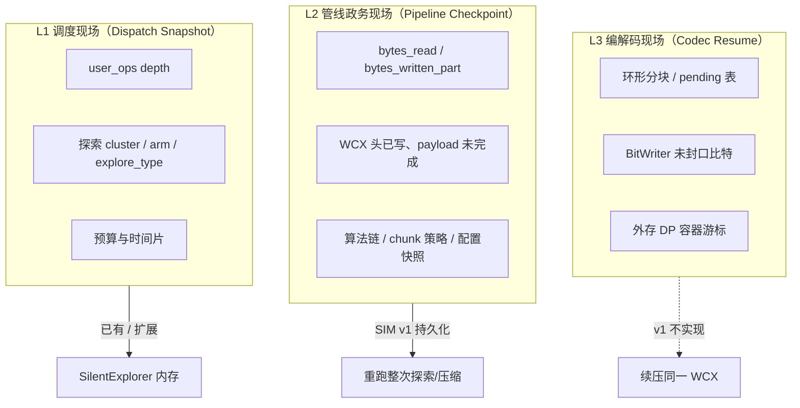
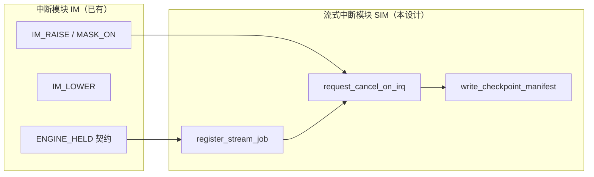
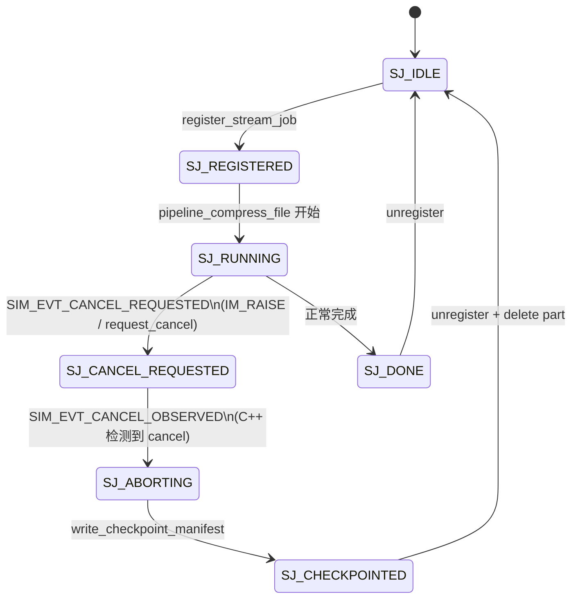
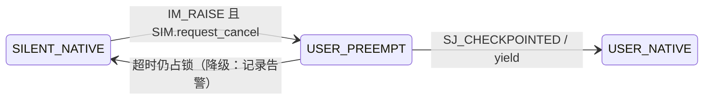

# 流式现场中断模块（SIM）设计方案

> **状态**：设计稿（待实现）  
> **版本**：v0.2 — 2026-05-15  
> **范围**：在现有 **流式管线** 与 **用户 IRQ（中断模块 IM）** 之上，定义可落地的「现场保存」语义、状态机与 API；供静默探索让位、未来可恢复任务打基础。  
> **非范围**：编解码器内部比特流 / DP 表的跨中断 **续压**（v1 明确不做）。

---

## 1. 相关文档与代码

| 文档 / 代码 | 关系 |
|-------------|------|
| [`streaming-compression-design.md`](./streaming-compression-design.md) | 分块环形队列、推进式 DP、`StreamParams`、`pipeline` 推/拉语义 |
| [`streaming-workspace-spec.md`](./streaming-workspace-spec.md) | 工作区 `.part`、job 状态、`cancel_job`、进度事件 `StreamProgressEvent` |
| [`silent_exploration_interrupt-design.md`](./silent_exploration_interrupt-design.md) | 监督器 S0–S5、IM（`user_ops` + 引擎锁）、P1 演进占位 |
| [`lzdp-file-pipeline-design.md`](./lzdp-file-pipeline-design.md)（若存在） | LZDP 文件管线与内存路径对齐 |
| `src/api/api.cpp` | `pipeline_compress_file`、`set_streaming_compress_cancel_requested`、`abort_compress_file` |
| `src/gui/ui/worker.py` | `_core_set_streaming_compress_cancel`（用户 Worker 取消） |
| `src/gui/ade/explorer.py` | 静默探索 `_execute_explore_async`（当前整文件 `compress`） |

---

## 2. 命名规范与术语索引

本节是本文档的 **命名源表**。后文所有状态机、字段名和 API 名称均应从本节派生；若实现中出现新的缩写，应先补入本节，再进入代码。

### 2.1 命名层级

| 层级 | 前缀 / 名称 | 作用域 | 出处 / 设计论证 |
|------|-------------|--------|-----------------|
| **Supervisor** | `S*` / `SUP_*` | GUI 进程内的任务编排状态 | 来自 [`silent_exploration_interrupt-design.md`](./silent_exploration_interrupt-design.md) §9。它描述「用户任务、静默探索、引擎锁」之间的宏观调度，不描述单个流式 job 的内部进度。 |
| **Interrupt Module** | `IM_*` | 用户 IRQ 屏蔽线与 `user_ops_depth` | 来自 [`silent_exploration_interrupt-design.md`](./silent_exploration_interrupt-design.md) §10。它回答「现在能不能新起静默探索」。 |
| **Streaming Interrupt Module** | `SIM_*` | 流式 job 的登记、取消、checkpoint | 本文档新增。它回答「已在跑的低优先级流式探索如何让位，以及让位后留下什么现场」。 |
| **Streaming Job** | `SJ_*` | 单个流式作业生命周期 | 来自 [`streaming-workspace-spec.md`](./streaming-workspace-spec.md) §17 的 job 状态模型，并针对探索 checkpoint 增加 `CHECKPOINTED`。 |
| **Checkpoint Layer** | `L1` / `L2` / `L3` | 现场保存粒度 | 本文档新增分层。用于避免把「保存调度/管线现场」误解为「保存编解码器内部状态并续压」。 |
| **Event** | `EVT_*` / `SIM_EVT_*` | 状态转移触发器 | `EVT_*` 继承监督器事件命名；`SIM_EVT_*` 专用于流式中断模块内部事件。 |
| **Invariant** | `SC*` | 安全不变量 | `SC` = Streaming Checkpoint，用于约束 checkpoint 与训练样本、`.part`、cancel 作用域的关系。 |

### 2.2 术语索引

| 名词 | 英文 / 代码名 | 定义 | 出处 / 完整论证 |
|------|---------------|------|-----------------|
| **用户 IRQ** | User IRQ / `IM_RAISE` | 用户主路径进入高优先级区域的逻辑信号；当前由 `begin_user_operation()` 或 `user_compression_priority()` 拉高。 | 来自 `SilentExplorer.user_ops_depth`。采用 IRQ 类比是因为它具备「高优先级事件到来，低优先级后台任务应停止调度」的语义；它不是 OS 线程中断。 |
| **IM** | Interrupt Module | 维护 `user_ops_depth`、`MASK_ON/OFF` 与引擎锁契约的中断协同层。 | 已在 [`silent_exploration_interrupt-design.md`](./silent_exploration_interrupt-design.md) 定义。IM 的职责边界是 **屏蔽新探索**，不是取消已运行的 native 调用。 |
| **SIM** | Streaming Interrupt Module | IM 的流式增强层：登记低优先级流式探索 job，在用户 IRQ 到来时发出 per-job cancel，并写入 checkpoint manifest。 | 本文档提出。原因是 IM 只有深度计数，不知道哪个流式 job 正在跑，也不知道如何保存 L1/L2 现场。 |
| **静默探索** | Silent Exploration | `maybe_explore` 命中后后台执行的额外压缩，用于 ADE 训练样本采集。 | 来自 `src/gui/ade/explorer.py`。其业务优先级低于用户任务，因此是 SIM 默认取消对象。 |
| **流式作业** | Streaming Job | 一个由 `pipeline_compress_file` 或未来 `start_stream_compress` 管理的文件到文件压缩任务。 | 来自 [`streaming-workspace-spec.md`](./streaming-workspace-spec.md) §17.3/§17.4。它具有 `job_id`、`job_state`、进度字段和 `.part` 输出。 |
| **低优先级作业** | Low-Priority Job | 可被用户 IRQ 要求让位的流式作业；v1 仅指 `job_kind=explore`。 | 设计选择：用户压缩/解压不可被静默探索抢占；但用户任务之间不应互相误 cancel。 |
| **现场** | Checkpoint Context | 中断时保留下来的可序列化信息。本文限定为 L1/L2，不包含 L3 编解码内部状态。 | 设计论证见 §4。这样能支持审计与重跑，同时避免承诺半截 WCX 续压。 |
| **L1 调度现场** | Dispatch Snapshot | `cluster_id`、`explore_type`、`parent_decision`、`ucb_gap`、预算等与 ADE 调度有关的信息。 | 来自 `SilentExplorer` 的 AC-UCB 元数据。保存它是为了可解释「为什么当时要探索这个 arm」。 |
| **L2 管线政务现场** | Pipeline Administrative Checkpoint | `bytes_read`、`bytes_written_part`、chunk 策略、算法参数、`.part` 状态等流式 job 外部状态。 | 来自 [`streaming-workspace-spec.md`](./streaming-workspace-spec.md) 的进度模型。它足以说明「在哪里被取消」，但不足以续压。 |
| **L3 编解码现场** | Codec Resume State | 环形分块、pending 表、BitWriter 未封口比特、DPFlate 外存 DP 游标等算法内部状态。 | 来自 [`streaming-compression-design.md`](./streaming-compression-design.md) 的三分块和推进式 DP。它跨算法、跨编码器差异巨大，v1 明确不保存。 |
| **CheckpointManifest** | `CheckpointManifest` | 取消时写入 `workspace/jobs/<job_id>.checkpoint.json` 的结构化现场文件。 | 本文档数据结构。它承载 L1/L2 信息，并明确 `part_deleted`，避免 `.part` 被误认为完成品。 |
| **协作取消** | Cooperative Cancel | C++ 管线在分块边界、`pull` 排空循环中主动检查 cancel flag 并退出。 | 来自 `src/api/api.cpp` 的 `detail_stream_cancel::is_cancel_requested()` 检查点。选择协作取消是为了不强杀 native 线程，保持配置 restore 与文件清理可控。 |
| **per-job cancel** | Per-Job Cancel Token | 每个流式 job 独立的取消标志。 | 当前 C++ 是全局原子标志；本文要求改为 per-job，论证见 §7.2：避免用户 Worker cancel 与探索 IRQ cancel 互相误伤。 |
| **`.part`** | Staged Output | 未提交的流式输出暂存文件。 | 来自 [`streaming-workspace-spec.md`](./streaming-workspace-spec.md) §11。取消时不得暴露为完成品。 |
| **重跑** | Retry / Re-run | 根据 manifest 重新发起一次完整探索压缩。 | 设计选择：L1/L2 可支持重排队；不使用 `bytes_read` 续压，因为 L3 未保存。 |
| **续压** | Resume Compression | 从半截编码器状态继续产出同一个 WCX payload。 | 本文档非目标。原因是 LZDP 三分块、pending 表、BitWriter、DPFlate 外存状态都必须序列化且版本化，成本和风险高于静默探索收益。 |

### 2.3 命名规则

1. **状态名必须携带域前缀**：监督器用 `S*`，流式作业用 `SJ_*`，中断模块用 `IM_*`，SIM 内部事件用 `SIM_EVT_*`。  
2. **状态名必须描述可观察条件**，不要用实现函数名。例如 `SJ_CANCEL_REQUESTED` 优于 `SET_FLAG_DONE`。  
3. **事件名用动词或外部事实**：`SIM_EVT_IRQ_RAISED`、`SIM_EVT_CANCEL_OBSERVED`；状态名用名词/形容词：`SJ_ABORTING`、`SJ_CHECKPOINTED`。  
4. **checkpoint 字段名优先沿用流式工作区字段**：`bytes_read`、`bytes_written_part`、`job_state`，避免另起一套进度词汇。  
5. **严禁把 L2 checkpoint 命名为 resume state**。如需讨论 L3，必须显式写 `Codec Resume State` 或 `L3`。

---

## 3. 问题与动机

### 3.1 现状缺口

| 能力 | 现状 | 问题 |
|------|------|------|
| IRQ 屏蔽新静默线程 | `user_ops` + `maybe_explore` 门禁 | 已在跑的探索可能长时间占 `compress()` / 引擎锁 |
| 流式协作取消 | `set_streaming_compress_cancel_requested` | 仅用于 **用户** `CompressionWorker.cancel()`；探索未走流式 |
| 取消后现场 | `abort_compress_file` → **删除** `.part` | 无结构化「断点记录」，无法审计或调度重试 |
| 可恢复压缩 | `streaming-workspace-spec` §15 OQ3 | **v1 未定**；本方案区分「政务现场」与「续压现场」 |

### 3.2 设计动机

用户主路径触发时，希望静默探索能：

1. **尽快**在分块边界退出（借流式 cancel，而非等整文件内存压完）；  
2. **保存可序列化的中断现场**（进度、配置、任务身份），供监督器 / 预算 / 可选「稍后重试」；  
3. **不**声称保存 LZDP/DPFlate 内部编解码状态（与 [`streaming-compression-design.md`](./streaming-compression-design.md) 三分块 + pending 衔接的复杂度正交）。

---

## 4. 「现场」分层定义（核心语义）



| 层级 | 名称 | 可否流式中断保存 | v1 策略 |
|------|------|------------------|---------|
| **L1** | 调度现场 | 是（内存 + 可选 JSON） | 沿用 `SilentExplorer` 统计；IRQ 时写入 `CheckpointManifest.dispatch` |
| **L2** | 管线政务现场 | 是（**不**保留有效 `.part` 成品） | **SIM 主交付**：cancel 前刷盘 manifest 到 `workspace/jobs/`；删除或隔离 `.part` |
| **L3** | 编解码现场 | 理论上可，成本极高 | **非目标**；取消后 **整次重跑** `pipeline_compress_file` |

**结论（产品口径）**：  
「流式保存现场」= 保存 **L1 + L2**，用于 **让位、审计、预算、可选排队重试**；**不等于**从半截 WCX 继续编码。

---

## 5. 流式中断模块（SIM）

SIM 是 IM 的 **扩展面**，专责 **低优先级流式作业**（默认仅静默探索）与 C++ cancel 门闩的绑定。

### 5.1 职责

| 职责 | 说明 |
|------|------|
| **作业登记** | 探索线程启动流式压缩前 `register_stream_job(kind=explore, ...)`，结束或 abort 后 `unregister` |
| **IRQ 联动** | `IM_RAISE`（用户优先级）时，对登记中的 explore 作业 `request_cancel()` → C++ `set_streaming_compress_cancel_requested(true)` |
| **现场落盘** | cancel 回调路径写入 `CheckpointManifest`（L2），再执行与 `abort_compress_file` 一致的 `.part` 清理 |
| **让位确认** | 探索线程退出 native 后 `signal_yield()`，监督器 S5 → S2 |

### 5.2 与 IM 的关系



- **IM**：回答「能不能 **新起** 探索？」（`depth > 0` → 否）。  
- **SIM**：回答「已在跑的探索 **何时停、停后留下什么记录？**」

### 5.3 建议 API（Python，`gui/ade/stream_interrupt.py`）

```python
@dataclass(frozen=True)
class StreamJobHandle:
    job_id: str
    kind: Literal["user", "explore"]
    input_path: str
    algorithm: str
    workspace_part_path: str

class StreamInterruptModule:
    _explore_jobs: dict[str, StreamJobHandle]
    _lock: threading.Lock

    def register(self, handle: StreamJobHandle) -> None: ...
    def unregister(self, job_id: str) -> None: ...

    def on_irq_raised(self) -> None:
        """IM_RAISE 时由 SilentExplorer.begin_user_operation 钩子调用。"""
        for h in self._explore_jobs.values():
            _core_set_streaming_compress_cancel(True)

    def on_irq_lowered(self) -> None:
        _core_set_streaming_compress_cancel(False)

    def clear_cancel_if_no_pending_irq(self) -> None:
        """探索线程退出时兜底清理；只有 IM 已回到 MASK_OFF 时才释放 cancel。"""
        if not IM.irq_active():
            _core_set_streaming_compress_cancel(False)

    def write_checkpoint(
        self,
        handle: StreamJobHandle,
        manifest: CheckpointManifest,
        *,
        keep_part: bool = False,
    ) -> Path: ...
```

**集成点**：`begin_user_operation` 末尾调用 `SIM.on_irq_raised()`；`end_user_operation` 在 depth 归零时 `on_irq_lowered()`（与 `worker.cancel` 共用同一 C++ 原子标志，需 **引用计数** 或「仅 explore 拉高、用户 cancel 独立」— 见 §7.2）。

---

## 6. 数据结构：`CheckpointManifest`

与 [`streaming-workspace-spec.md`](./streaming-workspace-spec.md) §17.3 对齐，并扩展中断专用字段。

```protobuf
// 逻辑结构（实现可用 JSON 存 workspace/jobs/<job_id>.checkpoint.json）
message CheckpointManifest {
  string job_id = 1;
  string job_kind = 2;          // "explore" | "user"
  string job_state = 3;       // "cancelled" | "aborted" | "failed"
  string cancel_reason = 4;     // "user_irq" | "user_cancel_button" | "timeout" | "error"

  // L2 管线政务
  uint64 bytes_total = 10;
  uint64 bytes_read = 11;
  uint64 bytes_written_part = 12;
  string staged_part_path = 13;   // 取消前路径；落盘后通常已删除
  bool part_deleted = 14;
  string input_path = 15;
  string input_content_hash = 16; // 可选 SHA256 前缀，用于重试去重
  string algorithm = 17;
  map<string, int32> algorithm_params = 18;
  bytes config_snapshot_json = 19;  // CompressionEngine 快照（探索参数现场）

  // L1 调度（探索专用）
  ExploreDispatch dispatch = 20;
  double elapsed_ms = 21;

  // 与流式设计对齐
  uint32 chunk_bytes = 22;        // effective_stream_chunk_bytes
  string pipeline_profile_hint = 23; // 可选：block_profile 摘要，非续压
}

message ExploreDispatch {
  int32 cluster_id = 1;
  string explore_type = 2;
  string parent_decision = 3;
  string target_algo = 4;
  float ucb_gap = 5;
}
```

**用途**：

| 字段组 | 用途 |
|--------|------|
| L2 | 进度条复盘、日志、证明「在 37% 处让位」 |
| L1 | 重排队探索时复用同一 `cluster_id` / `explore_type`（**重跑 compress**，非续压） |
| `config_snapshot_json` | 探索线程 `set_config` 的权威现场；IRQ 后 `finally` 仍须 restore 全局配置 |

### 6.1 字段命名出处与设计论证

| 字段 | 来源 | 设计论证 |
|------|------|----------|
| `job_id` | `streaming-workspace-spec.md` §17.3 `StreamProgressEvent.job_id` | checkpoint 必须能与进度事件、`.part`、日志归并到同一作业身份。 |
| `job_kind` | 本文档 SIM 域 | 用于区分 `explore` 与未来用户流式 job；v1 只有 `explore` 会被用户 IRQ 预占。 |
| `job_state` | `streaming-workspace-spec.md` §17.2.1 | 沿用 `cancelled/failed` 等现有状态，避免 checkpoint 与进度系统两套状态名。 |
| `cancel_reason` | 本文档 SIM 域 | 必须区分 `user_irq`、用户手动取消、超时和错误，防止把用户让位当作算法失败。 |
| `bytes_total` / `bytes_read` / `bytes_written_part` | `streaming-workspace-spec.md` §17.2.1 | L2 现场的最小可解释集合：说明输入扫描到哪里、`.part` 写到哪里。 |
| `staged_part_path` / `part_deleted` | `streaming-workspace-spec.md` §11 `.part` 策略 | 明确 checkpoint 不代表完成品；即使保留 `.part.aborted`，也不可导出。 |
| `input_content_hash` | 本文档重试去重需求 | 路径可能变化或因隐私被省略；hash 允许判断重试对象是否仍是同一输入。 |
| `algorithm` / `algorithm_params` | ADE 探索 arm + `CompressionEngine` 配置 | 重跑整次探索时需要复现目标 arm；不是为了续压。 |
| `config_snapshot_json` | `CompressionEngine.get_config()` / `set_config()` 现场 | 探索会临时覆盖算法配置；checkpoint 必须记录当时配置以便审计，但全局恢复仍依赖 `finally restore`。 |
| `dispatch` | `SilentExplorer` AC-UCB 元数据 | 保存「为什么探索这个算法/参数」的决策依据，便于训练样本解释和可选重试。 |
| `chunk_bytes` | `streaming-compression-design.md` §2.3 `effective_stream_chunk_bytes` | 取消延迟与分块大小直接相关；字段用于复盘用户等待时间。 |
| `pipeline_profile_hint` | `CompressResult.block_profile` / `Pipeline.getBlockProfile()` | 仅作调试摘要，不参与恢复；避免把 profile 误当作 L3 codec state。 |

---

## 7. C++ / 管线侧改造要点

### 7.1 现状（`pipeline_compress_file`）

- 分块循环内轮询 `detail_stream_cancel::is_cancel_requested()`；  
- 触发后 `abort_compress_file`：**关流、删 `.part`、返回 `success=false`、`error_message="cancelled"`**；  
- **不**返回 `bytes_read` 给 Python（`CompressResult` 可扩展）。

### 7.2 建议扩展

| 项 | 说明 |
|----|------|
| `CompressResult.bytes_processed` | 取消时填入已读输入字节，供 SIM 写 manifest |
| `CompressResult.cancelled` | 布尔，区分失败与协作取消 |
| **Cancel 作用域** | 全局原子标志改为 **per-job**（`job_id → atomic<bool>`），避免用户 Worker cancel 与 IRQ 取消探索互相误伤 |
| **可选 `abort_keep_part`** | 探索且 `keep_part_for_debug=true` 时重命名 `.part` → `.part.aborted`；默认仍删 |

与 [`streaming-compression-design.md`](./streaming-compression-design.md) 对齐：

- 取消点必须在 **`push` 分块之间** 与 **`pull` 排空循环** 内（已实现）；  
- LZDP **三分块** 状态在 `push` 中途不可安全冻结 → 支撑 **L3 非目标** 论断。

### 7.3 探索路径改造

| 步骤 | 当前 | 目标 |
|------|------|------|
| 输入 | `record.raw_data` 内存 | 临时明文文件或 `record.path`（优先路径，避免大文件双份内存） |
| 压缩 | `engine.compress(raw)` | `engine.pipeline_compress_file(in, workspace/explore_<uuid>.wcx.part, algo)` |
| 取消 | 无 | SIM + per-job cancel |
| 成功后 | 读 `compressed_size` 写训练样本 | 读结果 + 可选 `block_profile`；**删除** explore 用 `.part` |

---

## 8. 状态机

### 8.1 状态机命名总表

| 状态 ID | 标准名称 | 所属域 | 进入条件 | 退出条件 | 出处 / 设计论证 |
|---------|----------|--------|----------|----------|-----------------|
| **S0** | `APP_IDLE` | Supervisor | 无用户 Worker 批任务、无静默 native 任务 | 用户启动任务或 `maybe_explore` 发起探索 | 继承 IM 文档 §9。保留 `APP_` 是为了说明这是进程级空闲，不是 Qt 事件循环停止。 |
| **S2** | `USER_NATIVE` | Supervisor | `IM_RAISE` 后用户路径即将或正在进入 native 压/解压 | 用户 native 调用退出且 `user_ops_depth` 降为 0 | 继承 IM 文档 §9。SIM 只在该状态到来时取消低优先级探索。 |
| **S4** | `SILENT_NATIVE` | Supervisor | 静默探索已进入 `set_config → pipeline_compress_file` | 探索完成、取消或失败 | 继承 IM 文档 §9；本文将其内部细化为 `SJ_RUNNING` 等流式作业状态。 |
| **S5** | `USER_PREEMPT` | Supervisor | 用户 IRQ 到来且存在 `SJ_RUNNING` 的低优先级探索 | 探索 `SJ_CHECKPOINTED` 或超时降级 | 继承 IM 文档 §13 的目标态；本文给出 SIM 实现路径。 |
| **SJ_IDLE** | Streaming Job Idle | Streaming Job | SIM 未登记该 job，或 job 已完成清理 | `register_stream_job` | 来自工作区 job lifecycle 的初始/终止态。 |
| **SJ_REGISTERED** | Streaming Job Registered | Streaming Job | SIM 已有 `StreamJobHandle`，但 C++ 管线尚未开始或尚未进入可取消循环 | 调用 `pipeline_compress_file` 成功进入运行 | 本文新增。需要该状态是因为 Python 侧必须先有 `job_id` 和 `.part` 路径，才能在 IRQ 窗口内定位对象。 |
| **SJ_RUNNING** | Streaming Job Running | Streaming Job | C++ 流式管线已开始读块/推块/拉输出 | 正常完成、收到 cancel 请求或失败 | 对齐 `streaming-workspace-spec.md` §17 的 `job_state="running"`。 |
| **SJ_CANCEL_REQUESTED** | Streaming Job Cancel Requested | Streaming Job | SIM 或用户发出 per-job cancel，C++ 可能尚未观察到 | C++ 在分块边界或 `pull` 循环观察到 cancel | 对齐 `job_state="cancel_requested"`。使用完整单词 `REQUESTED`，避免 `REQ` 与 request object 混淆。 |
| **SJ_ABORTING** | Streaming Job Aborting | Streaming Job | C++ 已观察到 cancel，正在关闭流、清理 / 隔离 `.part` | `CheckpointManifest` 写入完成 | 对应 `api.cpp` 的 `abort_compress_file` 语义。单独建态是为了保证清理与 manifest 顺序可审计。 |
| **SJ_CHECKPOINTED** | Streaming Job Checkpointed | Streaming Job | SIM 已写入 checkpoint manifest，`.part` 已按策略删除或隔离 | `unregister` | 本文新增。它不是 `completed`，也不是可导出结果，只表示现场已保存。 |
| **SJ_DONE** | Streaming Job Done | Streaming Job | C++ 正常完成并提交最终输出 | `unregister` / 后续训练样本写入 | 对齐 `job_state="completed"`，但探索输出默认会被删除，不进入用户导出列表。 |

### 8.2 流式作业生命周期（SIM 视角）



### 8.2.1 SIM 事件命名表

| 事件 | 触发源 | 允许的当前状态 | 下一状态 | 出处 / 设计论证 |
|------|--------|----------------|----------|-----------------|
| `SIM_EVT_REGISTER` | Python `SIM.register(handle)` | `SJ_IDLE` | `SJ_REGISTERED` | SIM 需要先登记 `job_id` 与 `.part` 路径，才能被 IRQ 定位。 |
| `SIM_EVT_PIPELINE_STARTED` | `pipeline_compress_file` 进入 C++ 主循环 | `SJ_REGISTERED` | `SJ_RUNNING` | 对齐 `streaming-workspace-spec.md` 的 `job_state="running"`。 |
| `SIM_EVT_CANCEL_REQUESTED` | `IM_RAISE` 或显式 `request_cancel(job_id)` | `SJ_RUNNING` | `SJ_CANCEL_REQUESTED` | 表示 cancel token 已拉高，但 C++ 可能还在当前块内；因此不能直接进入 `ABORTING`。 |
| `SIM_EVT_CANCEL_OBSERVED` | C++ 检查到 per-job cancel | `SJ_CANCEL_REQUESTED` | `SJ_ABORTING` | 来自 `api.cpp` 分块循环 / `pull` 循环中的 cancel 检查点。 |
| `SIM_EVT_CHECKPOINT_WRITTEN` | Python / C++ 写入 manifest 成功 | `SJ_ABORTING` | `SJ_CHECKPOINTED` | 确保「清理 `.part`」与「现场可审计」之间有明确顺序。 |
| `SIM_EVT_JOB_COMPLETED` | C++ 正常返回 success | `SJ_RUNNING` | `SJ_DONE` | 对齐 `job_state="completed"`；探索输出随后可删除，但状态仍是正常完成。 |
| `SIM_EVT_UNREGISTER` | `finally` 清理 | `SJ_DONE` / `SJ_CHECKPOINTED` / failed | `SJ_IDLE` | 防止 SIM 持有过期 job，避免后续 IRQ 误 cancel。 |

### 8.3 监督器 + SIM 联合（含 S5）

与 [`silent_exploration_interrupt-design.md`](./silent_exploration_interrupt-design.md) §9 衔接：



| 状态 | SIM / 作业 |
|------|------------|
| **S4** `SILENT_NATIVE` | `SJ_RUNNING` |
| **S5** `USER_PREEMPT` | `SJ_CANCEL_REQUESTED` → `SJ_ABORTING` |
| **S2** `USER_NATIVE` | 用户取得引擎锁；探索 `SJ_CHECKPOINTED` 或已 `SJ_IDLE` |

### 8.4 主循环伪代码（含 SIM）

```python
def begin_user_operation():
    IM.raise_irq()
    SIM.on_irq_raised()          # 拉高 explore 对应 cancel

def end_user_operation():
    IM.lower_irq()
    if not IM.irq_active():
        SIM.on_irq_lowered()

def silent_explore_async(record, algo, params, dispatch_meta):
    if IM.irq_active():
        return
    handle = SIM.register(kind="explore", ...)
    try:
        Engine.set_config(merged)
        result = Engine.pipeline_compress_file(
            input_path, handle.workspace_part_path, algo
        )
        if result.cancelled:
            SIM.write_checkpoint(handle, build_manifest(result, dispatch_meta))
            return
        # 成功：写 TrainingSampleV3，不计入 discovery 除非 success
    finally:
        Engine.set_config(restored)
        SIM.unregister(handle.job_id)
        SIM.clear_cancel_if_no_pending_irq()
```

---

## 9. 与流式工作区、进度事件的映射

[`streaming-workspace-spec.md`](./streaming-workspace-spec.md) §17 已有 `job_state=cancel_requested|cancelled`。

| 探索流式作业 | `job_id` | `job_state` 迁移 |
|--------------|----------|------------------|
| 启动 | `explore-<uuid>` | `running` |
| 用户 IRQ | 同上 | `cancel_requested` → `cancelled` |
| manifest 写入 | 同上 | checkpoint 文件落盘，`export_state=not_exported` |

GUI **不**必须为探索单独弹进度窗；可选向 ADE 调试面板节流推送 `StreamProgressEvent`（`bytes_read/bytes_total`）。

**`.part` 策略**（与 spec §11 一致）：

- 默认：cancel 后 **删除** `.part`，`CheckpointManifest.part_deleted=true`；  
- 调试：`WEBCOMPRESS_KEEP_EXPLORE_PART=1` 保留 `.part.aborted`。

---

## 10. 场景时序

### 10.1 用户点击压缩，探索正在流式压大文件

```
探索线程: SJ_RUNNING (pipeline 块 N)
用户:     EVT_USER_COMPRESS_START → IM_RAISE → SIM.request_cancel
C++:      块 N+1 边界见 cancel → abort → bytes_read 回传
SIM:      write_checkpoint → 删 .part → SJ_IDLE
监督器:   S5 USER_PREEMPT → S2 USER_NATIVE (用户 smart_compress)
探索:     不生成有效训练样本（或 success=false, is_exploration=true, cancelled=true）
```

### 10.2 仅 IRQ，探索尚未进入 native

```
maybe_explore: IM_QUERY true → 不 start（现有 I1）
无需 SIM checkpoint
```

### 10.3 「稍后重试」探索（v1.5 可选）

```
调度器读 workspace/jobs/*.checkpoint.json
筛选 job_kind=explore, cancel_reason=user_irq
重新 maybe_explore（新 job_id，整文件重跑）
不使用 bytes_read 续压
```

---

## 11. 实现阶段

| 阶段 | 内容 | 依赖 |
|------|------|------|
| **P0** | 文档 + `CompressResult.bytes_processed` / `cancelled` | api.cpp |
| **P1** | per-job cancel；探索改 `pipeline_compress_file`；SIM 登记 + manifest | explorer.py, workspace |
| **P2** | `begin_user_operation` 钩子调 SIM；监督器 S5 日志与指标 | IM 集成 |
| **P3** | 可选 explore 重试队列；ADE 面板显示 checkpoint | GUI |
| **—** | L3 编解码 resume | **不规划** |

---

## 12. 风险与不变量

| ID | 不变量 |
|----|--------|
| **SC1** | 任何 `cancelled` 的探索样本 **不得** 进入 bandit 奖励更新（或显式 `success=false` 且权重 0） |
| **SC2** | IRQ 后全局 `CompressionEngine` 配置以探索线程 `finally` restore 为准；manifest 仅作审计副本 |
| **SC3** | 用户与探索 **不可** 共用同一 C++ cancel 原子标志而无引用计数 |
| **SC4** | 对外可导出 WCX **仅** 来自 `completed` 作业；checkpoint 的 `.part` 永不暴露为完成品 |
| **SC5** | 分块语义遵循 `effective_stream_chunk_bytes`（[`streaming-compression-design.md`](./streaming-compression-design.md) §2.3） |

| 风险 | 缓解 |
|------|------|
| 取消滞后 = 当前块处理时间 | 接受；大块时调小 explore 专用 chunk 仅用于探索（配置项） |
| 双份 cancel（用户按钮 + IRQ） | per-job 标志 + 用户路径仍用 Worker 级 cancel |
| manifest 与 GDPR/路径泄露 | `input_path` 可配置仅存 hash |

---

## 13. 非目标（明确排除）

1. **半截 WCX 续传**、**decompress 从中断点恢复**。  
2. **序列化** LZDP 环形三分块 / DPFlate 外存 DP 容器（L3）。  
3. 替代 [`silent_exploration_interrupt-design.md`](./silent_exploration_interrupt-design.md) 已有 IM/锁；SIM 为其 **流式增强**，不是第二套 IRQ。  
4. 单机多进程分布式 checkpoint。

---

## 14. 维护记录

| 日期 | 变更 |
|------|------|
| 2026-05-15 | v0.1 初稿：L1/L2/L3 现场分层、SIM API、CheckpointManifest、状态机、C++/探索改造、阶段计划 |
| 2026-05-15 | v0.2：补充命名规范与术语索引；细化 `SJ_*` 状态机命名、事件表、字段出处和设计论证 |
