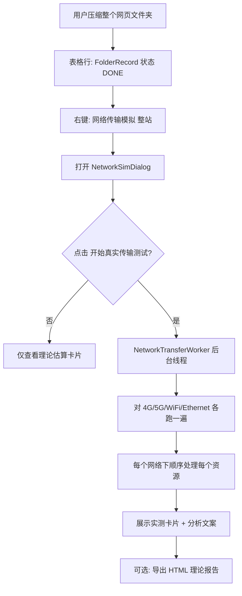
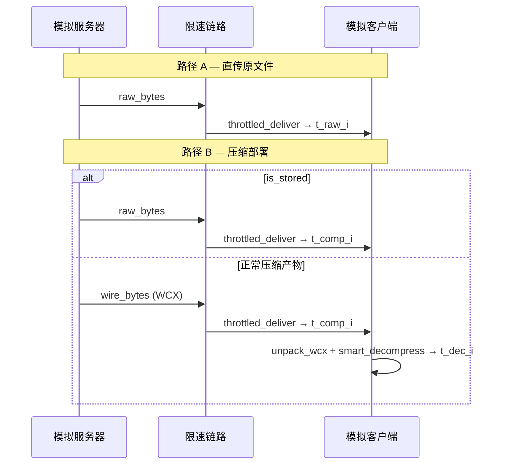

# 网页文件夹 · 真实网络传输模拟 — 设计说明

| 项目 | 说明 |
|------|------|
| **功能编号** | F8 传输模拟（整站 / 文件夹路径） |
| **状态** | 已实现（GUI + `gui.engine.network_transfer`） |
| **关联任务书** | 《数据结构任务书》F8：模拟不同网络环境，验证压缩系统实际价值 |
| **单文件路径** | 同一套引擎，`items` 仅含 1 个资源；本文档侧重 **网页文件夹（整站）** |

---

## 1. 背景与目标

### 1.1 要回答的问题

对**已批量压缩完成的网页资源目录**，在用户可能遇到的网络条件下：

1. **直传原文件**（未使用压缩产物）端到端要多久？
2. **传压缩产物 + 客户端解压**端到端要多久？
3. 改变网络速度（4G / 5G / WiFi / Ethernet）时，哪条路径更优？

压缩在真实部署中通常发生在**构建/服务器侧**（离线）；用户访问时主要是 **下载 + 解压**。本功能在**访问路径**上实测耗时，不把「再次压缩」算进每次打开网页的时间（压缩耗时仅在汇总信息中展示，供报告参考）。

### 1.2 与「公式估算」的区别

| 维度 | 公式估算（`compute_network_sim_profiles`） | 真实传输模拟（本文档） |
|------|---------------------------------------------|-------------------------|
| 传输 | \(T = \text{bytes} \times 8 / \text{带宽} + \text{延迟}\)，瞬时出结果 | `throttled_deliver` 按带宽 **sleep**，墙钟时间随 Mbps 变化 |
| 解压 | 未建模 | 调用 `CompressionEngine.smart_decompress`，实测 CPU 时间 |
| 整站 | 可对体积累加后一次公式计算 | **按资源顺序**逐个限速传输 + 解压，时间累加 |
| 用途 | 快速对比、导出 HTML 理论表 | 可演示、可写进实验报告「实测」一节 |

对话框 `NetworkSimDialog` 同时提供：打开时展示理论卡片；用户点击 **「开始真实传输测试」** 后，用实测结果刷新卡片。

---

## 2. 业务场景建模

### 2.1 网页文件夹在系统中的表示

- 表格行类型：`FolderRecord`（`gui/models.py`）。
- 子文件：`FolderRecord.files`，每项为 `FileRecord`（`rglob` 加载目录下所有文件）。
- 前置条件：子文件中至少有一个 `CompressionStatus.DONE`，且存在有效压缩产物（`compressed_payload_size > 0` 或 `is_stored`）。

### 2.2 与真实 Web 的对应关系

```text
[部署态]  服务器 / 静态资源目录
            ├── index.html
            ├── css/…
            ├── js/…
            └── images/…
            （WebCompress 批量压缩 → .wcx 或内存/磁盘中的 WCX 字节）

[访问态]  浏览器请求每个 URL
            → 下载响应体（本文：限速传输 wire_bytes）
            → 解压（本文：core_engine 客户端解压）
            → 渲染（不在本功能范围内）
```

本功能**不**建立真实 TCP/HTTP 连接，而是在本机用 **限速内存投递 + 真实解压** 复现「传输段 + 客户端解压段」的耗时。整站采用 **顺序加载**（见 §5），近似「无并行、按资源依次到达」的保守场景。

---

## 3. 端到端流程（用户视角）



**注意**：4G 下大文件夹实测可能持续数十秒至数分钟，属预期行为（真实限速）。

---

## 4. 数据准备：`FolderRecord` → `NetworkBenchmarkTarget`

入口：`target_from_folder_record(record)`（`gui/engine/network_transfer.py`）。

### 4.1 子资源筛选

对每个 `f in record.files` 调用 `item_from_file_record(f)`，保留：

- `f.status == CompressionStatus.DONE`
- `raw_data` 非空（`load_raw_data()`）
- 非 stored 时：`file_record_compression_blob(f)` 有效且 `compressed_payload_size(f) > 0`
- stored（`AlgorithmType.NONE`）时：`wire_bytes = raw_bytes`，不解压

未入选的文件（pending / failed / 无产物）**跳过**，不参与整站统计。

### 4.2 `NetworkBenchmarkItem` 字段

| 字段 | 含义 |
|------|------|
| `name` | 相对路径/文件名（展示与进度） |
| `raw_bytes` | 磁盘原始文件内容（直传路径 payload） |
| `wire_bytes` | 链路上实际发送的字节：通常为 **完整 WCX 容器**（`file_record_compression_blob`）；stored 时为原文 |
| `algorithm` | 解压所用算法枚举 |
| `is_stored` | 为 true 时不解压，压缩路径仅重复直传计时 |

### 4.3 `NetworkBenchmarkTarget` 聚合

| 字段 | 文件夹取值 |
|------|------------|
| `label` | `FolderRecord.name` |
| `algorithm` | 子文件算法名去重排序后用 `", "` 连接 |
| `scope_note` | `网页整站顺序加载 · N 个资源（限速传输 + 客户端解压）` |
| `compression_time_ms` | 各子文件 `compression_time_ms` **之和**（仅元数据，不参与实测循环） |
| `items` | 上述 `NetworkBenchmarkItem` 元组，顺序为 `record.files` 迭代顺序 |

并行提供 `folder_transfer_totals()`（`gui/windows/network_sim.py`）生成 `NetworkSimInput`，供对话框元信息与 HTML **理论** 报告使用（体积汇总与公式估算）。

---

## 5. 整站实测算法（核心）

对每个网络配置 `profile ∈ NETWORK_PROFILES`，执行 `benchmark_profile(target, profile, engine)`。

### 5.1 资源顺序

```text
for item in target.items:   # 顺序 = FolderRecord.files 扫描顺序
    …
```

**设计选择**：顺序串行，**不**模拟 HTTP/2 多路复用并行下载。整站总时间 = 各资源耗时之和。若需「并行取最大值」模型，可作为后续扩展（见 §10）。

### 5.2 每个资源的双路径

对单个 `item`：



累加：

- `raw_transfer_s += t_raw_i`
- `comp_transfer_s += t_comp_i`
- `decompress_s += t_dec_i`（stored 为 0）

整站在该网络下：

| 指标 | 公式 |
|------|------|
| `total_raw_path_s` | \(\sum_i t_{\text{raw},i}\) |
| `total_comp_path_s` | \(\sum_i t_{\text{comp},i} + \sum_i t_{\text{dec},i}\) |
| `net_vs_raw_s` | `total_raw_path_s - total_comp_path_s` |
| `worth_it` | `net_vs_raw_s > 0`（该网络下传压缩体+解压更快） |

### 5.3 预设网络参数

定义于 `gui/models.py` → `NETWORK_PROFILES`：

| 名称 | 带宽 (bps) | 延迟 (ms) |
|------|------------|-----------|
| 4G | 20_000_000 | 50 |
| 5G | 100_000_000 | 10 |
| WiFi | 50_000_000 | 20 |
| Ethernet | 1_000_000_000 | 1 |

---

## 6. 限速传输：`throttled_deliver`

实现：`gui/engine/network_transfer.py`。

1. 若 `latency_ms > 0`，先 `sleep(latency_ms / 1000)`（模拟首次 RTT）。
2. 按 `chunk_size`（默认 16 KiB）拷贝 payload 到输出缓冲区。
3. 维护「已发送字节数 / 应耗时」：`expected = len(sent) / (bandwidth_bps/8)`，若落后于墙钟则 `sleep` 补齐。
4. 返回 `(payload_copy, transfer_s)`，`transfer_s` 为含 sleep 的墙钟时间。

**性质**：本地内存拷贝 + 定时休眠，不产生真实网卡流量；**可重复、可随 Mbps 缩放**，适合教学实验。

---

## 7. 客户端解压

函数：`_decompress_wire_bytes(engine, wire, algorithm)`。

1. 若 `wire[:4] == MAGIC`（`WCMP`）：`unpack_compressed_file` → 得 `header` + 内层 `payload`，算法以 header 为准。
2. 否则：将整个 `wire` 视为 payload，算法用 `item.algorithm`。
3. `SilentExplorer.user_compression_priority()` 包裹下调用 `engine.smart_decompress`。
4. 校验 `result.success`；返回解压墙钟时间。

与 GUI「压缩演示」解压路径一致，保证与生产解压器行为对齐。

---

## 8. UI 与线程模型

### 8.1 入口

| 位置 | 行为 |
|------|------|
| `gui/ui/table.py` | 文件夹右键「🌐 网络传输模拟（整站）」→ `request_folder_network` |
| `gui/ui/main_window.py` | `_on_folder_network_row` → `target_from_folder_record` + `folder_transfer_totals` → `_run_network_sim_input` |

### 8.2 对话框

`gui/ui/dialogs/network_sim_dialog.py`：

- 构造参数含 `benchmark_target: NetworkBenchmarkTarget | None`。
- **开始真实传输测试** → 创建 `NetworkTransferWorker`（`gui/ui/network_transfer_worker.py`）。
- `QThread` 中调用 `benchmark_all_profiles`，避免阻塞 Qt 主线程。
- 信号：`progress(msg, cur, tot)`、`finished_ok(results)`、`failed(message)`。
- 完成后 `_rebuild_cards()` 显示 **实测** 卡片（直传 vs 压缩+解压、传输/解压拆分）。

### 8.3 取消与关闭

- **取消测试**：`worker.cancel()` → 各层 `cancel()` 检查 → `InterruptedError`。
- 关闭对话框：若线程仍在运行，先 `cancel()` 再 `wait(3000)`。

---

## 9. 代码映射

```text
gui/ui/table.py
  request_folder_network
       ↓
gui/ui/main_window.py
  _on_folder_network_row
  _run_network_sim_input(benchmark_target=…)
       ↓
gui/ui/dialogs/network_sim_dialog.py
  NetworkSimDialog + NetworkTransferWorker
       ↓
gui/engine/network_transfer.py          ← 核心逻辑
  target_from_folder_record
  benchmark_profile / benchmark_all_profiles
  throttled_deliver / _decompress_wire_bytes
       ↓
gui/models.py                           ← NETWORK_PROFILES
gui/engine/compressor.py                  ← CompressionEngine.smart_decompress
gui/engine/file_protocol.py               ← file_record_compression_blob, unpack_compressed_file
gui/windows/network_sim.py                ← 理论估算 + HTML 报告（NetworkSimInput / folder_transfer_totals）
```

---

## 10. 限制与后续扩展

### 10.1 当前限制

| 项 | 说明 |
|----|------|
| 无真实 HTTP/TLS | 不能替代浏览器 DevTools 网络面板 |
| 顺序加载 | 未模拟并行请求；整站时间可能**高于**真实 HTTP/2 并行 |
| 单次 RTT | 每资源仅链路级延迟一次，未按请求数叠加 DNS/TLS |
| 解压在本机 CPU | 与移动端弱 CPU 可能有差异 |
| HTML 报告 | 导出仍以公式估算表为主；实测数据主要在对话框卡片 |

### 10.2 可选扩展

1. **并行整站模型**：按资源类型分组，组内 `max(耗时)`，组间相加。
2. **自定义 Mbps / 延迟**：UI 输入覆盖 `NetworkProfile`。
3. **HTML 报告嵌入实测表**：`generate_network_sim` 增加 `ProfileBenchmarkResult[]` 参数。
4. **与文件夹压缩报告合并导出**：`FolderReportWidget` 一键附带 F8 实测节。
5. **真实 loopback TCP**：localhost 收发 + 应用层限速（更重，一般课程设计不必做）。

---

## 11. 与任务书 F8 的对应

| 任务书要求 | 整站真实传输模拟 |
|------------|------------------|
| （1）模拟 4G、5G、WiFi 等，计算压缩前后传输时间 | ✅ 限速实测传输；直传 vs 传 WCX |
| （2）分析不同带宽下传输效率提升 | ✅ `net_vs_raw_s`、`worth_it`、分传输/解压展示 |
| （3）生成传输效率对比报告 | ⚠️ 理论 HTML 已支持；实测建议截图或扩展导出（§10.2） |

---

## 12. 使用检查清单（实验/答辩）

1. 添加网页资源**文件夹**并完成批量压缩（子文件均为 DONE）。
2. 右键文件夹 → **网络传输模拟（整站）**。
3. 阅读对话框顶部流程说明。
4. 点击 **开始真实传输测试**（先可用 Ethernet 试跑缩短等待）。
5. 记录各网络下「直传原文件」与「传压缩体+客户端解压」实测秒数。
6. 对比 4G 与 Ethernet 下 `worth_it` 差异，说明「慢网压缩更有价值」。
7. 在报告中注明：整站为**顺序加载**假设，与浏览器并行下载的差异（§10.1）。

---

*文档版本：与 `src/gui/engine/network_transfer.py`（`target_from_folder_record` / `benchmark_profile`）实现同步。*
