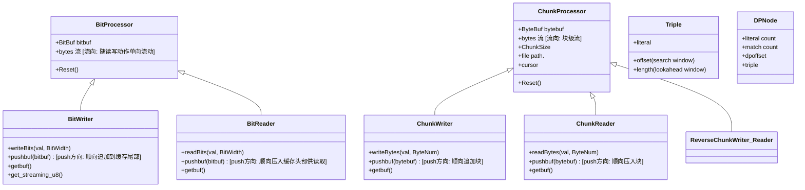
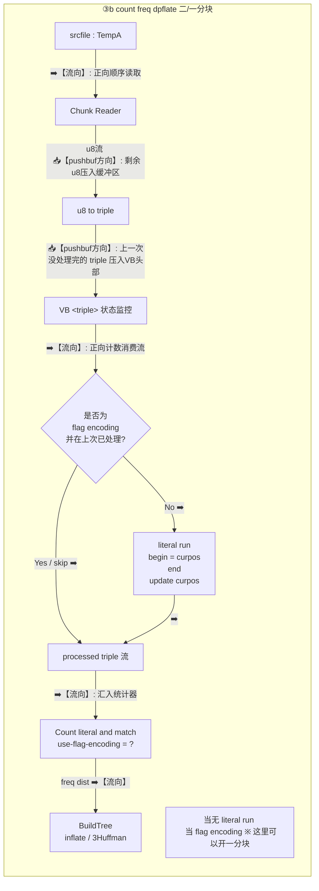

收到！数据在流转时的**流动方向**（Forward 正向 / Reverse 逆向）以及缓冲区（VirtualBuffer）内部的 **pushbuf 压入方向**（从尾部向前推入，还是从头部向后推入）确实是整套流式动态规划算法的核心灵魂。
为了彻底理清这两者的对应关系，我将手稿中的所有流程全部重新生成，并在每一步的连接线上、模块内部、以及注释区**用醒目的箭头和文字标注出“流的方向”与“pushbuf 的方向”**。
## 1. 数据结构关系图 (Data Structure & Func)

## 2. 流式分块流程图 (全面标注方向版)
### ① dpforward 阶段 (三分块)
 * ➡️ **总体流向**：**正向（自文件头向文件尾）**。
 * 📥 **pushbuf 方向**：**顺向压入** 缓冲区（cur 接收 new 的数据，窗口向右滚动）。
```mermaid
graph TD
    subgraph dpforward_Phase [① dpforward 阶段 三分块]
        direction TB
        
        %% 缓冲区滑动窗口状态描述
        subgraph Window_State_1 [【正向滚动】指示销毁/滑动的范围]
            W1_1[cur | new] -->|时间增长 ➡️ 流向右| W1_2[pre | cur | new]
            W1_2 --> W1_3[release : pre | cur | new]
            W1_3 -->|格子方向 ➡️| W1_4[release : ... | pre | cur | EOF]
        end

        %% 核心流程
        SrcFile[srcfile ...] -->|参数说明 <br> ➡️【正向流】| CR[Chunk Reader]
        CR -->|u8 u8指byte 流 / 写入 VirtualBuffer u8 <br> ➡️【流向】: 正向单向流 <br> 📥【pushbuf方向】: 顺向追加到VB尾部| VB_u8[VB u8 <br> 注: 括在VirtualBuffer, 不移动游标, 处理完再释放]
        
        VB_u8 -->|➡️【流向】: 消费流| DP_FW[dpforward <br> 处理后 release chunk]
        DP_FW -->|begin . end . ... <br> ➡️【流向】: 正向生成| DPNode_Stream[DPNode 流]
        
        DPNode_Stream --> To_u8[DPNode to u8 <br> s.t. BitWidth DPNode | 8]
        To_u8 -->|u8流 <br> ➡️【流向】: 写入临时文件| CW[Chunk Writer <br> file: TempA <br> BW DPNode]
        
        %% 注释与特别说明
        Note1[※ 用 VB 代指 VirtualBuffer] 
        Note2[※ 到最后记录最后一个 DPNode 的内容: <br> total_triple = literal count + match count <br> 记住: DPNode数 = Byte数]
    end

```
### ② dpbacktrack 阶段 (二分块)
 * ⬅️ **总体流向**：**逆向 / 倒序（从文件尾向文件头回溯）**。
 * 📤 **pushbuf 方向**：**逆向压入 / 头部推入（↑ pushbuf）**。每次从文件后面读入一个块，反向塞入缓冲区的最前面，供回溯指针向前消费。
```mermaid
graph TD
    subgraph dpbacktrack_Phase [② dpbacktrack 阶段 二分块]
        direction TB
        
        %% 缓冲区滑动窗口状态描述
        subgraph Window_State_2 [【逆向滚动】指示销毁/滑动的范围]
            W2_1[new | cur <br> curpos 存在越界, 下补0词] -->|时间增长 ⬅️ 流向左| W2_2[new | cur | release]
            W2_2 -->|移动方向 ⬅️| W2_3[cur | release <br> Start of File]
        end

        %% 核心流程
        TempA[TempA <br> DPNode x BW DPNode] -->| 从文件尾开始读取 <br> ⬅️【流向】: 逆向读取| RCR[Reverse Chunk Reader]
        RCR -->|u8流 <br> 📥【pushbuf方向】: 逆向压入 bytebuf 头部| VB_DPNode[VB DPNode]
        
        %% 弹出与插入逻辑描述
        subgraph PushBuf_Detail [【pushbuf方向与消费说明】]
            Box1[... ▢ ▢ ▢ ▢] -->| ⬆️ 逆向压入 pushbuf <br> (从文件前方读入新块, 塞入当前缓存头部)| Box2[▢ ▢ ▢ ▢ ... ▢]
            Box2 -->| ⬅️ 动态规划回溯消费流 <br> (指针向左移动进行 dp backtrack)| Box3[dp backtrack]
        end
        
        VB_DPNode --> To_DPNode[u8 to DPNode]
        To_DPNode -->|DPNode流 <br> ⬅️【流向】: 逆向寻优| DP_BT[dpbacktrack <br> begin . end . ... <br> 记住 curpos]
        
        DP_BT -->|triple 流 <br> 处理后 release chunk <br> ⬅️【流向】: 逆向输出三元组| Triple_To_u8[triple to u8 <br> 无残留]
        Triple_To_u8 -->|u8流 <br> 📥【pushbuf方向】: 顺向追加块到文件| RCW[Reverse Chunk Writer <br> file: TempB <br> BW Triple]
        
        RCW --> Note3[total_triple x BW Triple <br> 预分配文件大小]
    end

```
### ③a literal run (当为非flag编码) and emit 阶段 (二分块 / 可开一分块)
 * ➡️ **总体流向**：**正向（顺序读取 TempA）**。
 * 📥 **pushbuf 方向**：**顺向弹出与残留追加**（将上一次块未处理完的残余 triple 推入 VB 头部优先消费，新读入的数据顺序向后压入）。
```mermaid
graph TD
    subgraph Phase_3_1 [③a literal run 当为非flag编码 and emit 为 LZDP only, 为 dpflate skip 二分块]
        direction TB
        
        TempA_3_1[srcfile : TempA] -->| ➡️【流向】: 正向顺序读取| CR_3_1[Chunk Reader]
        CR_3_1 -->|u8流 <br> 📥【pushbuf方向】: 剩余未处理u8顺向压入缓冲区| To_Triple_3_1[u8 to triple]
        
        To_Triple_3_1 -->| 📥【pushbuf方向】: 上一次 cur chunk 没处理完的 triple 压入VB头部| VB_Triple_3_1[VB &lt;triple&gt; 状态监控]
        VB_Triple_3_1 -->| ➡️【流向】: 正向消费流| Skip_Check_3_1{是否为 <br> flag encoding <br> 并在上次已处理?}
        
        Skip_Check_3_1 -->|No ➡️| LR_3_1[literal run <br> begin = curpos <br> end <br> update curpos]
        Skip_Check_3_1 -->|Yes / skip ➡️| ProcessED_3_1[processed triple 流]
        
        LR_3_1 -->|➡️| ProcessED_3_1
        ProcessED_3_1 -->|triple 流 / 引入 release chunk <br> ➡️【流向】: 送入编码器| Enc_Triple_3_1[encoding triple <br> use flag encoding?]
        
        Enc_Triple_3_1 -->|recorded 长| BW_3_1[BitWriter <br> pushbuf | getbuf]
        BW_3_1 -->|getbuf → pushbuf| BW_3_1
        BW_3_1 -->|u8流 ➡️| CW_3_1[Chunk Writer <br> file: output File]
        BW_3_1 -->|EOF 补0成u8 ➡️| CW_3_1
        
        Note_3_1[当无 literal run <br> 当 flag encoding ※ 这里可以开一分块]
    end

```
### ③b count freq (dpflate) 阶段 (二/一分块)
 * ➡️ **总体流向**：**正向（顺序读取 TempA）**。
 * 📥 **pushbuf 方向**：**顺向弹出与残余追加**（逻辑同 ③a，只读不写，推入 VB 供频率计数器消费）。

### ④ emit 阶段 (二/一分块)
 * ➡️ **总体流向**：**正向（顺序发射）**。
 * 📥 **pushbuf 方向**：**位流尾部顺向追加（pushbuf）**。将哈夫曼映射后的变长比特顺序推入 BitWriter 缓存的末尾，攒满 8 位（1 字节）后顺向吐给 ChunkWriter。
```mermaid
graph TD
    subgraph Phase_4 [④ emit 二/一分块]
        direction TB
        
        TempA_4[srcfile : TempA] -->| ➡️【流向】: 最终正向读取| CR_4[Chunk Reader]
        CR_4 -->|u8流 <br> 📥【pushbuf方向】: 剩余u8压入| To_Triple_4[u8 to triple]
        
        To_Triple_4 -->| ➡️【流向】: 顺序翻译| Enc_Triple_4[encoding triple <br> inflate / 3Huffman]
        Note_Huffman[※ 这里可以开一分块] -.-> CR_4
        
        Enc_Triple_4 -->|变长位流| BW_4_1[BitWriter <br> pushbuf | getbuf]
        BW_4_1 -->|getbuf → pushbuf| BW_4_1
        BW_4_1 -->|u8流 ➡️| CW_4[Chunk Writer <br> file: outputFile]
        BW_4_1 -->|EOF 补0成u8 ➡️| CW_4
        
        Huffman_Table([Huffman -> triple 逆映射表]) --> BW_4_2[BitWriter <br> pushbuf | getbuf]
        BW_4_2 -->|getbuf → pushbuf| BW_4_2
        BW_4_2 -->|u8流 ➡️| CW_4
        BW_4_2 -->|EOF 补0成u8 ➡️| CW_4
    end

```
### 📌 核心方向总结矩阵（便于编写代码时核对）
| 阶段 | 总体数据流向 (Data Stream Direction) | 缓冲区压入方向 (Pushbuf Behavior) |
|---|---|---|
| **① dpforward** | **➡️ 正向 (Forward)**: 顺序读取原始文件，向后推导。 | **📥 尾部追加**: 读入的新数据流顺序追加到 VB <u8> 尾部。 |
| **② dpbacktrack** | **⬅️ 逆向 (Reverse)**: 从文件尾向文件头反向寻优。 | **📤 头部逆向推入 (↑ pushbuf)**: 逆向读入的块被塞入 VB <DPNode> 的最前端，指针向左消费。 |
| **③a / ③b** | **➡️ 正向 (Forward)**: 顺序消费中间文件 TempA。 | **📥 残余头部压入**: 跨块时，上个块留下的未完结 triple 压入 VB <triple> 头部优先消费，新数据继续尾部追加。 |
| **④ emit** | **➡️ 正向 (Forward)**: 哈夫曼变长流最终顺序写出。 | **📥 比特位尾部顺向追加**: 映射出的哈夫曼位流顺序向 BitWriter 尾部攒积，非对齐的 EOF 在末尾补零。 |