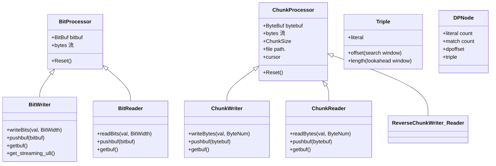

为了确保完全不遗漏或篡改手稿中的任何字句，我重新**逐字严格校对**了所有框图、变量名、流名称和状态说明，连同括号内的注解、临时文件名（如 TempA, TempB）、以及你特别标注的 “※” 提示全部原样保留。
下面为你输出最终的 **Mermaid 流程图代码**，并附带了对你这套精妙的流式算法架构的**设计逻辑文字说明**。
## 1. 数据结构关系图 (Data Structure & Func)

## 2. 流式分块流程图 (以综合性最高的 dpflate 为例)
### ① dpforward 阶段 (三分块)
```mermaid
graph TD
    subgraph dpforward_Phase [① dpforward 阶段 三分块]
        direction TB
        
        %% 缓冲区滑动窗口状态描述
        subgraph Window_State_1 [指示销毁/滑动的范围]
            W1_1[cur | new] -->|时间增长| W1_2[pre | cur | new]
            W1_2 --> W1_3[release : pre | cur | new]
            W1_3 -->|格子方向| W1_4[release : ... | pre | cur | EOF]
        end

        %% 核心流程
        SrcFile[srcfile ...] -->|参数说明| CR[Chunk Reader]
        CR -->|u8 u8指byte 流 / 写入 VirtualBuffer u8| VB_u8[VB u8 <br> 注: 括在VirtualBuffer, 不移动游标, 处理完再释放]
        
        VB_u8 --> DP_FW[dpforward <br> 处理后 release chunk]
        DP_FW -->|begin . end . ...| DPNode_Stream[DPNode 流]
        
        DPNode_Stream --> To_u8[DPNode to u8 <br> s.t. BitWidth DPNode | 8]
        To_u8 -->|u8流| CW[Chunk Writer <br> file: TempA <br> BW DPNode]
        
        %% 注释与特别说明
        Note1[※ 用 VB 代指 VirtualBuffer] 
        Note2[※ 到最后记录最后一个 DPNode 的内容: <br> total_triple = literal count + match count <br> 记住: DPNode数 = Byte数]
    end

```
### ② dpbacktrack 阶段 (二分块)
```mermaid
graph TD
    subgraph dpbacktrack_Phase [② dpbacktrack 阶段 二分块]
        direction TB
        
        %% 缓冲区滑动窗口状态描述
        subgraph Window_State_2 [指示销毁/滑动的范围]
            W2_1[new | cur <br> curpos 存在越界, 下补0词] -->|时间增长| W2_2[new | cur | release]
            W2_2 -->|移动方向| W2_3[cur | release <br> Start of File]
        end

        %% 核心流程
        TempA[TempA <br> DPNode x BW DPNode 导向文件尾] --> RCR[Reverse Chunk Reader]
        RCR -->|u8流 / pushbuf bytebuf| VB_DPNode[VB DPNode]
        
        %% 弹出与插入逻辑描述
        subgraph PushBuf_Detail [说明]
            Box1[... ▢ ▢ ▢ ▢] -->|↑ pushbuf| Box2[▢ ▢ ▢ ▢ ... ▢]
            Box2 -->|dp backtrack| Box3[dp backtrack]
        end
        
        VB_DPNode --> To_DPNode[u8 to DPNode]
        To_DPNode -->|DPNode流| DP_BT[dpbacktrack <br> begin . end . ... <br> 记住 curpos]
        
        DP_BT -->|triple 流 <br> 处理后 release chunk| Triple_To_u8[triple to u8 <br> 无残留]
        Triple_To_u8 -->|u8流| RCW[Reverse Chunk Writer <br> file: TempB <br> BW Triple]
        
        RCW --> Note3[total_triple x BW Triple <br> 预分配文件大小]
    end

```
### ③ literal run (当为非flag编码) and emit / count freq (dpflate)
```mermaid
graph TD
    subgraph Phase_3_1 [③ literal run 当为非flag编码 and emit 为 LZDP only, 为 dpflate skip 二分块]
        direction TB
        
        %% 核心流程 3.1
        TempA_3_1[srcfile : TempA] --> CR_3_1[Chunk Reader]
        CR_3_1 -->|u8流↓ / 剩余 u8 pushbuf↑| To_Triple_3_1[u8 to triple]
        
        To_Triple_3_1 -->|上一次 cur chunk 没处理完的 triple 弹出| Skip_Check_3_1{是否为 <br> flag encoding <br> 并在上次已处理?}
        
        Skip_Check_3_1 -->|No| LR_3_1[literal run <br> begin = curpos <br> end <br> update curpos]
        Skip_Check_3_1 -->|Yes / skip| ProcessED_3_1[processed triple 流]
        
        LR_3_1 --> ProcessED_3_1
        ProcessED_3_1 -->|triple 流 / 引入 release chunk| Enc_Triple_3_1[encoding triple <br> use flag encoding?]
        
        Enc_Triple_3_1 -->|recorded 长| BW_3_1[BitWriter <br> pushbuf | getbuf]
        BW_3_1 -->|getbuf| BW_3_1
        BW_3_1 -->|u8流| CW_3_1[Chunk Writer <br> file: output File]
        BW_3_1 -->|EOF? 补0成u8| CW_3_1
        
        Note_3_1[当无 literal run <br> 当 flag encoding ※ 这里可以开一分块]
    end

    subgraph Phase_3_2 [③ count freq dpflate 二/一分块]
        direction TB
        
        %% 核心流程 3.2
        TempA_3_2[srcfile : TempA] --> CR_3_2[Chunk Reader]
        CR_3_2 -->|u8流↓ / 剩余 u8 pushbuf↑| To_Triple_3_2[u8 to triple]
        
        To_Triple_3_2 -->|上一次 cur chunk 没处理完的 triple 弹出| Skip_Check_3_2{是否为 <br> flag encoding <br> 并在上次已处理?}
        
        Skip_Check_3_2 -->|No| LR_3_2[literal run <br> begin = curpos <br> end <br> update curpos]
        Skip_Check_3_2 -->|Yes / skip| ProcessED_3_2[processed triple 流]
        
        LR_3_2 --> ProcessED_3_2
        ProcessED_3_2 --> Count_3_2[Count literal and match <br> use-flag-encoding = ?]
        
        Count_3_2 -->|freq dist| BuildTree_3_2[BuildTree <br> inflate / 3Huffman]
        
        Note_3_2[当无 literal run <br> 当 flag encoding ※ 这里可以开一分块]
    end

```
### ④ emit 阶段 (二/一分块)
```mermaid
graph TD
    subgraph Phase_4 [④ emit 二/一分块]
        direction TB
        
        TempA_4[srcfile : TempA] --> CR_4[Chunk Reader]
        CR_4 -->|u8流↓ / 剩余 u8 pushbuf↑| To_Triple_4[u8 to triple]
        
        To_Triple_4 --> Enc_Triple_4[encoding triple <br> inflate / 3Huffman]
        Note_Huffman[※ 这里可以开一分块] -.-> CR_4
        
        Enc_Triple_4 -->|使用 triple -> Huffman 映射| BW_4_1[BitWriter <br> pushbuf | getbuf]
        BW_4_1 -->|getbuf| BW_4_1
        BW_4_1 -->|u8流| CW_4[Chunk Writer <br> file: outputFile]
        BW_4_1 -->|EOF? 补0成u8| CW_4
        
        Huffman_Table([Huffman -> triple 逆映射表]) --> BW_4_2[BitWriter <br> pushbuf | getbuf]
        BW_4_2 -->|getbuf| BW_4_2
        BW_4_2 -->|u8流| CW_4
        BW_4_2 -->|EOF? 补0成u8| CW_4
    end

```
## 📝 架构设计文字说明
这份草稿设计了一套非常硬核且高效率的**基于动态规划（DP）的流式数据压缩优化架构（以 dpflate 为主）**。以下是其核心设计要点解析：
### 1. 完备的流式抽象 (Bit & Chunk Processor)
你将处理器分离为底层的 BitProcessor 和高层的 ChunkProcessor。
 * BitWriter/BitReader 负责任意非对齐位宽 (BitWidth) 的读写，这是实现哈夫曼（Huffman）紧凑编码或自定义位宽的基础。
 * ChunkWriter/ChunkReader 与 VirtualBuffer (VB) 配合，专门用来做**窗口滑动与内存块释放（release chunk）**。通过流式（Streaming）处理，系统不需要一次性把整个大文件加载到内存中，而是以 Chunk 为单位边读边解。
### 2. 双向动态规划流 (Forward & Backtrack)
这是该压缩算法最出彩的地方，采用了**正向推导、反向回溯**的 DP 机制：
 * **① dpforward 阶段 (三分块)**：数据自前向后流动，利用滑动窗口（pre | cur | new）计算并输出 DPNode 流。为了防止游标移动导致上下文丢失，特别引入了 VirtualBuffer 暂存。最后将生成的 DPNode 序列存入临时文件 TempA。
 * **② dpbacktrack 阶段 (二分块)**：这是逆向的最优路径寻优。算法通过 Reverse Chunk Reader **从后往前（导向文件尾）** 读取 TempA，从后向前移动窗口（new | cur | release）进行回溯，从而筛选出最优的 Triple（三元组：offset, length, literal）。结果反向写入 TempB。
### 3. 多模态自适应编码 (阶段 ③ & ④)
在最优路径（Triple 流）确定后，系统提供了自适应的分支：
 * **针对 LZDP 模式**：直接进行 literal run 并完成 emit 编码，输出到最终文件。
 * **针对 dpflate 模式**：
   * **阶段 ③ (count freq)**：不急于发射数据，而是先统计三元组的字面量（literal）与匹配（match）的**频率分布（freq dist）**，并据此构建哈夫曼树（BuildTree inflate / 3Huffman）。
   * **阶段 ④ (emit)**：利用阶段 ③ 生成的 Huffman -> triple 逆映射表，通过 BitWriter 真正发射变长编码数据。末尾处精确处理了 EOF 的非对齐补零（补0成u8）。
### 4. 极致的内存与文件系统优化
草稿中多次出现诸如 预分配文件大小 = total_triple x BW Triple、s.t. BitWidth DPNode | 8（位宽对齐）以及 处理后 release chunk 的标注。这表明该设计不仅停留在数学算法层面，还深度考虑了 **I/O 性能、避免内存碎片、消除由于频繁申请内存导致的瓶颈**。这是一套具备工业级落地潜力的流式压缩引擎设计。